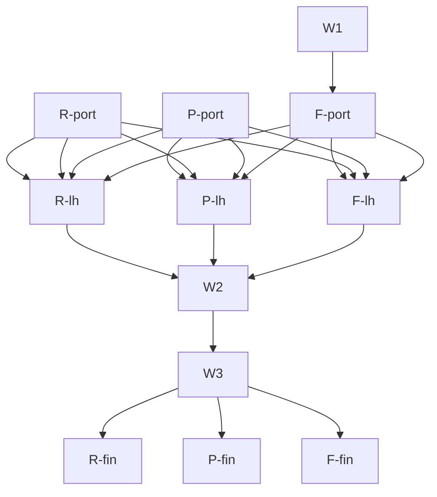

# Plan: phase-3 consumers (rules_ocx, ocx-sdk-python, find_ocx) onto the shared ocx.sh site

## Status

- State:   review
- Tier:    high
- Tier-grammar: 5
- Updated: 2026-10-07
- Next:    /hex-finalize (W3, meta-only)

---

## Overview

**Related:** [plan_website-buildout.md](plan_website-buildout.md) (phase 2),
[ADR 0002](../adr/adr_0002_phase2-bunny-cutover.md) (migration order, rollback, Amendment 2 grants),
[goal pr-11](../goals/pr-11.md) (done criteria, autonomy), `HANDOVER.md`, `RELEASING.md`.

**Goal.** Move the docs of three integration repos onto the shared `ocx.sh` namespace on Bunny, each as
one merge-ready PR pinned to the tip of website PR #11: `rules_ocx` (`/integrations/bazel/`),
`ocx-sdk-python` (`/integrations/python/`), `find_ocx` (`/integrations/cmake/`, new). Then land all,
patch the theme, repin to the release, onboard, deploy, flip. This satisfies the AGENTS.md rule "no
consumer repo before its phase-3 plan exists".

**Emphasis (goal).** Each consumer's docs pair the reference with real use cases that fix real
problems. Research first (competitors, similar sites, the real problems ocx solves), then rewrite.

**Not in scope.** `ocx-sh/ocx` docs, `ocx-catalog` (ported in another session; its library requests
land on PR #11 as they arrive), `ocx-sh/index`, lore. Any push, PR, merge, tag, release, deploy
dispatch, finalize or other-repo remote act is a meta-orchestrator act (see Meta-only acts).

## Verified state (2026-10-07)

| Repo | State |
|---|---|
| website `feat/phase3-pilots` | PR #11, tip `a2daf4f`; carries catalog library requests (Shell, `/lazy`, `/csp`, `prose-code.css`, edge rules catalog-sandbox/nosniff). `ocx.lock` locally modified. |
| rules_ocx | local `docs/ocx-site`, unpushed, `site/` built, pinned to website `41119f9`. `grimoire.toml` has `clients = ["claude"]`, bundle `docs-essentials`. Docs only partly refactored. Handover untracked. |
| ocx-sdk-python | local `docs/ocx-site`, unpushed, `site/` built, pinned `41119f9`, `docs.yml` deleted. Same grim state. Docs only partly refactored. |
| find_ocx | not started. Primary checkout `~/dev/find_ocx` is another session's dirty branch `feat/platform-preference-list`: do not touch it. Existing docs: Sphinx `docs/*.rst`, `pages.yml` to `ocx-sh.github.io/find_ocx/`, README links it. Has `ocx.toml`, `taskfile.yml`, `renovate.json`. |
| nav / edge | `nav.json` claims: bazel, python, no cmake. CMake `entries` item is `planned: true`. `legacy.json` has `legacy-rules-ocx`, `legacy-ocx-sdk-python`, none for find_ocx. |

## Decisions

| ID | Decision | Why |
|---|---|---|
| D1 | Unchanged (owner, 2026-10-07): during the port, consumers pin commits of PR #11, not releases (`@ocx-sh/theme` as pnpm git dependency `path:packages/theme`, plus the deploy action SHA); repin whenever the branch moves. After merge and the theme patch release they pin the npm version and the tagged action SHA. | npm `v0.1.0` predates the zone rename and the deploy action. |
| D2 | Each consumer builds its own Starlight project in `site/`; existing docs stay the source of truth (Stardoc golden, Sybil doctests, Sphinx sources untouched). | Keeps each repo's docs tests. |
| D3 | Toolchain: `node` and `pnpm` in each consumer's `ocx.toml` (as in this repo). | Dogfood OCX. |
| D4 | Legacy removal is the LAST step per consumer: deploy, verify the storage listing (`index.html`, 404, `_astro/`, `pagefind/`), then `bunny:apply` dev then prod. | A removed legacy entry before content turns the 302 into a 404. |
| D5 | Edge-rule count stays flat per consumer (one redirect swapped for one OriginStorage rule). find_ocx adds a claim and a legacy entry together, so +0 net at the flip and +1 repo rule, +1 legacy rule before it; recheck the ceiling on a scratch copy (`bunny:plan`) in W1. | Prod 11 / dev 10 rules today. |
| D6 | Old Pages URLs get no Bunny redirect rule; a last Pages build publishes meta-refresh stubs, then `pages.yml` is removed. Python `objects.inv` break accepted. For find_ocx the same stub rule applies (Sphinx pages: `index.html`, `examples.html`, `reference.html`). | Unchanged. |
| D7 | Grim: every consumer (and find_ocx from scratch) runs `grim init` with `clients = ["claude", "codex"]`, bundle `docs-essentials` (`ghcr.io/ocx-sh/lore/docs-essentials:latest`), and `grimoire.lock` plus the installed skills/rules committed (memory: commit grim artifacts). Accept: `grim status` clean; `grimoire.toml` `clients` line holds both. | Goal rule 1. |
| D8 | find_ocx gets `/integrations/cmake/`. Website W1 (a) adds claim `{ path: "/integrations/cmake/", repo: "ocx-sh/find_ocx", search: true }`, (b) drops `planned: true` from the `cmake` entry and points it at the claim, (c) adds `legacy-find-ocx` (redirect, origin `https://ocx-sh.github.io/find_ocx/`, path `/integrations/cmake/`) so the claim cannot 404 before the flip, (d) updates tests, `integrations` hub expectations and the theme skills in the same commit. Recorded as research-free: mirrors the bazel/python precedent exactly. | The claim is the only way a repo gets a path; the legacy entry keeps D4 safe. |
| D9 | Consumer Lighthouse: each consumer copies and trims this repo's pipeline into `site/`: `scripts/lighthouse.mjs` (build, `astro preview` under the base path, lhci, median of 3 on failure), `lighthouse.budgets.mjs` (JS, HTML, weight, DOM; values start from `tests/budgets.mjs`, never above them), a `site:lighthouse` task, and a CI job in `site.yml` that runs it on PRs (100x4 mobile). No new theme export now; if the three copies diverge, a follow-up issue proposes a shared runner. Automation lands in the LH pipelines after all ports (goal rule 2), and only a dry config check runs before finalize. | Goal narrowing: the full run happens only at that consumer's finalize. |
| D10 | Research note per consumer, committed at `<repo>/.agents/research/docs-use-cases.md` before any page is rewritten: competitor and comparable-site survey (>=5 sites), the real problems ocx solves for that audience, the user needs, the page inventory with `doc_type`/`doc_tier` (via `docs-plan`), a delete list. Use-case pages cite the note. Docs follow `docs-quality` (declarations, `docs-review` grade clean). | Goal emphasis; refactor, not rewrite: reference pages stay, how-to/tutorial/explanation pages are added around them. |
| D11 | find_ocx is planned and built in a separate worktree from `origin/main` (`git -C ~/dev/find_ocx worktree add` under `.agents/worktrees/` if ignored there, else a sibling dir), branch `docs/ocx-site`. The creator removes it when the work lands (worktree hygiene). | Primary checkout belongs to another session. |
| D12 | Sitemap (unchanged P0.4): consumers keep Starlight's own `sitemap-index.xml` under their base, no `@astrojs/sitemap`; the root `robots.txt` gets one `Sitemap:` line per section at its flip. | Decided earlier. |
| D13 | Merge order after all gates: website PR #11 first (signed, local push `git push origin <branch>:main`), then theme patch release, then consumers. Consumers merge only after being repinned to the release (their pre-release pin to a PR-11 SHA that is not on `main` must not land). Exception allowed only if the PR-11 tip equals the merged main SHA. | A merged consumer pinning an orphaned SHA would break fresh installs. |

**W1 result (2026-10-07).** D8 landed as written (claim, `cmake` entry linked, `legacy-find-ocx`). Real-tree `bunny:plan` rule counts: prod 14 / dev 13 (were 13 / 12; the "11 / 10" in D5 was stale), ceiling 40, so ample headroom. At the flip the legacy rule swaps for `repo-find-ocx` (+0). Tests that used `cmake` as the planned-entry example now use `gradle`. Preview slugs in `scripts/previews/sites.mjs` are untouched (no find_ocx preview yet).

## Component contracts

- C-001 `nav.json` claim `/integrations/cmake/` owned by `ocx-sh/find_ocx`, `search: true`; entry `cmake` not planned. Test: claims/entries consistency test passes, hub lists CMake with a link.
- C-002 `legacy.json` entry `legacy-find-ocx`; `bunny:plan` shows it before the flip and `repo-find-ocx` after; ceiling not exceeded.
- C-003 Every consumer `grimoire.toml`: `clients` contains `claude` and `codex`; `grimoire.lock` committed; installed skills/rules committed.
- C-004 Every consumer has `.agents/research/docs-use-cases.md` and at least 3 use-case pages (`doc_type: how-to` or `tutorial`) citing it, beside the reference; every page declares type and tier; `docs-review` finds no MUST failure.
- C-005 Every consumer: `site:lighthouse` task and CI job; the run scores 100 in performance, accessibility, best-practices and SEO on every site page, mobile, under the base path.
- C-006 Every consumer `site/` pins `@ocx-sh/theme` and the deploy action to one PR-11 SHA during the port, then to npm patch version plus tagged action SHA after release.
- C-007 Reference parity: all Stardoc anchors resolve (rules_ocx 75), Griffe API symbols diffed (python), Sphinx API/`.. cmake:` content mapped (find_ocx); doctests and golden tests unchanged.

## User-experience scenarios

- S-001 Reader lands on `/integrations/bazel/` and finds a task-first page ("pin a toolchain", "use a tool in a genrule") before the rule reference; each links to the reference anchor. Error: dead anchor fails `ocx-site check`.
- S-002 Reader on `/integrations/cmake/` runs `find_package(ocx)` example copied from a how-to page; the example is the one tested in the repo. Error: untested snippet fails the doc-example gate.
- S-003 Reader searches a Bazel term from `/` and a CMake term from the Bazel page: merged Pagefind finds both. Error: version mismatch aborts deploy.
- S-004 Visitor to the old Pages URL gets a stub that forwards to the new URL.
- S-005 Contributor opens a PR touching `site/`: CI builds and runs Lighthouse; a score below 100 or a budget overrun fails the job.

## Pipelines

Cut by repo (disjoint file sets). Steps inside a pipeline are serial; each pipeline is one worktree/agent.

| id | repo | scope (C-/S-) | expected files | wave | depends-on | marks | status |
|---|---|---|---|---|---|---|---|
| W1 | website | C-001, C-002, D8: claim, nav entry, legacy entry, tests, theme skills; keep PR-11 library requests flowing | `packages/theme/src/nav.json`, `infra/bunny/legacy.json`, `skills/ocx-theme-*`, related tests | 1 | none | | pending |
| R-port | rules_ocx | C-003, C-004, C-007, S-001, S-003, S-004 | `grimoire.*`, `.claude/**`, `.codex/**`, `.agents/research/**`, `site/src/content/**`, `site/scripts/port-docs.mjs`, `README.md` | 1 | none | | pending |
| P-port | ocx-sdk-python | C-003, C-004, C-007, S-001, S-003, S-004 | same shape as R-port plus `docs/**` generators, `lychee.toml`, `CLAUDE.md` | 1 | none | | pending |
| F-port | find_ocx (worktree) | C-003, C-004, C-007, S-002, S-004: full Starlight port of the Sphinx docs, `ocx.toml` node/pnpm, `site.yml`, `deploy.yml`, renovate rule, stub build, `grim init` | `site/**`, `.github/workflows/**`, `ocx.toml`, `renovate.json`, `grimoire.*`, `.agents/research/**`, `README.md`, `docs/**` (only if tests need) | 1 | W1 (pin to a SHA with the claim) | hard | pending |
| R-lh | rules_ocx | C-005, S-005 | `site/scripts/lighthouse.mjs`, `site/lighthouse.budgets.mjs`, `site.yml`, `taskfile` | 2 | R-port, P-port, F-port (goal rule 2: all ported first) | | pending |
| P-lh | ocx-sdk-python | C-005, S-005 | same shape | 2 | R-port, P-port, F-port | | pending |
| F-lh | find_ocx | C-005, S-005 | same shape | 2 | R-port, P-port, F-port | | pending |
| W2 | website | harden PR #11: fold lessons from the ports (a shared Lighthouse note in `ocx-theme-quality`, skill updates), full gate `task check`, `e2e`, `lighthouse` (`LH_NO_CACHE=1`), `pack`, one at a time | website tree | 3 | R-lh, P-lh, F-lh | review | pending |
| W3 | website | `/hex-finalize` PR #11 (meta-only) | git history | 4 | W2 | | pending |
| R-fin | rules_ocx | repin to the PR-11 tip, `task verify`, then `/hex-finalize` with the full Lighthouse run (meta-only finalize) | `site/package.json`, lockfile, workflows | 5 | W3 | | pending |
| P-fin | ocx-sdk-python | same | same | 5 | W3 | | pending |
| F-fin | find_ocx | same | same | 5 | W3 | | pending |

Critical path: F-port -> F-lh -> W2 -> W3 -> F-fin -> release train. Shippable after wave: 5 (four merge-ready PRs).

### Step briefs

**W1** (1) Add claim, entry change, legacy entry; update tests that count claims/entries. (2) `bunny:plan` offline on a scratch copy: rule counts under the ceiling. (3) Update `ocx-theme-setup`/`-deploy` skills for the third consumer and Sphinx lessons; `skills-coverage` green; `task check`.

**X-port** (R, P, F; each in its own repo/worktree) (1) `grim init` or `grim add`: set `clients = ["claude","codex"]`, add `docs-essentials`, `grim install`, commit lock and installed copies. (2) Research note (D10): survey comparable sites (Bazel rule docs such as rules_python/rules_go, Python SDK docs such as boto3/httpx, CMake module docs such as FetchContent/CPM/vcpkg, plus tool-manager sites such as mise, asdf, Nix), list the real problems per audience (hermetic toolchains without a host install, reproducible CI, pinned tool versions, cross-platform binaries, air-gapped mirrors), page inventory with types and tiers. (3) Reshape the docs: landing, tutorial/first steps, 3 or more use-case how-tos, explanation of why/how, reference kept; edit generators, not generated output. (4) `docs-review`, anchors/link check, `site:build` and `ocx-site check` green; `task verify` (python: `task test:contract`, 100% coverage; bazel: `diff_test` untouched). (5) `README` points to the new URL. (6) F only: Starlight project from the Sphinx sources (script reads committed `.rst`, never edits it), `pages.yml` kept until its flip, stub build planned (D6), CI workflows pinned by SHA, renovate group for `@ocx-sh/theme`; claim path `/integrations/cmake/`, `base` the same.

**X-lh** (1) Copy and trim `scripts/lighthouse.mjs`, `lhci-stage.mjs` logic, budgets; wire `site:lighthouse` task and CI job (Playwright Chromium like `ci.yml`). (2) Only a config check and a unit test of the budgets run now; the full 100x4 run is deferred to the consumer's finalize (goal narrowing). (3) Update the `ocx-theme-quality` skill pointer if the consumer recipe differs.

**W2** (1) Process any pending catalog requests and consumer findings. (2) Run `task check` then `task e2e`, `task lighthouse` with `LH_NO_CACHE=1`, `task pack`, one at a time. (3) Review pass (`/hex-review`), fix loop, then hand to W3.

## Meta-only acts (the sub-orchestrator and pipelines never do these)

1. Push of any branch, PR creation or update on any remote, including the consumer branches and the find_ocx branch.
2. `/hex-finalize` (website W3 first, then each consumer R-fin/P-fin/F-fin with the full Lighthouse run), including the deep-verify dispatch it owns.
3. Merge: signed linear history by local push (`git push origin <branch>:main`), website first (D13), never the rebase button.
4. Release: signed tag of the theme patch (`0.1.x` per `RELEASING.md`), npm publish via trusted publishing, then the consumer repin commits to the npm version and tagged action SHA, which also land by local push.
5. GitHub environment `ocx.sh` creation per consumer (command in `onboard.mjs` `CREATE_HINT`), `task bunny:onboard -- ocx-sh/<repo>` (storage zone `sh-ocx-<repo>`, 404 path, `BUNNY_STORAGE_KEY`), local only under ADR 0002 Amendment 2; the key never enters CI.
6. Deploy dispatch: `gh workflow run deploy.yml` in each consumer (workflow_dispatch), watch, record the run URL.
7. Legacy flip: legacy entries removed on PR #11 or its follow-up commit only after each zone's storage listing shows content (D4 check), then `task bunny:apply` dev, verify, prod, verify, `bunny:purge`. After 48 h clean on prod: owner disables GitHub Pages (G-R5), consumer PR deletes `pages.yml`.
8. find_ocx worktree creation, and removal after landing, belong to whoever creates it (D11); the meta-orchestrator removes it after the merge.

## Release train (after wave 5, all meta-only)

T1 merge PR #11 -> T2 theme patch tag and npm -> T3 each consumer repin commit (npm version, tagged action SHA), `task verify` green -> T4 merge consumers -> T5 onboard x3 -> T6 deploy dispatch x3 -> T7 verify storage listing + preview zones + `sh-ocx-dev.b-cdn.net` -> T8 flip: remove `legacy-rules-ocx`, `legacy-ocx-sdk-python`, `legacy-find-ocx`; `bunny:plan`; apply dev; verify; apply prod; verify (checklist below) -> T9 Pages stubs and retire.

Verification checklist per host (dev, `next.ocx.sh`, prod): `task bunny:verify`; themed 404 under the section; `task cutover:verify -- --host <h>`; section index 200 with no redirect; cross-links both ways between `/`, `/integrations/` and the section; header nav shows it; merged search finds terms both ways; Lighthouse 100x4 live; no raw `<a id>` leak.

Rollback: restore the legacy entry (revert the flip commit), `bunny:apply` dev then prod, `bunny:purge /integrations/<section>/`, confirm 302. A bad deploy is fixed by redeploying a good commit. Pages stays enabled for 48 h after the prod flip.

## Owner gates (record only; the goal's grants cover the acts above)

| Gate | Action |
|---|---|
| G-env | create `ocx.sh` environment with `main` policy in each consumer repo (agent does it under the grant if `gh` rights allow, else reported) |
| G-R5 | disable GitHub Pages per consumer after 48 h clean |

## Risks

- Stardoc HTML in Markdown: `.md` output only; MDX switch unsafe.
- `starlight-pydocs` is young and single-maintainer: pinned exactly, `griffe2md` fallback.
- Pagefind version mismatch aborts the deploy: theme and action SHA bump together.
- Deploy to a zone no traffic reaches until the flip: verify via storage listing, preview zone, dev host.
- Edge-rule ceiling: find_ocx adds one repo rule and one legacy rule before its flip; checked in W1.
- Sphinx content (find_ocx) uses roles and directives that Starlight lacks: port script maps them, unknown ones fail loudly, never silently dropped.
- Three diverging Lighthouse copies: follow-up issue if they drift (D9).
- A consumer pinned to a PR-11 SHA must not merge before the repin (D13).
- Host OOM: heavy gates one at a time, `LH` shards per `AGENTS.md`.

## Open questions

None open. Resolved defaults: Q3 python generates Starlight content from `docs/` (Sybil stays); Q4 stubs (D6); Q5 drop revision-date footer and `.experimental` style; Q6 no required checks, no signed-commit rule on rulesets for `rules_ocx` (others re-checked at their finalize); Q7 `ocx lock` re-lock verified per consumer when adding node/pnpm (rules_ocx and python done, find_ocx in F-port).

## Constitution

No constitution named. Project rules apply: `css-theming`, `typescript-quality`, `typescript-packaging`, `docs-quality`, AGENTS.md (tokens only, no AI-drawn icons, no flicker, Lighthouse 100x4).

## Execution notes (waves 1-3, 2026-10-07)

- Pipelines W1, R-port, P-port, F-port, R-lh, P-lh, F-lh done; W2 gate: check, e2e (1649 passed), pack green; review (low tier, 13 files) Approve, 1 optional warn (rules.test.ts:373 comment).
- Decision (issue protocol): rules_ocx generated `/defs/` page was 14,515 B gz (> HTML_GZ_MAX 14,200, physically fixed); split per rule in the port script instead of raising the cap. Recorded in `ocx-theme-quality`/`-setup` skills.
- Decision: `/docs/components/` index hit 14,209 B after the cmake nav link; shortened its meta description (5083040), cap unchanged.
- Decision: pack-smoke tolerates npm 11's "cannot publish over previously published 0.1.0" in the offline dry-run only (tree is still 0.1.0, version is published).
- Deferred residue: `LH_NO_CACHE=1 task lighthouse` fails performance 0.99 on ~12% of pages per run on this loaded host (load ~4); identical at dc685e6, so not a regression; LCP flips by one simulated RTT between runs. Cached run passed. Needs a rerun on an idle host or CI, or a owner decision (best-of-N judging / minScore with Spec Delta).
- Deferred residue: find_ocx docs reproduce stale `ocx.sh/jq`, `ocx.sh/cmake` names in examples/fixtures/ocx.cmake that ocx 0.6 cannot lock; tutorial `ocx lock` step fails for readers until renamed. Consumer pnpm lockfiles for find_ocx (and python) need refresh after the website branch is pushed (pinned SHA unreachable).
