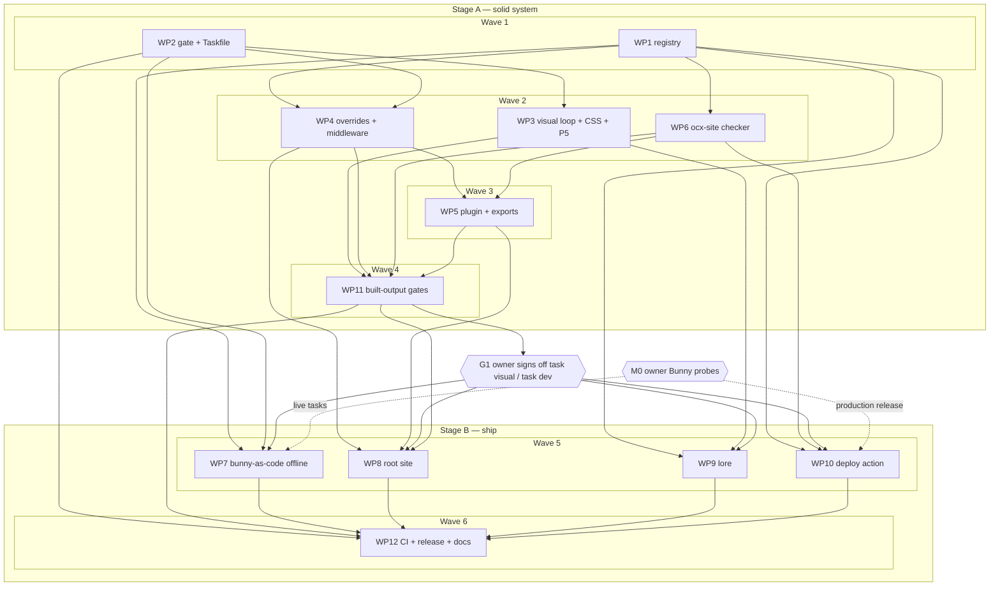

# Plan: ocx.sh website build-out

## Status

- State:   executing
- Tier:    xhigh
- Tier-grammar: 5
- Effective-tier: derived
- Updated: 2026-09-28 (Stage A complete: WP1–WP6, WP11, WP11b, WP13, WP14 merged; halted at G1 for owner sign-off. Owner re-scope: Stage A → G1 → Stage B; no consumer docs move)
- Next:    owner: sign off G1 (`task visual` / `task dev` against the mocks) before Stage B (WP7–WP10, WP12) starts

---

## Overview

**Status:** Draft
**Author:** hex-plan (xhigh), owner Michael Herwig
**Date:** 2026-09-27
**Related ADR:** [adr_0001_ocx-site-architecture.md](../adr/adr_0001_ocx-site-architecture.md)
**Related Spec:** [design_ocx-site.md](../adr/design_ocx-site.md) — canonical contracts (§7) and scenarios (§8)
**Baseline:** `HANDOVER.md` (amended by ADR H1–H16), local commit `0ac0fda`

Classification: scope large · reversibility **one-way (high)** — published slugs, `nav.json`
v4 schema, npm export map, lore artifact names, apex `/v2` routing · tier xhigh.
Required artifacts: this plan, ADR 0001, persisted research (`.agents/research/`).

## Objective

Build a solid system in `ocx-sh/website` first, then ship it. Two stages, split by a hard
owner gate (owner, 2026-09-27: "We first want a solid system"):

- **Stage A — solid system** (WP1–WP6, WP11): the path registry + checker, a mock-faithful
  `@ocx-sh/theme` with the owner live-review loop, and the full local quality gate (oxc +
  typed ESLint, built-CSS contracts, cascade probe, axe, Lighthouse 100×4, pack-smoke). Ends
  at **G1**: the owner signs off `task visual` / `task dev` against the mocks.
- **Stage B — ship** (WP7–WP10, WP12, only after G1): the root site, the lore rule +
  adoption skill, Bunny-as-code + the reusable deploy action, CI/release.

Every target has `:dev` and `:test`. No consumer repo is touched and no consumer docs move
in this plan.

## Scope

### In Scope

- Stage A: `packages/theme` (registry, schema, checker bin, CSS layer, Starlight overrides, route middleware, `EcosystemMenu`, `./vitepress` CSS); `examples/starlight` (fixture under `/docs/`); gate tooling, Taskfile targets, built-output gates on the example.
- Stage B: `site/` (root: landing, hubs, install, 404); `.github/actions/deploy`, `infra/bunny` (rules, zone settings, onboard, gc, cutover verify), `infra/cutover` (`dev.ocx.sh` + `ocx.sh` nginx, Cloudflare/DNS snippets); `docs/lore/` (rule `ocx-design`, skill `ocx-site-integration`, publish config); CI + release workflows, HANDOVER/AGENTS amendments.

### Out of Scope

- **Every consumer repo** (ocx docs, rules_ocx, SDK, catalog, index): no edits, no deploys, no
  onboarding, no Pages stubs, no docs moved — in either stage. Migrations are separate
  follow-up plans, started only when the owner decides the system is ready (owner re-scope
  2026-09-27; gate answer 1).
- Live hosting steps — owner-local with `BUNNY_API_KEY` / hetzner1 SSH: zone creation, the
  `dev.ocx.sh` staging vhost, the later `ocx.sh` vhost swap, Cloudflare rules, and the DNS move
  after registry removal. This plan delivers the tasks, snippets and their offline tests.
- Catalog Astro port (HANDOVER phase 5). `lore.ocx.sh` move (stays a subdomain, gate answer 2).
- Visual snapshots in Docker (`visual:test`, `visual:update`) — deferred until the design draft
  stabilises (ADR D5); `task visual` is the fidelity loop.

## Research

Artifacts in `.agents/research/`: `2026-09-27-context.md`, `discover-{architecture,gate,bunny-lore,visual}.md`,
`research-{technology,patterns,domain-bunny}.md`. Key inputs: Bunny limit is 50 edge rules
(not 20) and serves directory index natively; the apex nginx `~ /v2/` match is unanchored (live
`/docs/v2/` bug); Starlight ships six `starlight.*` sub-layers and moved to JS + `.d.ts`; oxlint
type-aware is stable, oxfmt weak on `.astro`; Lost Pixel is dead; no Bunny OIDC; npm OIDC cannot
publish a first version; the current theme deviates from mock #1b in sidebar, code frames, page
title, measure, H2 rhythm, breadcrumb, footer, mobile header.

## Technical Approach

Canonical: ADR 0001 (decisions D1–D5, amendments H1–H16, probes P1, P3–P6, milestone M0) and the
design doc (§1 registry, §2 Bunny, §3 deploy, §4 theme, §5 lore, §6 gate matrix). This plan does
not restate them.

### Key Decisions

| Decision | Rationale |
|---|---|
| `nav.json` v4 `claims[]` is the single path registry; `registry.mjs` is pure and shared by plugin, checker, deploy action, Bunny rules | one source, no drift (D1.1, D2.3) |
| One `@layer ocx` after `starlight`; consumer unlayered wins | css-theming CSS-CAS-02; F3 (D2.2) |
| Ship `.mjs` + JSDoc, `.d.mts` generated at `prepack`; `.astro`/`.css` as source | strict consumers, no dev build (D2.1) |
| Per-repo storage zone behind one pull zone (M0-gated, fallback C) | write isolation without OIDC (D1.2) |
| No purge in CI; deploy prunes stale HTML only; owner `bunny:gc` for assets | API key never in CI; no missing asset by construction (D1.3) |
| Staged hosting: `dev.ocx.sh` vhost → Bunny (noindex staging) first; later the `ocx.sh` vhost swap (anchor `/v2/` + token realm, `location /` → Bunny) + Cloudflare "respect headers"; DNS → Bunny after registry removal | one-edit rollback per step; no registry traffic on Bunny (D1.4, D1.5) |
| Two stages with a hard owner gate G1 between them | solid system before anything ships (owner) |
| Deploy = node24 JS action in this repo, zero deps, released with the theme tag from `1.0.0` | D3 |
| Lore authored in `docs/lore/`, published from here (P4-gated) | rule changes with the theme it describes (D4) |
| Taskfile + root `package.json` owned by WP2, which pre-declares every target and every root devDep | keeps all other WPs file-disjoint |

## Component Contracts

Canonical text: [design_ocx-site.md §7](../adr/design_ocx-site.md#7-component-contracts) —
**not duplicated here** so the two cannot drift; worker briefs carry the verbatim excerpt.
Index for coverage:

| IDs | Surface |
|---|---|
| C-001…C-010 | registry, `nav.json` v4, schema, `activeSection`, CODEOWNERS |
| C-011…C-014, C-070 | `ocx-site check` (link, layout, Pagefind version) |
| C-015…C-034 | theme plugin, overrides, cascade probe, built-CSS gate, contrast, exports, pack-smoke, vitepress CSS, `./nav` |
| C-035…C-046 | deploy action (inputs, order, retry, prune, dry-run, masking), index.ocx.sh guard, release. C-042 REMOVED |
| C-047…C-054, C-072 | Bunny-as-code (plan, rules, apply/verify, zone, onboard, purge, cutover verify, gc) |
| C-055…C-059, C-071 | task targets (`:dev`/`:test`, `check`, lighthouse, visual, dev, missing-dist) |
| C-060…C-066 | lore rule, generated tokens, css-theming boundary, skill, deploy-job ref, grim build, publish |
| C-067…C-069 | root site hubs, robots, 404 |

## User-Experience Scenarios

Canonical: [design_ocx-site.md §8](../adr/design_ocx-site.md#8-ux-scenarios) — S-001 owner live
review · S-002 consumer adopts · S-003 deploy failure mid-upload · S-004 new integration path ·
S-005 nav change propagates · S-006 publish lore · S-007 docker pull after cutover · S-008 old
URL visit · S-009 ocx CLI after cutover.

## Milestone M0 — Bunny probes (owner-run)

| Item | Value |
|---|---|
| Who / how | owner with `BUNNY_API_KEY`; runbook `infra/bunny/README.md` (lands with WP7; M0 may run earlier by hand) |
| Probe | P1 on S3-enabled scratch storage zones behind a scratch pull zone |
| Pass criteria | (1) an `OriginStorage` rule routes `/<prefix>/x` to zone B with the path kept; (2) `/<prefix>/` and `/<prefix>` serve `index.html` with 200; (3) a miss under the prefix returns zone B's `bunnycdn_errors/404.html` with 404 |
| Side answers | a storage write auto-purges the pull-zone cache? (yes → ADR D1.3 v) · S3-enabled zones work as targets? (yes → create zones S3-enabled) |
| Not in M0 | P3 — agent-run at the start of WP10 |
| Gates | WP7 live tasks (`bunny:zone:apply`, `bunny:apply`, `bunny:verify`, `bunny:onboard`) and WP10's production release. Offline code and tests proceed without it |
| Result | pending |
| Decision | Topology **B** (all three pass) / **C** (any fails): pending |

## Gate G1 — owner sign-off (end of Stage A)

| Item | Value |
|---|---|
| Who / how | owner runs `task dev` + `task visual -- --watch` against the `.tmp/design/` mocks (S-001) |
| Pass criteria | owner signs off the visual pairs; `task check`, `task e2e`, `task lighthouse`, `task pack` green on the example |
| Gates | every Stage B WP (WP7–WP10, WP12). Nothing in Stage B starts before G1 |
| Result | pending |

## Parallelization

| WP | Stage | Scope | Expected Files | Size | Wave | Depends on | Review | Verify | Status |
|----|-------|-------|----------------|------|------|------------|--------|--------|--------|
| WP1 | A | Registry: C-001…C-009, C-034 | `packages/theme/src/{nav.json,nav.schema.json,registry.mjs,nav.mjs}` (`nav.ts` deleted), `packages/theme/src/starlight/Header.astro` (minimal v4 patch), `packages/theme/package.json` (`ajv` devDep, `astro` exact), `pnpm-lock.yaml (regenerated at merge)`, `packages/theme/test/{registry,nav}.test.ts`, `packages/theme/test/fixtures/nav-invalid/*` | M | 1 | — | risk | full | merged |
| WP2 | A | Gate tooling + Taskfile: C-029, C-071 | `Taskfile.yml`, `ocx.toml`, `ocx.lock`, `package.json`, `pnpm-workspace.yaml`, `pnpm-lock.yaml`, `eslint.config.js`, `.oxlintrc.json`, `.oxfmtrc.json`, `.prettierrc.json`, `.prettierignore`, `tsconfig.json`, `vitest.config.ts`, `playwright.config.ts`, `scripts/css/{outside-layers,literal-colours,dark-parity}.mjs`, `scripts/css/*.test.ts`, `scripts/require-dist.mjs`, `scripts/require-dist.test.ts`, `scripts/lhci-posix-tmpdir.cjs`, `scripts/bin/oxc.sh` | M | 1 | — | | | merged |
| WP3 | A | Visual loop + converter + CSS layer + mock fidelity + probe P5: C-030, C-033, C-058, S-001 | `scripts/visual/{visual.mjs,report.html.tmpl,visual.test.ts}`, `tests/visual/pairs.ts`, `scripts/samples/{convert,fetch,convert.test}.ts`, `examples/starlight/src/content/docs/components/*`, `packages/theme/src/{tokens,base,fonts}.css`, `packages/theme/src/starlight/starlight.css`, `packages/theme/src/vitepress/vitepress.css`, `packages/theme/test/{tokens.test.ts,contrast-pairs.ts,vitepress.test.ts}`, `packages/theme/package.json` (only if P5 changes the font source), `pnpm-lock.yaml (regenerated at merge)`, `Taskfile.yml` (only: drop the `css` report-only flag once theme CSS is layered and dark-parity clean) | M | 2 | WP2 | | | merged |
| WP3b | A | Owner-review fix: shell-icon code tabs, design copy button, tabs showcase (S-001) | `packages/theme/src/icons/**`, `packages/theme/src/components/CodeTabs.astro`, `packages/theme/src/starlight/starlight.css`, `packages/theme/test/code-tabs.test.ts`, `scripts/samples/convert{,.test}.ts`, `examples/starlight/src/content/docs/components/*`, `tests/visual/pairs.ts` | S | 3 | WP3 | | | merged |
| WP13 | A | Port ocx VitePress components (owner 2026-09-27): Terminal/asciicast player incl. collapsible, Tooltip, file Tree (+Node/Description), PlatformIcons, DependencyExplorer, FeatureSection; converter maps VitePress usages; showcase pages; regression tests per refinement (research `ocx-components-port.md`) | `packages/theme/src/components/{Terminal,Tooltip,Tree,PlatformIcons,DependencyExplorer,FeatureSection}*.astro`, `packages/theme/src/components/*.mjs`, `packages/theme/test/components-*.test.ts`, `tests/e2e/components.spec.ts`, `scripts/samples/{convert,fetch,convert.test}.ts`, `examples/starlight/src/content/docs/components/*`, `examples/starlight/public/casts/**`, `packages/theme/package.json` (player dep + component exports), `pnpm-lock.yaml` | L | 5 | WP5, WP3b | risk | full | merged |
| WP3c | A | Owner-review fix: table overflow only when columns can't fit; tabs first-paint artifact | `packages/theme/src/starlight/{starlight.css,tab-icons.mjs,MarkdownContent.astro}`, `packages/theme/test/code-tabs.test.ts`, `tests/e2e/tables-tabs.spec.ts` | S | 5 | WP3b | | | merged |
| WP14 | A | Primitive set from the design component sheet (owner 2026-09-27: components inconsistent): Button, Input, Select, Combobox, Choice, Tags, Menu, Feedback/Loader (from DependencyExplorer's loading animation) as theme components; ported components (DependencyExplorer first) consume them; code-page load artifact root-caused | `packages/theme/src/components/ui/**`, `packages/theme/src/components/DependencyExplorer*`, `packages/theme/test/ui-*.test.ts`, `tests/e2e/ui-*.spec.ts`, `examples/starlight/src/content/docs/components/*` | L | 6 | WP13 | risk | full | merged |
| WP4 | A | Overrides + route middleware: C-023 (markup), C-024…C-027, C-059, S-001 | `packages/theme/src/starlight/{Header,Footer,PageTitle,TableOfContents,ThemeSelect,MobileMenuFooter}.astro`, `packages/theme/src/components/EcosystemMenu.astro`, `packages/theme/src/starlight/{route-middleware,theme-toggle,menu-focusout}.mjs`, `packages/theme/test/{header,theme-select,chrome,route-middleware}.test.ts`, `scripts/dev-smoke.test.ts` | M | 2 | WP1, WP2 | risk | | merged |
| WP5 | A | Plugin + exports + `bin` + prepack `.d.mts`: C-015…C-020, C-022, C-031 (declared) | `packages/theme/src/starlight/{index.mjs,ec.mjs}` (`index.ts` deleted), `packages/theme/package.json`, `packages/theme/tsconfig.dts.json`, `packages/theme/.gitignore`, `packages/theme/test/plugin.test.ts`, `examples/starlight/astro.config.mjs`, `.oxfmtrc.json` + `.prettierignore` (bring `packages/theme/**` into fmt scope), `pnpm-lock.yaml (regenerated at merge)` | M | 3 | WP4, WP6 | risk | | merged |
| WP6 | A | Checker `ocx-site`: C-011…C-014, C-070 | `packages/theme/bin/ocx-site.mjs`, `packages/theme/src/check/{links,layout,pagefind,index}.mjs`, `packages/theme/src/nav.mjs` (re-export `PAGEFIND_VERSION`), `packages/theme/test/check.test.ts`, `packages/theme/test/fixtures/dist-*/**` | M | 2 | WP1 | | | merged |
| WP7 | B | Bunny-as-code (offline) + gc + cutover files: C-043, C-047…C-054, C-072, S-004, S-007, S-009 | `taskfiles/bunny.yml`, `infra/bunny/{rules,zone,api,onboard,purge,gc,cutover}.mjs`, `infra/bunny/*.test.ts`, `infra/bunny/__snapshots__/*`, `infra/bunny/README.md`, `infra/old-urls.txt`, `infra/cutover/{dev.nginx.conf,nginx.conf,cloudflare.md}` | M | 5 | WP1, WP2, G1 | risk | | pending |
| WP8 | B | Root site: C-067…C-069, C-021 (search merge e2e), C-057 (site URLs) | `site/**`, `taskfiles/site.yml`, `packages/theme/src/components/HubGrid.astro`, `packages/theme/test/hub-grid.test.ts`, `tests/e2e/search.spec.ts`, `tests/fixtures/pagefind-old/**`, `.lighthouserc.cjs` (adds site URLs), `pnpm-lock.yaml (regenerated at merge)` | M | 5 | WP4, WP5, WP11, G1 | | | pending |
| WP9 | B | Lore: C-060…C-066, S-002, S-005, S-006, S-008 | `docs/lore/**`, `taskfiles/lore.yml`, `scripts/lore/{gen-tokens.mjs,gen-tokens.test.ts,lore.test.ts,pages-redirect.test.ts}`, `.github/workflows/lore-publish.yml` | M | 5 | WP1, WP3, G1 | | | pending |
| WP10 | B | Deploy action (+ probe P3 first): C-035…C-041, C-044, C-045, S-003 | `taskfiles/deploy.yml`, `.github/actions/deploy/{action.yml,index.mjs,deploy.ts,bunny.ts,README.md}`, `.github/actions/deploy/test/{deploy.test.ts,fake-bunny.ts}` | M | 5 | WP1, WP6, G1 | risk | full | pending |
| WP11 | A | Built-output gates on the example: C-017 (canonical), C-023 (e2e), C-028, C-031 (tarball), C-032, C-057 (example URLs), C-071 (wiring) | `tests/e2e/{smoke,header,mobile,cascade,a11y}.spec.ts`, `tests/fixtures/consumer/**`, `examples/starlight/src/content/docs/probe/*`, `scripts/pack-smoke.mjs`, `scripts/pack-smoke.test.ts`, `scripts/lhci-stage.mjs`, `.lighthouserc.cjs` | M | 4 | WP3, WP4, WP5, WP6 | | | merged |
| WP11b | A | Gate-closing fixes: Lighthouse perf 100 (font metric fallback, preload, CSS size), ecosystem menu in mobile menu at 390px (C-023), diff-line contrast (axe), prepack idempotent, theme default favicon, `--ocx-text-xs` ≥12px | `packages/theme/src/**`, `packages/theme/tsconfig.dts.json`, `packages/theme/test/**`, `tests/e2e/**`, `scripts/pack-smoke.mjs` | M | 5 | WP11 | risk | full | merged |
| WP12 | B | CI + release + repo docs: C-010, C-046, C-055, C-056 | `Taskfile.yml` (final `check` list), `.github/workflows/{ci,release}.yml`, `.github/CODEOWNERS`, `.github/dependabot.yml`, `.github/zizmor.yml`, `scripts/release/{check-version.mjs,check-version.test.ts}`, `scripts/ci/{workflow.test.ts,tasks.test.ts}`, `packages/theme/package.json` (version bump to `1.0.0`), `HANDOVER.md`, `AGENTS.md`, `README.md` | M | 6 | WP2, WP7, WP8, WP9, WP10, WP11 | risk | full | pending |

**Critical path:** WP1 (or WP2) → WP4 → WP5 → WP11 → **G1** → WP8 → WP12 (registry → overrides →
plugin → built-output gates → owner sign-off → root site → CI/release), 6 waves.

**Shippable after wave:** 4 (= G1) — mock-faithful theme (CSS, overrides, plugin), registry +
checker, green `task check` (lint, fmt, typecheck, test, build, css) plus `task e2e`,
`task lighthouse`, `task pack` on the example, reviewable live via `task dev` + `task visual`.
Nothing is deployed. Stage B: wave 5 adds root site, lore, Bunny-as-code and the deploy action;
wave 6 CI/release.

**Merge order:** Stage A: WP1, WP2, WP3, WP4, WP6, WP5, WP11 → **G1** → Stage B: WP7, WP8, WP9,
WP10, WP12 — each WP merges only after all its deps; scoped check after each merge, full
verification on the documented triggers.

**Parallelization justification:** `Taskfile.yml` and root `package.json` are the shared
hot-spots. WP2 owns both in wave 1 and pre-declares every root devDep (`astro` exact,
`@astrojs/starlight`, `playwright-core`, `@playwright/test`, `jsdom`, `@axe-core/playwright`,
`markdownlint-cli2`, `@lhci/cli`, `publint`, `@arethetypeswrong/cli`, `prettier`,
`prettier-plugin-astro` ≥ 1, `eslint-plugin-astro`, `eslint-plugin-oxlint`, `pixelmatch`,
`pngjs`); area targets live in per-area `taskfiles/*.yml` (optional includes) owned by their WPs;
only WP12 (wave 6, alone) edits `Taskfile.yml` again. `packages/theme/package.json` is touched by
WP1 (wave 1), WP3 (wave 2, only on a P5 font change; no other wave-2 WP touches it) and WP5
(wave 3). `Header.astro`: WP1 (wave 1), WP4 (wave 2). `src/nav.mjs`: WP1 (wave 1), WP6 (wave 2).
`.lighthouserc.cjs`: WP11 (wave 4), WP8 (wave 5).
Same-wave file sets are disjoint except for `pnpm-lock.yaml`, the one shared file every
dependency-adding WP lists: worktrees run `pnpm install --no-frozen-lockfile` and the merge
regenerates it serially, so it is exempt from the disjointness check.

**Verify justification:**
- WP1 `full` — `nav.json` v4 + schema is a one-way door every other WP reads; a silent shape change breaks plugin, checker, deploy and Bunny rules at once.
- WP10 `full` — writes and deletes production storage with a credential; the ordering guarantee (C-038/C-041) is invisible to a scoped check.
- WP12 `full` — CI/release workflows change what gates `main` and what publishes to npm.

effective tier: high 9 · xhigh 3 (ceiling xhigh) — Stage A high 6 · xhigh 1 (WP1), Stage B high 3 · xhigh 2 (WP10, WP12); xhigh for `door`/`full`, high for every other `M` WP.

## Implementation Steps

> Contract-first TDD per WP: Stub → Specify (tests from design §7, failing) → Implement →
> Review-Fix. Each WP's gate is its scoped check; `task check` stays green at every merge.
> Root test dirs live under `tests/`; vitest includes `packages/**`, `scripts/**`, `infra/**`,
> `.github/actions/deploy/test/**`.
> Stage A = WP1–WP6, WP11. Stage B = WP7–WP10, WP12, started only after G1.

### WP1 Registry
- Stub: `registry.mjs` exports `validate`, `claimFor`, `claimsOf`, `zoneName`, `mergeTargets` (throw) and `ROOT_DIRS`, JSDoc-typed; `nav.schema.json` shape-only skeleton; `nav.json` migrated v3 → v4 (claims per design §1.2, `/integrations/github-actions/` rename, `menuRules` dropped); `nav.ts` → `nav.mjs`; `Header.astro` minimal patch (import path + v4 field names) so the example still builds; `package.json`: `ajv` devDep, `astro` exact.
- Specify: C-001 (schema accepts `nav.json`; each invalid fixture fails `validate()`), C-002…C-006 one fixture each, C-007 table, C-008 purity, C-009, C-034 runtime exports.
- Implement: pure functions; `ajv` in tests only.

### WP2 Gate tooling + Taskfile
- Stub: root `Taskfile.yml` with `includes:` (`optional: true`) for `taskfiles/{site,deploy,lore,bunny}.yml`, and its own targets `lint`, `fmt`, `typecheck`, `test`, `build`, `css` (auto-discovering), `theme:dev` (= `dev`), `theme:test`, `visual`, `e2e`, `lighthouse`, `pack`, `docs` (invoke-only, calling scripts later WPs create), and `cutover:verify` (alias of `bunny:cutover-verify`). `check` = lint, fmt, typecheck, test, build, css. `build` and `typecheck` cover only apps present on disk (glob `examples/*`, `site` if it exists), so `task check` stays green before WP8 lands. Root `package.json` with every root devDep (list above); `pnpm-workspace.yaml` adds `site`; `tsconfig.json` widened with `allowJs` + `checkJs` and `include` covering `packages/*/{src,bin,test}/**/*.{ts,mjs}`, `infra/**/*.{ts,mjs}`, `tests/**/*.ts`, `.github/actions/deploy/**/*.{ts,mjs}`, `scripts/**/*.{ts,mjs}`, `*.config.{ts,cjs,mjs}`, so typed ESLint `projectService` and `tsc` cover every later WP's files; `vitest.config.ts` via `getViteConfig()` against the example's Starlight config, include globs as above; `ocx.toml` pins `oxlint`, `oxfmt`, `actionlint`, `lychee`, `gitleaks`, `zizmor`, `grim`. oxlint via `scripts/bin/oxc.sh` (target-triple resolution, `ponytail:` marked).
- Specify: C-029 (each css script from `.claude/rules/css-theming/gate.md` goes red on a planted violation); C-071 (`require-dist.mjs` on a missing dir exits 1 with `missing dist: <dir>`; `css` uses it; the expected-dist list covers only apps present on disk — glob `examples/*`, `site` if it exists); oxlint fires on a planted floating promise.
- Implement: eslint-plugin-astro (astro-eslint-parser v3) + eslint-plugin-oxlint; oxfmt for ts/js/json/css/md/yaml, Prettier + prettier-plugin-astro for `**/*.astro` only; `playwright.config.ts`.

### WP3 Visual loop + converter + CSS layer + fidelity + P5
- Stub: `task visual [-- --watch]` → `scripts/visual/visual.mjs` (playwright-core; mock ids from `.tmp/design/*.dc.html`, site pages from the dev server; light/dark × desktop/mobile) → `.tmp/visual/report.html`; `@layer starlight, ocx;` as the first line of `tokens.css`; all theme CSS wrapped in `@layer ocx` (`@font-face` outside); `.md-typeset` dropped from the prose `:is()` list.
- Specify: C-058 (rows = `tests/visual/pairs.ts`; missing mock id → "mock missing" row, exit 0) [S-001]; converter emits `.mdx` with `<Tabs syncKey="shell">`; C-030 incl. 3:1 UI pairs; C-033.
- Implement: probe P5 first (fresh Starlight + Pagefind + theme page, 100×4 mobile median of 3; Astro Fonts API vs fontsource CSS decided here, preload + metric fallback); fix own CSS offenders; mock #1b fidelity (flat sidebar CSS, `--sl-content-width` ≈ 675 px, H2 rule, title spacing, code panel tokens, header container queries 960/640), each checked against `task visual` pairs.

### WP4 Overrides + route middleware
- Stub: the six `.astro` overrides and `EcosystemMenu.astro` (Popover API, `position: fixed` below the header, anchor positioning as enhancement, tabs via `:has()`); `route-middleware.mjs` (`onRequest`), `theme-toggle.mjs`, `menu-focusout.mjs` (~5 lines).
- Specify: Container API (`experimental_AstroContainer`, `locals.starlightRoute`) for C-023 markup (sections, `aria-current`, `popovertarget`, rail/strip), C-025 and C-026 incl. exact separator text, C-027; C-024 toggle module under jsdom with a throwing `localStorage`; focusout unit (focus leaves panel → `hidePopover`); route-middleware unit (group label; sidebar flattened only when enabled); C-059 dev smoke [S-001].
- Implement: mock OcxHeader / #1a / #1b fidelity; ≤ 4 categories × 6 items (5 + "n more →"); coexistence with `sl-sidebar-pane` at 390 px; every `<style>` in `@layer ocx`.

### WP5 Plugin + exports + bin + prepack
- Stub: `ocxTheme()` (no options) with `config:setup`, injected integration for `site`/`trailingSlash`, `addRouteMiddleware` (WP4 module); export map per design §4.1; `bin: ocx-site`; `prepack` = `tsc --allowJs --declaration --emitDeclarationOnly -p tsconfig.dts.json`; `.d.mts` gitignored; peers `@astrojs/starlight >=0.42.0 <0.43`, `astro ^7`; version stays `0.0.0` until the release WP.
- Specify: C-015…C-020, C-022 against a resolved config (hook called with a fake `updateConfig`), C-016/C-017 build-failure messages, C-020 incl. `mergeFilter`/`indexWeight`; C-031 declared (export keys = §4.1; `prepack` emits a `.d.mts` per JS export).
- Implement: EC defaults (plain frame, no window dots, CSS-variables Shiki theme on `--ocx-color-code-*`); `mergeIndex` from `mergeTargets`; example `astro.config.mjs`.

### WP6 Checker `ocx-site`
- Stub: bin with `check` subcommand, exit codes 0/1/2; `PAGEFIND_VERSION` in `check/pagefind.mjs` as a node-free literal constant (no `node:` imports — it is re-exported via `nav.mjs` and loaded in the browser by the catalog), re-exported by `nav.mjs`.
- Specify: fixture dists for each C-011…C-014 failure and a clean pass (incl. root `_astro/` + `pagefind/` pass, top-level `foo/` fail); C-070 (version-mismatch fixture; a test resolves `pagefind`'s version via `createRequire` from `@astrojs/starlight`'s package directory — `pagefind` is not a direct dependency — and asserts it equals `PAGEFIND_VERSION`).
- Implement: HTML attribute scan (no DOM dep), longest prefix via `claimFor`, layout mapping.

### WP7 Bunny-as-code (offline) + gc + cutover files
- Stub: `rules.mjs` renders §2.4 from `nav.json`; `zone.mjs` §2.3; `api.mjs` thin fetch client (explicit timeouts); `onboard`, `purge`, `gc`, `cutover`; `bunny:cutover-verify` target; `infra/cutover/dev.nginx.conf` (step 2 staging, noindex) + `nginx.conf` (step 5 `ocx.sh` swap) + `cloudflare.md` (browser-TTL rule, step 8 DNS move) (design §2.8). `taskfiles/bunny.yml` → `bunny:dev` (=plan), `bunny:test`, `bunny:apply`, `bunny:zone:apply`, `bunny:verify`, `bunny:onboard`, `bunny:purge`, `bunny:gc`, `bunny:cutover-verify`.
- Specify: C-047 snapshot; C-048 budget ≤ 40, ordering incl. multi-claim repos, ≤ 5 patterns per trigger [S-004]; C-049; against a fake API: C-050…C-052, C-053 (refuses under `CI`), C-054 incl. `/docs/v2/` not JFrog 401, `pagefind.js` `no-cache` and `dev.ocx.sh` noindex [S-007], C-043 [S-009], C-072 (conditions a/b, young-claim skip, never HTML, `CI` refusal, `--dry-run`); its `:dev`/`:test` pair is listed by `task --list-all` (C-055 per area).
- Implement; `README.md` = owner runbook: M0 steps (S3-enabled scratch zones, pass criteria), onboard, apply, gc, cutover (`dev.ocx.sh` staging → `ocx.sh` swap → DNS move after registry removal). Live tasks run only after M0 is recorded.

### WP8 Root site
- Stub: `site/` Starlight app, base `/`, plugin; landing (mock 3a), `/integrations/` + `/apps/` hubs (2a/2b/3b via `HubGrid`), `/install/` (1e), `404` (1f), `robots.txt` endpoint. `taskfiles/site.yml` → `site:dev`, `site:test`.
- Specify: C-067 (HubGrid Container API), C-068 (robots), C-069 (404 renders header + search); C-021 in `tests/e2e/search.spec.ts`: search merge with a second real bundle from `site/`, degrade on 404, older-Pagefind bundle case (P6); C-057 site URLs (landing, hub, install) added to `.lighthouserc.cjs`; its `:dev`/`:test` pair is listed by `task --list-all` (C-055 per area).
- Implement to mock fidelity; `site:dev` / `site:test`.

### WP9 Lore
- Stub: `docs/lore/` tree per design §5, `publish.toml`, `gen-tokens.mjs`, `lore-publish.yml` (environment `lore`, `LORE_ANNOUNCE_TOKEN`). `taskfiles/lore.yml` → `lore:dev`, `lore:test`.
- Specify: C-060; C-061 [S-006]; C-062 widened grep; C-063 [S-002]; C-064 incl. the three triggers [S-005]; C-065; C-066; pages-redirect stub test — meta refresh, canonical, `location.replace` keeps the path [S-008]; its `:dev`/`:test` pair is listed by `task --list-all` (C-055 per area).
- Implement content (DESIGN.md-shaped rule citing CSS-TOK-01 / CSS-CAS-03 / CSS-TOK-03 instead of restating; skill steps 0–8 + references); probe P4 (`grim publish --dry-run` from `docs/lore/`), fallback copy-PR documented.

### WP10 Deploy action
- Probe P3 first (node24 runner importing `.ts` outside `node_modules`); fallback committed `tsc` output + freshness test.
- Stub: `action.yml` inputs/outputs §3.2 (`path`, no `kept`); `deploy.ts` steps §3.3. `taskfiles/deploy.yml` → `deploy:dev`, `deploy:test`.
- Specify: fake Bunny recording request order/headers; C-035; C-036 incl. empty `storage-key`; C-037; C-038 incl. `pagefind/` top-level files in phase 2; C-039; C-040; C-041 (no DELETE for non-HTML); C-044; C-045; every §3.4 row [S-003]; its `:dev`/`:test` pair is listed by `task --list-all` (C-055 per area).
- Implement: parallel 8, retry ×3 (network/5xx/429), SHA-256 upper `Checksum`, phase barrier, HTML-only prune, key masking. Production release waits for M0.

### WP11 Built-output gates
- Stub: `tests/e2e/*.spec.ts` skeletons against the built example (base `/docs/`) only — nothing here needs `site/` (WP8 adds the search-merge spec and site URLs); `pack-smoke.mjs`; `lhci-stage.mjs` (copies the example dist under `<tmp>/docs/`); `.lighthouserc.cjs`.
- Specify: C-017 canonical + trailing slash in smoke; C-023 keyboard, Esc / outside click / focus-leave close, mobile 390 px with `sl-sidebar-pane` open, axe with the menu open; C-028 cascade (4 controls); C-031 tarball + C-032 (`strictest` fixture, attw); C-057 example URLs; C-071 wiring (`e2e`, `lighthouse` fail on a missing dist).
- Implement: `CHROME_PATH` from the playwright cache, WSL tmpdir preload; fixture consumer in `tests/fixtures/consumer/`.

### WP12 CI, release, repo docs
- Stub: `ci.yml` (one job per `check` row; `build` uploads dists, `e2e` + `lighthouse` download them, `repo-checks` runs `secrets`), `release.yml`, `CODEOWNERS`, `dependabot.yml`, `zizmor.yml`, `check-version.mjs`; `Taskfile.yml` `check` adds `e2e`, `lighthouse`, `pack`, `docs`, `secrets` (`gitleaks`, pinned in `ocx.toml`).
- Specify: C-010 (CODEOWNERS grep for `packages/theme/src/nav.json`); C-046 (`check-version.mjs` unit test: version ≠ tag fails; already-published version → skip); C-055 (`task --list-all` parse: `:dev`/`:test` per area); C-056 (`ci.yml` parse: every `run:` is `ocx exec -- task <check-row>`; `check` list = design §6 in-check rows).
- Implement: `permissions: {}`, per-job `contents: read`, `persist-credentials: false` on every checkout, SHA-pinned `uses:` incl. `ocx-sh/setup-ocx@25fa771f8572572dc64528db89560de68a163a0e # v1`; bumps `packages/theme/package.json` to `1.0.0`; `release.yml`: tag `vX.Y.Z` → gate → skip-if-published → `npm publish --provenance` → move `v1`, no setup cache; `dependabot.yml` (npm + github-actions, `cooldown`); HANDOVER amendments H1–H16; `AGENTS.md` commands (H14); README.

## Dependencies

| Package / tool | Purpose |
|---|---|
| oxlint, oxfmt (ocx), eslint-plugin-oxlint, eslint-plugin-astro, prettier, prettier-plugin-astro ≥ 1 | lint/format (D5) |
| astro (exact), @astrojs/starlight, jsdom | Container API tests, toggle unit |
| ajv (dev, `packages/theme`) | schema validation in tests |
| @playwright/test, playwright-core, @axe-core/playwright | e2e, axe, visual loop |
| @lhci/cli 0.15.1 (Lighthouse 12.6) | Lighthouse |
| publint, @arethetypeswrong/cli | pack-smoke |
| markdownlint-cli2, actionlint, lychee, gitleaks, zizmor (all but the first via ocx) | repo hygiene |

| Service | Status | Notes |
|---|---|---|
| GitHub repo `ocx-sh/website` | **Needed** — owner confirmation pending | CI, release |
| npm `@ocx-sh/theme` | Needed at WP12 | owner bootstraps `1.0.0` with a short-lived token, then trusted publisher (direct publish) for `release.yml` |
| Bunny account (`BUNNY_API_KEY`) | Needed for M0 + apply | owner-local only |
| `LORE_ANNOUNCE_TOKEN` | Needed at WP9 publish | App or fine-grained PAT, PR write on `ocx-sh/grimoire-lore`, environment `lore` (`main` only) |

## Rollback Plan

1. Theme releases are semver; a consumer pins the previous version (Dependabot PR revert).
2. Deploy: redeploy the previous commit's dist; deploys never delete assets, so old HTML stays whole.
3. Cutover, per step: revert the `dev.ocx.sh` or `ocx.sh` vhost edit (seconds; the `^~` anchors may stay), rerun `task cutover:verify`. DNS move: restore the proxied hetzner1 record for `ocx.sh` (DNS TTL).

## Risks

| Risk | Mitigation |
|---|---|
| M0 / P1 fails (`OriginStorage` undocumented) | fallback C: per-repo pull zones + Change Origin URL; deploy contract unchanged |
| Lighthouse 100×4 unreachable with Starlight + Pagefind | P5 runs first in WP3; offenders fixed in theme; assertion only lowered with owner sign-off |
| Starlight internals change (`starlight.css` selectors) | peer range `<0.43`; Dependabot PR runs the full gate + owner `task visual` review |
| Merged bundles from mixed Pagefind versions | C-070 fails the consumer's `ocx-site check`; P6 older-bundle case |
| Stale assets accumulate in zones | owner `task bunny:gc` (C-072), safe by construction |
| DNS must move while the registry is still live | ADR D1.4 option 2: two edge rules → JFrog; registry traffic then counts against the Bunny bandwidth cap |
| Stage B starts on a system that is not ready | hard gate G1; no Stage B WP depends on anything but Stage A outputs + G1 |

## Open Questions

- [NEEDS CLARIFICATION: auto-merge theme Dependabot PRs in consumers?] Recommended: yes for patch/minor (from `1.0.0`) via the shipped `automerge.yml`; the daily `schedule:` redeploys after the merge.
- [NEEDS CLARIFICATION: versioned docs within a year?] Recommended: no — R6 dropped, `v<N>` stays reserved, so adding it later breaks nothing.

Decided (owner, was the hetzner1 question): staged cutover ending in a DNS move after registry removal (ADR D1.4).

Default (not a question): the catalog stays out of merged search (`claims[].search: false` for `/catalog/`) until it emits a Pagefind bundle.

## Deferred to human

| Item | Status |
|---|---|
| S-006 "version not bumped → `grim publish` skips" | relies on grim behaviour; no contract in this repo |
| C-048 ordering for multi-claim repos | decided default: a repo's rule sorts by its longest claim path; confirm if a multi-claim consumer appears |

## Checklist

### Before Starting
- [x] ADR 0001 approved (this plan's gate)
- [ ] GitHub repo `ocx-sh/website` created and `main` pushed (owner)
- [x] Feature branch `hex/website-buildout` created from `main`
- [x] nginx `/v2/` anchor bug fixed live 2026-09-27 (`^/v2/` + explicit token-realm location; `/docs/v2/` no longer reaches JFrog) — herwig-systems/server-hetzner1@66b2e22

### Owner actions during execution
- [ ] G1: sign off `task visual` / `task dev` against the mocks (gates all of Stage B)
- [ ] M0 (Stage B): run P1, record result + topology B/C in this plan (gates WP7 live tasks, WP10 production release)
- [ ] Staging first: SSH to hetzner1, point the existing `dev.ocx.sh` vhost at Bunny (`infra/cutover/dev.nginx.conf`, noindex) + Cloudflare browser-TTL rule for `dev.ocx.sh`
- [ ] Later, outside this plan, once the sites are released on Bunny: same `location /` swap on the `ocx.sh` vhost with the `^~` registry anchors (`infra/cutover/nginx.conf`) + the rule for `ocx.sh`
- [ ] After the OCI registry is removed: move `ocx.sh` DNS to Bunny (design §2.8 step 8); earlier only via ADR D1.4 option 2
- [ ] Create environment `lore` + `LORE_ANNOUNCE_TOKEN` (before the first lore publish)
- [ ] npm bootstrap: publish `1.0.0` from the green `v1.0.0` tag with a short-lived token, then configure the trusted publisher for `release.yml` with direct publish enabled

### Before Merge
- [ ] G1 recorded (owner signed off `task visual` pairs); `task check` green
- [ ] Final full verification passes

---

## Schedule log

- 2026-09-27 WP2 merged → b273d27 · trigger scoped · `task check` green. Extra files justified: `scripts/oxlint.test.ts` (planted floating-promise probe the plan asks for), `scripts/samples/convert{,.test}.ts` (oxfmt wrap only).
- 2026-09-27 WP1 merged → b152aee · trigger full (Verify cell) · `task check` rc 0 · lockfile regenerated at merge.
- 2026-09-27 WP6 merged → b39d1db · trigger scoped · `task check` rc 0.
- 2026-09-27 WP4 merged → 83dbc62 · trigger scoped · `task check` rc 0 · post-merge fix: Footer keeps Starlight `Pagination` (owner review).
- 2026-09-27 WP3 merged → 4e7c410 · trigger scoped · `task check` rc 0 · css gates now hard. Extra files justified: `scripts/css/outside-layers.{mjs,test.ts}` (exact-rule allowlist for Starlight's unlayered `Page.astro` block bundled into the same CSS file; a theme leak in that file still fails).
- 2026-09-27 WP5 merged · trigger scoped · `task check` rc 0 · post-merge fix 642cb10: consumer EC `styleOverrides` (+`frames`) merge one level deep. Extra files justified: `packages/theme/src/starlight/Head.astro` (Fonts API `` tag), `scripts/css/outside-layers.mjs` (allowlist the Fonts API's unlayered `:root{--ocx-font-*}`).
- 2026-09-27 WP3b merged · trigger scoped · `task check` rc 0 · post-merge fix a3000f5 (register `MarkdownContent`, first code line clear of copy button). Extra files justified: `MarkdownContent.astro` + `tab-icons.mjs` (replace declared `CodeTabs.astro`), `ec.mjs`, `tokens.css`, `contrast-pairs.ts`, `code-highlight.test.ts` (highlight finding), `prose.md`, `asides.mdx`, `components/tabs.mdx`. Late commits a4d8272..c3f9ace (table scroll box, highlight colours) had no L1 → covered by the end-of-run L2.
- 2026-09-27 WP11 merged · trigger scoped · `task check` rc 0 · `task e2e` 1 fail (axe contrast on `.del` diff line — WP3b palette × WP11 test, found post-merge) · `task lighthouse` perf 0.98–0.99 → WP11b. Extra files justified: `playwright.config.ts` (port 4322 / `E2E_PORT`, `--ignore-lock`), `eslint.config.js` (`require` in `.cjs`), `.gitignore`, `scripts/require-dist.test.ts`, css gate allowlists for the cascade probe page, theme `package.json` bin path (npm strips `./`), example favicon + 404, consumer fixture files.
- 2026-09-27 WP3c merged → 92b580d · trigger scoped · `task check` rc 0 (e2e axe `.del` failure pre-existing → WP11b).
- 2026-09-27 WP13 merged → 73c96f7 · trigger full (decomposing coordinator, 5 sub-WPs) · `task check` rc 0 · `task e2e` 245 pass / 1 pre-existing fail (`.del` contrast → WP11b). Extra files justified: vendor-chunk allowlist in `literal-colours.mjs`, consumer fixture terminal page + cast (pack-smoke resolves the player from the tarball), trimmed `dependencies.json`, `.gitignore` for fetched casts, private helpers `base-url.mjs`, `terminal-player.css`, `TreeNode`/`TreeDescription`, per-component e2e specs.
- 2026-09-27 WP11b merged → 2f211c4 · trigger full (coordinator died; leaves' uncommitted work committed + finished by a sub-orchestrator) · `task check` rc 0 post-merge · worktree: `task e2e` 263 pass, `task lighthouse` 100×4 on all 10 URLs, `task pack` rc 0 (twice: prepack idempotent) · L1 opus APPROVE, findings fixed. Extra files justified: `.lighthouserc.cjs` (WP13 pages), `examples/starlight/astro.config.mjs` (dev toolbar off), example `public/favicon.svg` deleted (theme default favicon), WP13 components (`Terminal`/`Tooltip`/`TreeNode` reduced-motion patches dropped, `TreeNode` italic, `FeatureSection` + `feature-section.mjs` reveal) + their specs, `fonts.css`.
- 2026-09-28 WP14 merged → `merge: WP14 primitive set` · trigger full (sub-WPs a statics, b overlays, c DependencyExplorer/PlatformIcons onto primitives, showcase index + coverage test) · `task check` rc 0 post-merge and on a clean checkout (new `sync` task: `astro sync` before lint/typecheck) · worktree: `task e2e` 343 pass, `task lighthouse` 100×4 on all 10 URLs, `task pack` rc 0 · L1 opus APPROVE (9 minor), fixed: Button `iconOnly` requires `aria-label` in the type, disabled link drops `href`; Combobox `aria-selected` follows the highlighted option (APG/Zag); showcase coverage matches `import` lines only; demo/skeleton raw values tokenised or marked. Stopgaps swapped for WP11b tokens `--ocx-control-2xl/3xl/choice`. Extra files justified: `Taskfile.yml` (`sync`), theme plugin inlines stylesheets < 20 KB (per-component CSS cost Lighthouse an LCP round trip; consumer limit wins), `PlatformIcons` Tux → MDI 0.7 KB (Simple Icons' 5 KB Tux broke the ≤ 2 KB icon rule and pushed the page past the first TCP window). Deferred: warning-tone Tag keeps its halved tint (no label-grade `--ocx-color-warning-tint` token yet); Combobox published but visual-only until behaviour lands; explorer 12-row reserve shifts on SBOMs under 12 rows; no live loading-state demo.

## Spec Deltas

Target: `.agents/adr/design_ocx-site.md`

- WP1 ADDED: `validate()` returns `Problem { at, message }`, `message` prefixed with the rule id (`R1`…`R8`, `C-004`…`C-006`). Extra rules: every internal brand/section/hub/action href equals a claim path; each hub sits in exactly one section; `mergeTargets` labels unique.
- WP1 ADDED: `mergeTargets` → `{ path, label }[]`, root label = `brand.wordmark`. `claimFor` / `activeSection` also match a path without its trailing slash. `claimFor` falls back to the root claim; R5 enforcement belongs to the checker (C-013). A hub-slug claim does not require the hub itself to be claimed.
- WP1 ADDED: published types widened (`Nav.version: number`, `Action.kind: string`) so a JSON import type-checks; consumers (WP4) compare `kind` at runtime. `./nav` export added (C-034).
- WP2 ADDED: `require-dist` also fails `empty dist: <dir>` (no `.css`/`.html`) and on no args; `docs` runs `grim build --offline` over `docs/lore` only when present; `oxlint-tsgolint` devDep; type-checked ESLint rules off for `.astro` (astro check covers them).
- Orchestrator decisions: WP3 declares the 14 default-only colour tokens (accent family, `code-*`, focus-ring) in the dark scope and drops the `css` report-only flag in `Taskfile.yml`; WP5 brings `packages/theme/**` into fmt scope; zizmor is not on ocx.sh → WP12 provides it via a SHA-pinned action or `uvx zizmor==<pin>` (C-064 unchanged); `PAGEFIND_VERSION` stays in node-free `check/pagefind.mjs` per plan.
- Open for owner: gradle/java hub entries' `meta` (mock says "planned"; WP1 set `plugin` / `ocx-sdk`).
- WP6 ADDED: `check()` reports "owns no claim" / "`--path` not owned" as `nav.json:` problems, exit 1 (not usage); missing `pagefind/pagefind-entry.json` on a `search: true` claim is a problem; problems on stdout sorted by file, deduped per page; `--help` exits 2; `PAGEFIND_VERSION = '1.5.2'` in import-free `check/pagefind.mjs`. Deferred to WP5: `./check` export for WP10 (else relative import); eslint + fmt ignores must cover `packages/theme/test/fixtures/**`.
- WP4 ADDED: eyebrow `hub / entry / group` (sep ` / `); footer links sep `·`, licence line `Apache-2.0 · © <year> The OCX Authors`; prev/next pagination kept above the footer line, styled as the components-page card (owner review 2026-09-27; overrides mock #1a). Route data `starlightRoute.ocxGroup`; `route-middleware.mjs` exports `createOnRequest({ flatten })` + `onRequest` — WP5 wires it by file path. Footer is a plain `<footer>` (Starlight nests it in `<main>`): C-026 wording "contentinfo" amended. C-059 dev smoke gated on `OCX_DEV_SMOKE=1`.
- WP4 deferred to owner/G1: pages without a sidebar have no section nav at ≤640px; C-027 edit/report links only where Starlight shows the right sidebar; mock uses lowercase entry labels ("python sdk") vs capitalised nav.json labels; token gaps (menu width, rail, strip, control height, mark size, a line-height) — WP3 to add tokens, WP4 used `calc()` over existing ones.
- WP3 ADDED: P5 = theme mobile median 99/95/93–96/100 (fresh Starlight 100/100/96/100); fonts via Astro Fonts API (`fontProviders.fontsource()`, LCP 1211 vs 1959 ms) wired by WP5; `@fontsource/*` + `fonts.css` stay for the VitePress catalog. Light focus colour = `accent-fg` (light coral 2.8:1 < 3:1). `--ocx-lh-none` token. Content column stays 760px (mock's own CSS; ≈675px was artboard-derived). Converter escapes `{`, `}`, `<` as entities. `task visual` re-shoots mocks only on `.dc.html` change; `--watch` re-shoots all site pages.
- D2.5 amended (orchestrator): the `./vitepress` CSS supports a **custom VitePress theme only** — the default theme's CSS is unlayered and would beat `@layer ocx` tokens.
- Remaining #1b deviations → WP5: Shiki CSS-variables theme on `--ocx-color-code-*`, EC focus/active-tab on the focus token, language in frame titles; → G1 review: Starlight "Overview" TOC entry, `base.css` header rules duplicated by WP4's `Header.astro` scoped styles (dead weight, WP11 prunes if the probe shows no effect).
- WP5 AMENDED (orchestrator-approved): §4.3 — Starlight 0.42 reads `trailingSlash` before plugin-injected integrations run, so the plugin **fails the build unless `trailingSlash: 'always'`** and the consumer sets it (lore skill step 3 says so). C-018: `fonts.css` dropped from `customCss`; fonts via Astro Fonts API with `cssVariable` `--ocx-font-sans`/`--ocx-font-mono`. C-019: `Head` joins the overrides. Route middleware registered by absolute path. No `./check` export (§4.1). EC 0.44 rejects Shiki's css-variables theme → one custom theme with `var(--ocx-color-code-*)` token colours; focus uses `--ocx-color-focus`.
- WP5 deferred: consumer `--ocx-font-*` override wins by tag order, not by layer (Fonts API emits its style before the CSS links); `.d.mts` absent in the workspace until prepack (types still resolve from `.mjs`); theme `.css` still outside oxfmt (WP11).
- WP3b ADDED (owner review): `MarkdownContent` override adds shell icons to every Starlight `<Tabs>` tab whose label matches (VitePress rule: case-insensitive substring, longest key first; icons in `packages/theme/src/icons/`), and wraps bare markdown tables in a focusable `.ocx-table-scroll` region so tables fill the column and wide ones scroll inside. Copy button: title-bar, always visible, "✓ copied" 1.5 s, no toast. Code palette: function = purple, variable/key = coral (design says purple; changed so sh/pwsh show ≥3 colours) — owner decision pending. Starlark not bundled in Shiki → bazel code plain. `fish.svg` is an embedded PNG of unknown origin → licence check before public release.
- WP11 ADDED: attw `--profile esm-only --entrypoints ./starlight ./nav`; publish guard runs from `packages/theme` `--offline`; fixture installs with pnpm `--ignore-workspace --prefer-offline`, Starlight 0.42.4; 404 canonical `https://ocx.sh/docs/404/`; cascade "theme beats Starlight" = `.content-panel` padding-top 40px; C-057 long doc = synthetic `probe/long.md`.
- Orchestrator decisions: Lighthouse bar stays 100×4 mobile (owner bar) — fix the theme (WP11b); C-023 at 390px — the ecosystem menu gets a trigger inside the mobile menu (WP11b), contract unchanged.
- WP3c ADDED (owner review): table cells let `code`/links break anywhere; column widths share proportionally (a "last column absorbs all" rule starves the other columns — rejected); cell side padding space-4; 0 overflow on all sample tables at 1280px. `MarkdownContent` hoists Expressive Code's stylesheet link ahead of the content (no unstyled first tab frame). Shell tab icons all inlined (<4KB each); `fish.svg` replaced by an own 0.3KB outline fish (removes the licence question).
- Owner rule (2026-09-27, AGENTS.md › Working here): no load-time flicker or broken-image look; UI SVGs inlined + optimized ≤2 KB; reserved image boxes; images-blocked e2e; rasters via `<Picture>` responsive avif/webp; first-paint CSS before content. WP11b implements (logo inline, asset budget, images-blocked e2e, dev toolbar off); WP9 carries it into the `ocx-design` lore rule.
- WP13 ADDED: §4.1 `./components/*.astro` covers Terminal, Tooltip, Tree, TreeNode, TreeDescription, PlatformIcons, DependencyExplorer, FeatureSection (`.mjs` helpers private). Runtime dep `asciinema-player@3.15.1` exact, loaded on demand; vendor CSS in new `ocx.vendor` sub-layer. Casts fetched from `https://ocx.sh/casts/` by `task samples` (gitignored, DOC-EX-13); two committed fixtures. Tree descriptions via `<Description slot="description">`; Starlight `<FileTree>` deliberately unused; Steps → Starlight `<Steps>`. Dropped: Frame, Stepper, standalone FileTree; out of scope: Roadmap family, DevBanner, HomeLayout (→ Stage B root site). Visual deltas vs ocx.sh: theme accent, square terminal dots, one-shot reveal. Parity tests cite ocx SHAs 2210983da, 146611f12, 1b55b24ff, 43d3f2dc9 and DOC-EX-14..17/34.
- WP13 deferred: reduced-motion token rule loses to `:root[data-theme]` (WP11b fix → then drop WP13's `ponytail:` local patches); tooltip lacks a fallback without CSS anchor positioning; no WebKit/Firefox e2e project; `.lighthouserc.cjs` to add WP13 showcase pages after WP11b.
- WP11b ADDED: four font faces only (sans + mono at 400/600; Lighthouse counted 6 before paint). `--ocx-font-weight-medium` → 400, `--ocx-font-weight-bold` → 600; literal weights → tokens; metric fallback faces `OCX Sans/Mono Fallback` (base.css) lead both font stacks, Fonts API `optimizedFallbacks: false`. **Design question for owner:** the design uses 500 (≈150×) and 700 (≈16×, prose h1) — both now render at 400/600; re-adding a face costs Lighthouse perf 100 unless another is dropped. Tree descriptions upright (design has no italics; italic faces were 2 extra files before LCP). FeatureSection: a section on screen at load is never hidden (only wholly-below-viewport ones get `data-pending` and fade in) — deviates from ocx 43d3f2dc9 "above-the-fold animates in" (held LCP to 0.99); it still plays the settle glow. Logo optimized to 1.8 KB (13 no-op clip paths removed) and inlined; theme serves it at `/favicon.svg` unless the consumer sets `favicon` or ships `public/favicon.svg`. `--ocx-text-2xs` (10.5px) kept: Lighthouse SEO font-size and axe pass on all audited pages. WP13's reduced-motion `ponytail:` patches dropped.
- WP14 ADDED: the primitive set (Button, Input, Select, Combobox, Choice, Tags, Menu, Loader) ships
  under `packages/theme/src/components/ui/**`, resolved by consumers through the existing §4.1
  `./components/*.astro` glob (`@ocx-sh/theme/components/ui/Button.astro`) — no new export key.
  Button's `iconOnly` prop requires `aria-label` in its type (a label-less icon button does not typecheck), and
  a disabled link variant drops its `href`. `Taskfile.yml` gains `sync` (`astro sync` per app before
  lint/typecheck, so a clean checkout has the generated content types those tasks read) as a dep of
  `lint` and `typecheck`. The Starlight plugin injects `vite.build.assetsInlineLimit`
  (`packages/theme/src/starlight/index.mjs:92-101`): a per-component stylesheet under 20 KB inlines
  instead of costing a render-blocking request each, unless the consumer already set the option.
