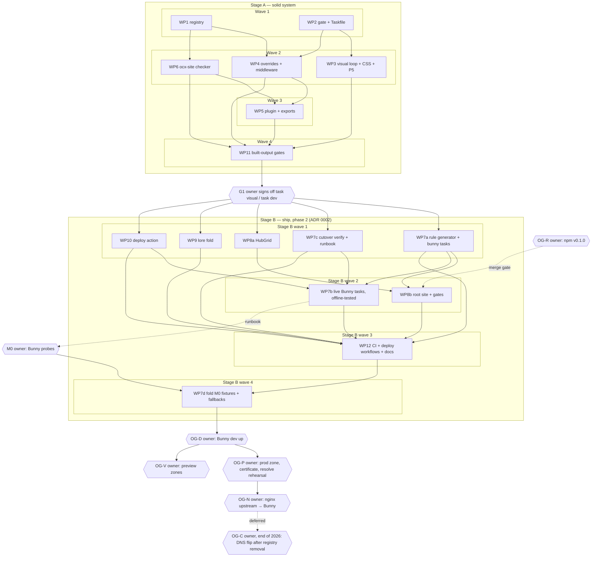

# Plan: ocx.sh website build-out

## Status

- State:   review
- Tier:    xhigh
- Tier-grammar: 5
- Updated: 2026-10-04
- Next:    /hex-finalize

---

## Overview

**Author:** hex-plan (xhigh), owner Michael Herwig
**Date:** 2026-09-27
**Related ADR:** [adr_0001_ocx-site-architecture.md](../adr/adr_0001_ocx-site-architecture.md),
[adr_0002_phase2-bunny-cutover.md](../adr/adr_0002_phase2-bunny-cutover.md) (Stage B, amends 0001)
**Related Spec:** [design_ocx-site.md](../adr/design_ocx-site.md) — canonical contracts (§7) and scenarios (§8)
for Stage A and for the Stage B IDs this plan marks *kept*; every other Stage B contract is canonical
[here](#stage-b-contracts-phase-2-adr-0002)
**Baseline:** `HANDOVER.md` (amended by ADR H1–H16), local commit `0ac0fda`

Classification: scope large · reversibility **one-way (high)** — published slugs, `nav.json`
v4 schema, npm export map, lore artifact names, apex `/v2` routing · tier xhigh.
Required artifacts: this plan, ADR 0001, [ADR 0002](../adr/adr_0002_phase2-bunny-cutover.md), persisted
research (`.agents/research/`, incl. `phase2_*`).

## Objective

Build a solid system in `ocx-sh/website` first, then ship it. Two stages, split by a hard
owner gate (owner, 2026-09-27: "We first want a solid system"):

- **Stage A — solid system** (WP1–WP6, WP11): the path registry + checker, a mock-faithful
  `@ocx-sh/theme` with the owner live-review loop, and the full local quality gate (oxc +
  typed ESLint, built-CSS contracts, cascade probe, axe, Lighthouse 100×4, pack-smoke). Ends
  at **G1**: the owner signs off `task visual` / `task dev` against the mocks.
- **Stage B — ship, phase 2** (re-planned 2026-09-30, [ADR 0002](../adr/adr_0002_phase2-bunny-cutover.md)):
  the root site `site/` (+ theme `HubGrid`), Bunny-as-code for the dev and prod pull zones and the
  preview zones (rules from `nav.json` + `infra/bunny/legacy.json`, diff apply, read-back), the
  reusable deploy action (incl. `preview` mode, wired into `previews.yml` and a new `site.yml`),
  the cutover verify suite and runbook (legacy proxies and redirects for unmigrated sections, the
  nginx-upstream rehearsal, rollback), CI hardening, and the lore fold. Owner gates carry every live
  step: the npm `v0.1.0` release, API-key runs, the certificate, the hetzner1 nginx upstream switch
  (OG-N) and, at the end of 2026, the DNS flip (OG-C, ADR 0002 Amendment 1).
  *Superseded Stage B text (2026-09-27): "the lore rule + adoption skill" (→ fold, ADR 0002 D10) and
  the `dev.ocx.sh` staging vhost (→ `sh-ocx-dev.b-cdn.net`, ADR 0002 D6.2).*

Every target has `:dev` and `:test`. No consumer repo is touched and no consumer docs move
in this plan.

## Scope

### In Scope

- Stage A: `packages/theme` (registry, schema, checker bin, CSS layer, Starlight overrides, route middleware, `EcosystemMenu`, `./vitepress` CSS); `examples/starlight` (fixture under `/docs/`); gate tooling, Taskfile targets, built-output gates on the example.
- Stage B (2026-09-30): `site/` (root: landing port, `/integrations/` + `/apps/` hubs, `/install/`, 404, robots, sitemap) + `packages/theme/src/components/HubGrid.astro`; `.github/actions/deploy` (`.mjs`, preview mode, prune cap); `infra/bunny` (rules, legacy entries, zone settings, diff apply, verify, onboard incl. previews, purge, gc); `infra/cutover` (verify suite with `--resolve`/`--dns`/`--registry`, old-URL seed, owner runbook incl. the OG-N nginx snippet and rehearsal, the Cloudflare audit and rollback); `skills/ocx-theme-theming/references/design-rules.md` (lore fold); `.github/workflows/{ci,site,previews}.yml`, `dependabot.yml`, `CODEOWNERS`, `zizmor.yml`; HANDOVER/AGENTS amendments.
- *Superseded Stage B scope (2026-09-27): `infra/cutover/{dev.nginx.conf,nginx.conf}` (the nginx change lives as a snippet in `infra/cutover/README.md`, ADR 0002 Amendment 1), `docs/lore/**`, `lore-publish.yml`, `scripts/release/check-version.mjs`, the version bump to `1.0.0`.*

### Out of Scope

- **Every consumer repo** (ocx docs, rules_ocx, SDK, catalog, index): no edits, no deploys, no
  onboarding, no Pages stubs, no docs moved — in either stage. Migrations are separate
  follow-up plans, started only when the owner decides the system is ready (owner re-scope
  2026-09-27; gate answer 1).
- Live hosting steps — owner-local with `BUNNY_API_KEY`, hetzner1 SSH and the Cloudflare
  dashboard: zone creation and applies, the `ocx.sh` certificate, the hetzner1 nginx upstream edit
  (OG-N), and at the end of 2026 the Cloudflare audit and the apex DNS flip (OG-C)
  ([Owner gates](#owner-gates-stage-b)). This plan
  delivers the tasks, runbooks and their offline tests. `dev.ocx.sh` stays as it is.
- The npm `v0.1.0` publish (owner, by hand, `RELEASING.md`).
- Catalog Astro port (HANDOVER phase 5). `lore.ocx.sh` move (stays a subdomain, gate answer 2).
- Visual snapshots in Docker (`visual:test`, `visual:update`) — deferred until the design draft
  stabilises (ADR D5); `task visual` is the fidelity loop.

## Research

Artifacts in `.agents/research/`: `2026-09-27-context.md`, `discover-{architecture,gate,bunny-lore,visual}.md`,
`research-{technology,patterns,domain-bunny}.md`; phase 2 (2026-09-30): `phase2_{bunny,deploy,cutover}.md`. Key inputs: Bunny limit is 50 edge rules
(not 20) and serves directory index natively; the apex nginx `~ /v2/` match is unanchored (live
`/docs/v2/` bug); Starlight ships six `starlight.*` sub-layers and moved to JS + `.d.ts`; oxlint
type-aware is stable, oxfmt weak on `.astro`; Lost Pixel is dead; no Bunny OIDC; npm OIDC cannot
publish a first version; the current theme deviates from mock #1b in sidebar, code frames, page
title, measure, H2 rhythm, breadcrumb, footer, mobile header.

## Technical Approach

Canonical: ADR 0001 (decisions D1–D5, amendments H1–H16, probes P1, P3–P6, milestone M0) and the
design doc (§1 registry, §2 Bunny, §3 deploy, §4 theme, §5 lore, §6 gate matrix). This plan does
not restate them.

### Key Decisions

| Decision | Rationale |
|---|---|
| `nav.json` v4 `claims[]` is the single path registry; `registry.mjs` is pure and shared by plugin, checker, deploy action, Bunny rules | one source, no drift (D1.1, D2.3) |
| One `@layer ocx` after `starlight`; consumer unlayered wins | css-theming CSS-CAS-02; F3 (D2.2) |
| Ship `.mjs` + JSDoc, `.d.mts` generated at `prepack`; `.astro`/`.css` as source | strict consumers, no dev build (D2.1) |
| Per-repo storage zone behind one pull zone (M0-gated, fallback C) | write isolation without OIDC (D1.2). *Amended: HTTP-API zones, two pull zones `sh-ocx-dev` + `sh-ocx` (ADR 0002 D6.2)* |
| No purge in CI; deploy prunes stale HTML only; owner `bunny:gc` for assets | API key never in CI; no missing asset by construction (D1.3) |
| ~~Staged hosting: `dev.ocx.sh` vhost → Bunny (noindex staging) first; later the `ocx.sh` vhost swap (anchor `/v2/` + token realm, `location /` → Bunny) + Cloudflare "respect headers"; DNS → Bunny after registry removal~~ | SUPERSEDED by ADR 0002 D8 (owner, 2026-09-30) |
| Two stages with a hard owner gate G1 between them | solid system before anything ships (owner) |
| ~~Deploy = node24 JS action in this repo, zero deps, released with the theme tag from `1.0.0`~~ | SUPERSEDED by ADR 0002 D7: `.mjs`, `0.x`, no floating tag |
| ~~Lore authored in `docs/lore/`, published from here (P4-gated)~~ | SUPERSEDED by ADR 0002 D10 (fold into `ocx-theme-theming`) |
| Taskfile + root `package.json` owned by WP2, which pre-declares every target and every root devDep | keeps all other WPs file-disjoint |
| Stage B: Bunny-as-code = own `.mjs` in `infra/bunny/`; rules derived from `nav.json` + `infra/bunny/legacy.json`; diff apply by `ocx:` description, read-back; dev before prod | ADR 0002 D6.1, D6.3 |
| ~~Stage B: early DNS flip with legacy rules …~~ | SUPERSEDED by ADR 0002 Amendment 1 |
| Stage B: nginx interim. Cloudflare DNS stays; hetzner1 nginx `location /` → Bunny `sh-ocx` with `Host`/SNI `ocx.sh` (OG-N); legacy rules proxy `pages.dev` (path-identical) and 302 path-shifted sections; apex flip (certificate first, `--resolve` rehearsal, DNS-only flattened CNAME) deferred to OG-C, end of 2026 | ADR 0002 AM1, D8.2, D8.3 |
| ~~Stage B: registry at the flip = R1 behind P-C4~~ → registry stays on hetzner1 nginx until retirement; no registry rules on Bunny | ADR 0002 AM1 (D8.4 closed) |
| Stage B: `taskfiles/bunny.yml` owned by WP7a, which pre-declares every `bunny:*` target; workflow files only in WP12 | keeps the Stage B pipelines file-disjoint |

## Component Contracts

Canonical text: [design_ocx-site.md §7](../adr/design_ocx-site.md#7-component-contracts) —
**not duplicated here** so the two cannot drift; worker briefs carry the verbatim excerpt.
Index for coverage:

| IDs | Surface |
|---|---|
| C-001…C-010 | registry, `nav.json` v4, schema, `activeSection`, CODEOWNERS |
| C-011…C-014, C-070 | `ocx-site check` (link, layout, Pagefind version) |
| C-015…C-034 | theme plugin, overrides, cascade probe, built-CSS gate, contrast, exports, pack-smoke, vitepress CSS, `./nav` |
| C-035…C-046 | deploy action (inputs, order, retry, prune, dry-run, masking), index.ocx.sh guard, release. C-042 REMOVED |
| C-047…C-054, C-072 | Bunny-as-code (plan, rules, apply/verify, zone, onboard, purge, cutover verify, gc) |
| C-055…C-059, C-071 | task targets (`:dev`/`:test`, `check`, lighthouse, visual, dev, missing-dist) |
| C-060…C-066 | lore rule, generated tokens, css-theming boundary, skill, deploy-job ref, grim build, publish. **Superseded** by C-332 (ADR 0002 D10) |
| C-067…C-069 | root site hubs, robots, 404 |
| C-303…C-334 | Stage B, phase 2 (below; canonical here) |

### Stage B contracts (phase 2, ADR 0002)

Canonical text for Stage B. Status of each older ID: **kept** = design §7 text unchanged, still
implemented; **amended** = the text below replaces design §7; **superseded** = not implemented, the
named ID replaces it. Offline tests only: Bunny, GitHub and live hosts are faked (`node:http` fakes,
recorded Bunny API JSON under `infra/bunny/fixtures/`, Playwright routes). No test needs a key or
the network.

| Older ID | Status | Note |
|---|---|---|
| C-010 | kept | CODEOWNERS; C-331 adds `infra/bunny/legacy.json` |
| C-015 | amended (Spec Delta WP5, record only) | the plugin takes one option, `breadcrumbs`; no Stage B work |
| C-021 | superseded by C-308 | |
| C-035 | amended (below) | |
| C-036…C-041, C-044, C-045 | kept | read "`deploy.ts`" as `deploy.mjs` |
| C-043 | kept | asserted inside C-325 |
| C-046 | superseded by C-324 | first release `0.1.0` by hand, no floating tag |
| C-047 | amended (below) | |
| C-048 | superseded by C-311, C-312 | |
| C-049 | kept | rules 1–2 add a `StatusCode` = 200 trigger (ADR 0002 D6.4); asserted in C-312 |
| C-050 | superseded by C-315, C-316 | |
| C-051 | amended (below) | |
| C-052 | superseded by C-317 | |
| C-053 | kept | |
| C-054 | superseded by C-325 | |
| C-055 | amended (below) | |
| C-056 | superseded by C-328 | CI keeps the gate matrix (AGENTS.md H14) |
| C-057 | superseded by C-309 | the URL list is derived, not listed |
| C-060…C-066 | superseded by C-332 | C-064's workflow assertions move into C-323 |
| C-067, C-069 | kept | |
| C-070 | kept | asserted for `site/dist` inside C-305 (WP8b) |
| C-071 | kept | asserted for `site/dist` inside C-310 (WP8b) |
| C-068 | superseded by C-304 | |
| C-072 | kept | `gc` imports the C-322 storage client |

#### Root site (WP8a, WP8b)

- **C-303** (WP8a) `HubGrid.astro` (under `packages/theme/src/components/`, reached through the
  existing `./components/*.astro` export) renders a hub from `nav.json`: one group per hub category in
  `nav.json` order, each entry under its category. It satisfies C-067: a `planned` entry is labelled
  "planned" and has no `href`; an external entry has an ↗ icon and an accessible "(external)" text.
  It has a showcase page under `examples/starlight/src/content/docs/components/` with
  `src/stories/hub-grid/default.mdx`. `skills/ocx-theme-components` names it, and
  `skills-coverage.test.ts`, the showcase-coverage test and a Container API test pass.
- **C-304** (WP8b) `site/dist/robots.txt` contains `User-agent: *`, `Allow: /` and exactly one
  `Sitemap: https://ocx.sh/sitemap-index.xml` line, and no `Disallow: /`. `site/dist/sitemap-index.xml`
  exists and lists only URLs under the root claims, all with a trailing slash. (Section sitemaps join
  robots when each section migrates, in phase 3.)
- **C-305** (WP8b) `site/` is a workspace app (`site/package.json`, `@ocx-sh/theme: workspace:*`)
  with `ocxTheme()`, `base: '/'`, `trailingSlash: 'always'`. After `task build`,
  `ocx-site check --dist site/dist --repo ocx-sh/website` exits 0 with `search: true` on `/`, so the
  C-070 Pagefind-version check runs on the root bundle, and the dist has `index.html`,
  `integrations/index.html`, `apps/index.html`, `install/index.html` and `404.html`, with no top-level
  directory besides those claims, `_astro/` and `pagefind/`.
- **C-306** (WP8b) The landing (`/`) has: the hero (name `ocx`, text and tagline from
  `ocx/website/src/index.md`) with actions to `/docs/getting-started`, `/install/` and
  `/docs/user-guide`; an install tab set with the five shells (`sh`, `pwsh`, `nu`, `fish`, `elvish`)
  whose commands come from one module, `site/src/install.mjs`; four feature cards with Lucide
  icons; five "how it works" sections built on `FeatureSection`; and the early-development banner.
  A dist test asserts: no `/licensed/` URL anywhere in `site/dist`; each install command appears
  verbatim; every ``/`<svg>` has a reserved box (the images-blocked e2e covers layout); every
  `href` in `site/dist` that falls under a `legacy.json` proxy claim has no trailing slash (ADR 0002
  F15: a cached Pages 308 would loop once phase 3 adds the slash 301).
- **C-307** (WP8b) `/install/` renders the same five commands by importing `site/src/install.mjs`
  (asserted by a test that the landing and install pages carry byte-identical command strings), the
  `ocx-sh/setup-ocx` step, and links to `https://setup.ocx.sh/` and `/docs/installation` (no-slash
  form while `/docs/` is legacy, C-306).
- **C-308** (WP8b, replaces C-021 and probe P6) An e2e test serves `site/dist` at `/` with the
  example dist at `/docs/` from one origin. (a) A query that matches both sections returns hits from
  both, each labelled with its section. (b) With Playwright routes making `/docs/pagefind/*` 404 and
  `/integrations/bazel/pagefind/*` 302 to a 404, the same query still returns root hits, and the page
  logs no uncaught error. If (b) cannot pass, the WP applies the ADR 0002 D9 fallback in `site/`:
  the search config drops every `mergeTargets(nav, '/')` entry whose claim `infra/bunny/legacy.json`
  still lists, at build time (a test pins it against the committed `legacy.json`). `nav.json` is not
  touched and no theme release follows. It records the fallback as a Spec Delta.
- **C-309** (WP8b, replaces C-057) `task lighthouse` audits every page from `examplePages()` plus
  every HTML page of `site/dist`: 100 in all four categories, mobile, on the median of 3 runs.
  `scripts/lhci-stage.mjs` stages the site dist at the stage root without deleting `docs/`.
  `classOf()` maps every site page to exactly one budget class. `scripts/lhci-urls.test.ts` asserts
  that every site HTML page is listed. A new class or a raised value lands only with a Spec Delta row.
- **C-310** (WP8b) `task e2e` covers the site: every site page has a canonical
  `https://ocx.sh<path>` with a trailing slash, the `.ocx-header`, no console error, and an
  identical layout with images blocked. `task e2e` and `task lighthouse` fail with
  `missing dist: site/dist` when the site dist is absent (C-071, asserted by a test that runs both
  with `site/dist` moved away).
- **C-055** (amended, WP7a/WP8b/WP10) Each of `theme`, `site`, `deploy`, `bunny` has a `:dev` and a
  `:test` target (`bunny:dev` = plan for the dev zone), asserted by parsing `task --list-all`. The
  `lore` area is dropped.

#### Bunny as code (WP7a, WP7b)

- **C-047** (amended, WP7a) `task bunny:plan -- --zone <dev|prod|preview:<site>>` needs no
  credentials and no network. Its output is byte-identical across runs (snapshot per zone).
- **C-311** (WP7a, amended AM1) The rule set of zone Z with host set H(Z) (dev `{sh-ocx-dev.b-cdn.net}`; prod
  `{ocx.sh, sh-ocx.b-cdn.net}`; preview `{sh-ocx-preview-<slug>.b-cdn.net}`) is exactly the ADR 0002
  D6.4 table, in this order: asset cache ×2 (C-049, each with a second trigger `StatusCode` = 200),
  `noindex` on H(Z) − {`ocx.sh`}, HSTS on
  `ocx.sh` (prod only), `X-Frame-Options`, one rule group per `legacy.json` entry, one `OriginStorage`
  rule per non-root claiming repo that has no legacy entry, and no registry rule (the four registry rules are superseded by ADR 0002 AM1). A preview zone gets `noindex` and `X-Frame-Options` only. The `noindex` rule's triggers are hostname patterns only (`https://<host>/*`), so a request with Host `ocx.sh` never matches it (AM1: all nginx traffic carries `Host: ocx.sh`). Every
  pattern outside C-049 starts with `https://<literal host of H(Z)>/`. Each trigger has ≤ 5 patterns
  and each rule ≤ 5 triggers. Origin rules are ordered longest path first. Each `Description` is a
  unique `ocx:<id>`. The prod total is ≤ 40; the committed plan has 11 prod and 10 dev rules.
- **C-312** (WP7a, amended AM1) First-match golden: a matcher in `infra/bunny/match.mjs` that simulates Bunny
  patterns (`*` greedy across `/`, literal otherwise; a `StatusCode` trigger matched against the
  probe's status; first origin rule by order wins; header and action rules stack) runs over a probe
  list. The list holds every claim root, `…/x/`, every legacy path, `/apps/catalog/x/` against
  `/catalog/x/`, `/docs/v2/`, `/v2/` (wins no origin rule: root default origin), `/unknown/`, the S-115 set (`/docs/getting-started`,
  `/assets/x.js`, `/logo.svg`), the S-116 deep link `/integrations/bazel/a/`, and `/_astro/x.js` at
  status 200 and at status 404. It asserts each probe's winning origin rule and its header rules
  against a committed golden table: the 404 `_astro` probe gets no cache rule. Each probe carries a
  host: `/` and `/docs/getting-started` on `ocx.sh` get no `noindex`, and on `sh-ocx.b-cdn.net` and
  `sh-ocx-dev.b-cdn.net` they do (AM1). *Superseded (AM1): the `registry-nocoalesce` probes.*
  Example: `/apps/catalog/x/` → `legacy-catalog`, never `legacy-index`; `/docs/v2/` → `legacy-ocx-dirs`.
- **C-313** (WP7a, amended AM1) `bunny:plan` exits 1, naming the rule, when an `OriginUrl` target host is any
  zone host (`ocx.sh`, `*.b-cdn.net` of our zones), when a pattern outside C-049 has `*` before its
  path, or when two origin rules would win the same probe at equal order. It also exits 1 when a Redirect
  target is not an absolute `https://` URL, or when a prod Redirect targets a `*.b-cdn.net` host
  (ADR 0002 AM1: a same-site redirect names `https://ocx.sh/…` literally).
- **C-314** (WP7a, amended AM1) `infra/bunny/legacy.json` validates against `infra/bunny/legacy.schema.json` (and
  shape-only checks in a test): entries `{ id, repo, mode: 'proxy' | 'redirect', origin, paths[] }`,
  and no other top-level key (the optional `registry` block is superseded by ADR 0002 AM1; a
  planted `registry` key fails the schema). `repo` owns a claim in `nav.json`. A `redirect` entry
  maps `<claim>…rest` to `<origin><rest>` with status 302 via `%{Path.N-}`, N = claim depth; for
  example `/integrations/bazel/a/b/` → `https://ocx-sh.github.io/rules_ocx/a/b/`. The committed
  file has the entries of ADR 0002 D6.4 rules 6–11. A path
  added to an entry (e.g. one the C-326 crawl finds) lands with a Spec Delta row.
- **C-315** (WP7b) `task bunny:apply -- --zone <z> [--dry-run]` finds the pull zone by name.
  Against the fake API, it (1) upserts planned rules with explicit `OrderIndex`, then (2) deletes
  only `ocx:*` rules the plan no longer names, never a rule without the prefix, then (3) re-reads
  the zone and exits 1 naming the first field or order difference. The fake asserts that no request
  sequence ever leaves a previously routed origin path without a rule (no delete-all). Before any
  write, it exits 1 naming both counts when |live rules ∪ planned| exceeds `RULE_LIMIT = 50`
  (a fake zone with 45 live rules and 10 new ones gets zero writes). `--dry-run` sends GETs only and
  prints the diff.
- **C-316** (WP7b) `task bunny:verify -- --zone <z>` needs no credentials. On the zone's
  `b-cdn.net` host: each `OriginStorage` claim root returns 200 with a canonical equal to
  `https://ocx.sh<path>`; each proxy probe returns 200 and passes the origin-leak check; each
  redirect probe returns 302 with the golden `Location`; every response carries `X-Robots-Tag`
  containing `noindex`. It exits 1 listing each failed probe. **Origin-leak check** (shared with
  C-325; one module, `infra/cutover/leak.mjs`, owned by WP7c): no `pages.dev` or `github.io` host in `Location`, `Link`, `Content-Location` or a
  `Set-Cookie` domain, nor in the page's own `<link rel=canonical>` or `og:url`; the body must not
  contain `ocx-website.pages.dev`. Third-party `*.github.io` links in the body are allowed (the
  docs link `jqlang.github.io` and others): a fake page carrying one passes.
- **C-051** (amended, WP7b) `task bunny:zone:apply -- --zone <z>` creates the pull zone when absent
  (by name). It sets design §2.3 (edge TTL 60 s, browser `no-cache`, shield, retries,
  stale-while-*) with request coalescing **off** (`EnableRequestCoalescing: false`, ADR 0002 D6.4)
  and `AddHostHeader: false` (the legacy proxies need Pages to see `Host: ocx-website.pages.dev`,
  P7), plus Force SSL on every hostname, the default origin
  (`sh-ocx-website`, or the preview storage zone), and no per-IP rate limit on prod (ADR 0002
  AM1: every visitor reaches Bunny as hetzner1). A bandwidth cap is the owner's choice (AM1: no
  registry bytes on Bunny). It
  reads every value back and exits 1 on a mismatch or on a requested field missing from the GET;
  a planted mismatch test covers `AddHostHeader` and `EnableRequestCoalescing`.
  It never adds a hostname: the owner adds `ocx.sh` in the dashboard (OG-P, needed for OG-N's
  `Host: ocx.sh`), and `zone:apply --zone prod` then asserts that the hostname has a certificate and
  Force SSL.
- **C-317** (WP7b, replaces C-052) `task bunny:onboard -- <repo>` exits 1 when the repo owns no
  claim. Before any Bunny request it checks with `gh api repos/<repo>/environments/<env>` that the
  target environment exists (`ocx.sh`, or `previews` for `--preview`) and otherwise exits 1 naming
  the command that creates it (fake-`gh` test: zero Bunny requests). It creates `sh-ocx-<name>` with the HTTP API (region and replication from one
  constant in `infra/bunny/zones.mjs`) when absent. It sets the zone's 404 path and pipes the zone
  password to `gh secret set BUNNY_STORAGE_KEY --env ocx.sh --repo <repo>` on **stdin**. It is
  idempotent. `-- --preview <site>` does the same for `sh-ocx-preview-<slug>` plus pull zone
  `sh-ocx-preview-<slug>`, with secret `secretName(site)` in this repo's `previews` environment.
  `scripts/previews/sites.mjs` exports `secretName(site)` = `BUNNY_PREVIEW_KEY_` + the slug
  uppercased with `-` → `_` (GitHub secret names allow `[A-Z0-9_]` only; `rules-ocx` →
  `BUNNY_PREVIEW_KEY_RULES_OCX`). Onboard and C-330 both use it.
  A test with a fake `gh` asserts the key is absent from every argv, stdout, stderr and written file.
- **C-318** (WP7a skeleton, WP7b) Secrets hygiene. Every key-reading entry point takes an explicit
  `env` object; only the CLI `main` passes `process.env`. It exits 1 before any request when
  `env.CI` is set or `env.BUNNY_API_KEY` is empty. Tests pass `{ BUNNY_API_KEY: 'fake' }` without
  `CI`, and `{ CI: '1', BUNNY_API_KEY: 'fake' }` for the refusal; one test asserts the suite passes
  with `CI=true` in the outer environment (GitHub Actions sets it). The API client replaces the
  `AccessKey` value with `***` in every thrown error and log line; a test forces 401, 500 and a
  timeout with a fake key and greps all output. `api.mjs` exports `redact(json)`, which the owner's
  fixture-recording path uses, so no fixture is stripped by hand. A test fails when any file under
  `infra/bunny/fixtures/` has a non-empty field whose name matches `/(key|secret|password|token)$/i`
  (e.g. `AccessKey`, `Password`, `ReadOnlyPassword`, `ZoneSecurityKey`, `AWSSigningKey`,
  `AWSSigningSecret`, `LogForwardingToken`), minus an explicit allowlist of known-safe names; a
  planted `ZoneSecurityKey` fixture fails it. `taskfiles/bunny.yml` has no top-level `dotenv` (Task
  3.53.1 rejects it in an included file); `apply`, `zone:apply`, `onboard`, `purge` and `gc` carry a
  task-level `dotenv: ['.env']`, and `test`, `plan`, `verify`, `old-urls`, `cutover-verify` carry
  none (a test parses `bunny.yml`). `.gitignore` covers `.env` and `.env.*` except `.env.example`,
  which holds names with empty values. `task secrets` stays clean.
- **C-319** (WP7b) The API client gives every request an explicit timeout
  (`AbortSignal.timeout`). It retries only GET, at most 3 attempts, on network errors, 5xx and 429
  (honouring `Retry-After`). POST and DELETE are never retried blindly: apply re-reads and re-diffs.

#### Deploy action (WP10)

- **C-035** (amended) `action.yml`: `runs.using: node24`, `main: index.mjs`, code `.mjs` + JSDoc,
  zero dependencies. Inputs `dist`, `storage-key`, `path`, `storage-host`, `dry-run`, `preview`,
  `force-prune`; outputs `url`, `uploaded`, `deleted`. `outputs.url` = `https://ocx.sh<path>`, or the
  preview URL of C-321. Probe P3 is retired.
- **C-320** Prune cap: when the prune would delete more than half of the listed HTML files under
  `path` and at least 10 are listed, the action exits 1 with zero DELETE requests and names the
  count, unless `force-prune: true`. Uploads already done stay (consistent state, C-038).
- **C-321** Preview mode: `preview: <site>` (a name or slug from `scripts/previews/sites.mjs`)
  targets zone `sh-ocx-preview-<slug>` at path `/`. It skips the claim-ownership and layout checks
  (C-013/C-014) and keeps every other step: `index.html` required, checksums, phases, prune, prune
  cap. `outputs.url` = `previewUrl(site)` (`https://sh-ocx-preview-<slug>.b-cdn.net/` until
  `<slug>.preview.ocx.sh` exists; the one place that changes is `sites.mjs`). An unknown site,
  or `preview` together with `path`, exits 1 with zero requests. Without `preview`, any resolved zone
  starting `sh-ocx-preview-` exits 1.
- **C-322** `.github/actions/deploy/storage.mjs` is the only Bunny storage client (the action and
  `infra/bunny/gc.mjs` import it). It lists recursively with ≤ 5 concurrent listings and a depth and
  count cap, and never sends `allowRootDelete`. It sends DELETE only for a listed entry with
  `IsDirectory === false` whose URL does not end in `/` (a directory DELETE removes the tree); the
  fake Bunny fails the test on any DELETE ending in `/` or naming a directory. It replaces the
  `AccessKey` value with `***` in every thrown error, with the same forced 401/500/timeout grep test
  as C-318. It rejects a dist entry that is a symlink, contains `..`, or resolves outside `dist`
  (exit 1 before any request).
- **C-323** `skills/ocx-theme-deploy` (SKILL.md + `references/failure-modes.md`) documents in the
  same commit: consumer triggers `push: main` + daily `schedule` + `workflow_dispatch`, environment
  `ocx.sh`, a SHA-pinned `uses:` with a `# vX.Y.Z` comment and no floating major, the inputs of
  C-035 incl. `preview` and `force-prune`, the prune cap failure, and a failure-modes entry for a
  scheduled workflow GitHub disabled after 60 days without repository activity (symptom: no daily
  run; fix: `gh workflow enable`; push and dispatch stay the real triggers). The skill's workflow template
  passes actionlint and zizmor. `on:` has exactly those three triggers, and every `uses:` is
  SHA-pinned. A test extracts the template from the skill.

#### Cutover (WP7c)

- **C-325** (replaces C-054, amended AM1) `task cutover:verify -- --host <h> [--resolve <ip>] [--dns]
  [--registry]` needs no credentials and prints one named line per check, exiting 1 on any failure:
  every URL in `infra/old-urls.txt` returns 200 or exactly one redirect (301/302/308) to a 200 (no
  chain, no loop; the redirect target is fetched with the same pinning rule); proxied legacy
  responses pass the C-316 origin-leak check (a fake page with a third-party `github.io` link
  passes); a proxied docs page's Home nav link and logo link carry `target="_self"` (the
  `ocx-sh/ocx` VitePress PR of C-327);
  `X-Robots-Tag: noindex` is present when `<h>` ends in `.b-cdn.net` and absent otherwise (`ocx.sh`,
  the rehearsal host `next.ocx.sh`); on every host not under `.b-cdn.net`: HSTS equals
  `max-age=31536000; includeSubDomains; preload`, HSTS and `X-Frame-Options` each appear exactly
  once (nginx and Bunny both set them, ADR 0002 AM1), and no `b-cdn.net` host appears in a
  `Location`, `Link`, canonical or `og:url`; on `ocx.sh` only: `http://ocx.sh/` answers one 301 to
  `https://ocx.sh/`; `/pagefind/pagefind.js` has `cache-control` containing `no-cache` and a
  JavaScript content type; one `/_astro/` asset has `max-age=31536000`; `/robots.txt` has no
  `Disallow: /`, and the **path** of its `Sitemap:` URL returns 200 when fetched on `<h>` with the
  same pinning (the literal `https://ocx.sh/sitemap-index.xml` is the old `pages.dev` site until OG-N;
  a test covers the dev host); C-043. `--registry`: `/v2/` returns 401 with the realm and
  service of ADR 0002 D8.4 unchanged; the token endpoint returns 200; `/docs/v2/` is not a JFrog 401 (through nginx; the
  registry-origin certificate check is superseded by AM1). `--resolve`: the certificate served for
  `<h>` has more than 30 days left (P-N1: Bunny's `ocx.sh` certificate while DNS stays on
  Cloudflare).
  `--dns`: `ocx.sh` `MX` and `TXT` equal `infra/cutover/dns-baseline.json`. `--resolve` pins only
  connections whose host equals `<h>` to `<ip>`, with SNI and Host `<h>`; every other host (a 302 to
  `index.ocx.sh` or `ocx-sh.github.io`) resolves normally, and a test redirects to a second fake
  host that must be reached through normal lookup. Tests run each check against a fake server that
  passes, then against one that breaks exactly that check.
- **C-326** (amended AM1) `task bunny:old-urls` crawls `https://ocx.sh/` and `/docs/` (same-host links plus every
  same-host `href`/`src` asset, capped at 2,000 URLs, sorted, deduped, skipping `/v2/` and `/artifactory/` because nginx serves
  them, ADR 0002 AM1) into `infra/old-urls.txt`,
  which is committed. It keeps only URLs that answer 200 or exactly one redirect to a 200 today, so
  a URL already broken or chained on the live site cannot make C-325 red forever. A test runs it
  against a fake site graph and asserts the cap, same-host filter, the today-healthy filter and
  determinism. The committed seed is produced by the WP7c agent with a read-only crawl.
- **C-327** (amended, ADR 0002 AM1) `infra/cutover/README.md` is the owner runbook for OG-D, OG-P,
  OG-N, OG-V and the deferred OG-C and OG-T: each step names its verify command and its rollback.
  Its first step creates the environments `ocx.sh` and `previews` (deployment branch `main`), and it
  needs the merged `ocx-sh/ocx` PR that sets `target: '_self'` on the VitePress Home nav item and
  `logoLink` (else readers navigating from proxied docs get the retired landing from the SPA; C-325
  checks it from OG-D on). OG-N holds: the Cloudflare cache audit (no cache rule or Edge TTL override
  on `ocx.sh`, Browser Cache TTL "respect existing headers"); the temporary `next.ocx.sh` rehearsal
  block and `cutover:verify -- --host next.ocx.sh --registry`; the ADR 0002 AM1 nginx snippet
  verbatim; the switch of `ocx.sh` `location /`; rollback = revert `location /` to
  `ocx-website.pages.dev` and reload nginx. A test extracts the snippet and asserts `Host ocx.sh`,
  `proxy_ssl_server_name on`, `proxy_ssl_name`, `proxy_redirect` to `https://ocx.sh/`,
  `proxy_hide_header` for HSTS and `X-Frame-Options`, and no `proxy_cache`. OG-C (deferred, end of
  2026, after the registry leaves hetzner1) keeps the Cloudflare audit checklist, the recorded
  Cloudflare SSL mode, the zone export, a renewal of the hetzner1 `ocx.sh` certificate with its expiry
  recorded as the rollback deadline (after it, rollback starts with a DNS-01 re-issue), and the
  `--resolve <bunny ip>` rehearsal rerun. A test asserts that every `task …` command it names exists
  in `task --list-all`. *Superseded (AM1): the OG-Q1 `origin.ocx.sh` step and the R2 fallback
  snippet.*

#### CI, release, lore (WP12, WP9)

- **C-324** (replaces C-046, WP12) A test parses `release.yml`: trigger tag `v[0-9]+.[0-9]+.[0-9]+`,
  a verify job (tag = `packages/theme/package.json` version, tag on `main`), gate, npm publish
  with provenance and skip-if-published, grim publish. No step creates, moves or pushes a tag
  matching `^v[0-9]+$`. `RELEASING.md` states that `v0.1.0` is the owner's first release by hand and
  that consumers pin SHAs.
- **C-328** (replaces C-056, WP12) A test parses every file in `.github/workflows/`: top-level
  `permissions: {}`; every `actions/checkout` has `persist-credentials: false`; every `uses:`
  except `./…` is pinned to a 40-hex SHA with a version comment; every job that reads `secrets.*`
  other than `GITHUB_TOKEN` has `environment:`. `ci.yml` keeps the matrix `[check, e2e, lighthouse,
  pack]` and adds jobs `zizmor` (SHA-pinned action, `.github/zizmor.yml` makes `ocx-sh/*`
  hash-pinned) and `secrets` (`ocx exec -- task secrets`).
- **C-329** (WP12) `.github/workflows/site.yml`: triggers `push` to `main` (paths `site/**`,
  `packages/theme/**`, `pnpm-lock.yaml`), daily `schedule`, `workflow_dispatch`. A build job
  (`contents: read`) uploads `site/dist`. A deploy job has `environment: ocx.sh`,
  `if: github.ref == 'refs/heads/main' && vars.BUNNY_DEPLOY == 'true'`,
  `concurrency: { group: deploy-root, cancel-in-progress: false }`, `permissions: {}`, and calls
  `./.github/actions/deploy` with `storage-key: ${{ secrets.BUNNY_STORAGE_KEY }}`. Before OG-D
  the deploy job is skipped, not failed.
- **C-330** (WP12) `previews.yml`: the "not wired" step is replaced by one deploy step per site, each
  calling `./.github/actions/deploy` with `preview: <site>` and only its own secret
  `secrets.<secretName(site)>` (the test asserts the name equals `secretName(site)` for all four
  sites), each carrying `if: inputs.site == '' || inputs.site == '<name>'` so a single-site dispatch
  skips the unbuilt ones (asserted on every step), in a job with `environment: previews`, gated by
  `vars.PREVIEWS_DEPLOY == 'true'` and `main`. No dynamic `secrets[...]` indexing and no
  `toJSON(secrets)`; zizmor is clean. `sites.mjs` `previewUrl` returns the `b-cdn.net` URL.
- **C-331** (WP12) `.github/dependabot.yml` has `npm` (root) and `github-actions` with
  `cooldown.default-days: 7`. `.github/CODEOWNERS` assigns `packages/theme/src/nav.json` and
  `infra/bunny/legacy.json` to the owner (C-010 test extended).
- **C-332** (WP9, replaces C-060…C-066) `skills/ocx-theme-theming/references/design-rules.md` holds
  HANDOVER's `ocx-design` rules as do/don't pairs. A rule that restates a generic CSS rule cites its
  `css-theming` ID instead. `SKILL.md` links it. `ocx exec -- grim publish --dry-run --version 0.0.0`
  exits 0. No new artifact name joins `bundles/ocx-theme.toml`.
- **C-333** (WP12, needs WP7a, WP7c, WP8b, amended AM1) Offline old-URL coverage: every path in
  `infra/old-urls.txt` either exists in `site/dist` or wins a legacy rule of the prod plan under the
  C-312 matcher (`infra/bunny/match.mjs`), probed with host `ocx.sh` (the host every nginx request
  carries, ADR 0002 AM1). A path under `/v2/` or `/artifactory/` fails it (nginx-only, never seeded). A planted uncovered path fails it. The fix for a real miss
  is a `legacy.json` path addition with a Spec Delta (C-314).
- **C-334** (WP15, before OG-R) `skills/ocx-theme-deploy/SKILL.md` starts with a status line: the
  deploy action ships in a later 0.x; do not wire it yet. Its workflow template has no `tags:`
  trigger. A test asserts both. WP10 rewrites the skill later and drops the status line.

## User-Experience Scenarios

Canonical: [design_ocx-site.md §8](../adr/design_ocx-site.md#8-ux-scenarios) — S-001 owner live
review · S-002 consumer adopts · S-003 deploy failure mid-upload · S-004 new integration path ·
S-005 nav change propagates · S-006 publish lore · S-007 docker pull after cutover · S-008 old
URL visit · S-009 ocx CLI after cutover.

Stage B status: S-003, S-009 **kept** (S-009 tested through C-043 in WP7c). S-005 **kept,
cross-repo, not testable here** (design §8 says so). S-002 **amended** (skill names `ocx-theme-setup` +
`ocx-theme-deploy`; environment `ocx.sh`; onboard per C-317). S-004 **amended** (onboard → first
deploy → delete the legacy entry → apply dev, verify, apply prod = S-120). S-006 **superseded**
(lore fold, C-332). S-007 **superseded** by S-119. S-002 is tested by C-323 (WP10) and C-317
(WP7b); S-004 by the S-120 plan-diff test (WP7a). S-008 **moved to phase 3** (Pages stubs live in
consumer repos). New scenarios, canonical here:

| ID | Actor → action | Expected outcome | Error cases |
|---|---|---|---|
| S-114 Owner brings up Bunny dev (OG-D) | owner: creates environments `ocx.sh` and `previews` (branch `main`) → `task bunny:onboard -- ocx-sh/website` → `bunny:zone:apply -- --zone dev` → `bunny:apply -- --zone dev` → sets `BUNNY_DEPLOY=true` → dispatches `site.yml` | root site on `https://sh-ocx-dev.b-cdn.net/`, `/docs/…` proxied from Pages, `/catalog/x` 302 → `index.ocx.sh/x`, every response `noindex`; `bunny:verify -- --zone dev` and `cutover:verify -- --host sh-ocx-dev.b-cdn.net` green | environment missing → onboard exit 1 before any Bunny request, naming the command (C-317); key unset or `CI` set → exit 1 before any request (C-318); read-back differs → exit 1 naming the field (C-315, C-051); secret missing in `ocx.sh` env → deploy exit 1, zero requests (C-036) |
| S-115 Reader opens a legacy docs page through Bunny | browser → `https://ocx.sh/docs/getting-started` after OG-N (Cloudflare → nginx → Bunny, ADR 0002 AM1) | same bytes as Pages today: 200, all root assets (`/assets/`, `/icons/`, `/logo.svg`) 200 through rules 6–7, no `pages.dev` visible | Pages down → Bunny serves stale (stale-while-offline) or 502; `/docs/getting-started/` → one relative 308 hop (F15) |
| S-116 Reader follows a hub link to an unmigrated GitHub Pages section | click `/integrations/bazel/` on `/integrations/` | 302 → `https://ocx-sh.github.io/rules_ocx/`; deep link `/integrations/bazel/a/` → `…/rules_ocx/a/` | page absent there → GitHub 404 (accepted until phase 3) |
| S-117 Owner rehearses prod before nginx switches (OG-P) | owner adds `ocx.sh` to pull zone `sh-ocx` by Seamless Domain Migration (TXT in Cloudflare), then `cutover:verify -- --host ocx.sh --resolve <bunny ip>` | certificate valid for `ocx.sh`; every check of C-325 green against Bunny while the public still reaches `pages.dev` through nginx | certificate not issued → no OG-N (P-C1 fallback); any red line → fix, re-apply dev → prod, rerun |
| S-118 DNS flip and rollback (OG-C, deferred to the end of 2026, after the registry leaves hetzner1) | owner exports the Cloudflare zone, sets apex = DNS-only CNAME `sh-ocx.b-cdn.net`, TTL 60, runs `cutover:verify -- --host ocx.sh --dns` from the public internet | green; `MX`/`TXT` unchanged; 48 h watch shows no `ocx.sh` HTML on hetzner1 | any red check → restore the exported records; traffic returns within 60 s, the Cloudflare certificate (Universal SSL kept on) satisfies HSTS |
| S-119 `docker pull` / `ocx install` after OG-N (replaces S-007; amended AM1) | user pulls `ocx.sh/<ns>/<pkg>` | unchanged path: Cloudflare → hetzner1 nginx → JFrog; token realm unchanged; no registry byte touches Bunny; `cutover:verify -- --host ocx.sh --registry` green at OG-N. *Superseded: the R1 path via rules 12–15* | `/v2/` answered by Bunny (the switch replaced a registry location) → revert per S-123 |
| S-123 nginx upstream → Bunny and rollback (OG-N, ADR 0002 AM1) | owner: Cloudflare cache audit → `cutover:verify -- --host next.ocx.sh` (DNS-only end-state rehearsal) → temporary `edge.ocx.sh` vhost with the AM1 snippet → `cutover:verify -- --host edge.ocx.sh --registry` → switches `ocx.sh` `location /`, reloads nginx → `cutover:verify -- --host ocx.sh --registry` → 48 h watch | green: root site and legacy sections served by Bunny with `Host: ocx.sh`; no `noindex` on `ocx.sh` (`next.ocx.sh` and `b-cdn.net` carry it; ADR 0002 Amendment 2); HSTS and `X-Frame-Options` once each; no `b-cdn.net` in any `Location`; `/v2/` still JFrog | any red check → revert `location /` to `ocx-website.pages.dev`, reload (seconds, no DNS change); certificate not verifiable → P-N1 fallback 1 (SNI `sh-ocx.b-cdn.net`) |
| S-120 A section migrates (phase 3 hook) | repo onboarded, first deploy to its zone, PR deletes its `legacy.json` entry → owner `bunny:apply` dev → `bunny:verify` → apply prod | the path switches from proxy/302 to `OriginStorage` with no unrouted moment (C-315 upsert before delete); plan snapshot diff shows exactly −legacy +`repo-<name>` | verify red on dev → prod not applied; revert the PR and re-apply |
| S-121 Preview deploy (OG-V) | owner confirms environment `previews` exists (created at OG-D), runs `bunny:onboard -- --preview <site>` ×4, sets `PREVIEWS_DEPLOY=true`, dispatches `previews.yml` | each site at `https://sh-ocx-preview-<slug>.b-cdn.net/`, `noindex`; production zones untouched | a site's secret missing → its step exits 1 with zero requests; wrong key → 401 on list, exit 1 (C-036) |
| S-122 First npm release (OG-R) | owner follows `RELEASING.md`: tag `v0.1.0`, publish by hand, then configure the trusted publisher | `@ocx-sh/theme@0.1.0` on npm; `release.yml` for the tag skips npm (already published) and publishes the skills | version ≠ tag → verify job red; ghcr packages private → set Public (RELEASING.md) |

## Milestone M0 — Bunny probes (owner-run)

| Item | Value |
|---|---|
| Who / how | owner with `BUNNY_API_KEY`; runbook `infra/bunny/README.md` (lands with WP7b; M0 may run earlier by hand). Recorded GETs pass through `api.mjs` `redact()` (C-318) before they leave the owner's machine |
| Probe | P1 on the dev pull zone `sh-ocx-dev` plus one scratch HTTP-API storage zone (amended 2026-09-30: **no S3 zones**, ADR 0002 A1), plus P7–P9 (ADR 0002 › Probes) |
| Pass criteria | (1) an `OriginStorage` rule routes `/<prefix>/x` to zone B with the path kept; (2) `/<prefix>/` and `/<prefix>` serve `index.html` with 200; (3) a miss under the prefix returns zone B's `bunnycdn_errors/404.html` with 404; (4) the rule JSON (`ActionParameter1`) read from a dashboard-made rule is recorded as a fixture; P7 bare `OriginUrl` to `pages.dev` keeps the path and, with `AddHostHeader: false`, Pages sees `Host: ocx-website.pages.dev`; P8 redirect `%{Path.N-}` keeps the rest and the query; P9 `pagefind.js` is JavaScript and compressed |
| Side answers | a storage write auto-purges the pull-zone cache? (yes → ADR D1.3 v) |
| Not in M0 | ~~P3~~ retired (ADR 0002 D7: `.mjs`); P-C1 runs at OG-P, P-N1 at OG-N, P-C3 at OG-C/OG-T; ~~P-C4~~ dropped (ADR 0002 AM1) |
| Gates | WP7d (fixture fold), then the owner's first live runs at OG-D. The `repo-*` `OriginStorage` rules (phase 3) need P1 (1)–(3); rules 6–11 need P7/P8. Offline code and tests proceed without it |
| Result | done 2026-10-05, run by the agent under ADR 0002 AM2 (no dashboard: every probe rule written through `POST /pullzone/<id>/edgerules/addOrUpdate` on `sh-ocx-dev`, an API-written rule that routes being the stronger evidence for our code). **P1 pass**: `/m0/x.txt` 200 body `x`; `/m0/` and `/m0` 200 body of `m0/index.html`; `/m0/missing` 404 body of the zone's own `bunnycdn_errors/404.html`. Rule shape: `ActionType` 17, `ActionParameter1` = storage zone **Id** (string), `ActionParameter2` = zone **name**; the API refuses a missing or mismatched pair (`edgerule.invalid`, "Storage zone not valid"), so name alone (what the hand-written planner emitted) never applies. **P7 pass**: bare `OriginUrl https://ocx-website.pages.dev` on `/docs/*` kept the path; `/docs/getting-started` (the origin's `/docs/` is a 404, `/` is 200) answered 200 with the Pages page and Cloudflare headers; `AddHostHeader` was `false` before and after, nothing changed. **P8 pass, with a caveat**: Redirect `ActionType` 1, `ActionParameter2` = status (301 and 302 both honoured); `/m8/a/b/?q=1` with `%{Path.1-}` gave `Location: https://index.ocx.sh/a/b/?q=1`; `%{Path.2-}` on `/m8/x/a/b/?q=1&r=2` kept the rest and the query. Without a query the tail's trailing slash is dropped (`/m8/x/a/b/` gives `.../a/b`); no per-page fallback needed (Spec Delta WP7d). **P9 pass**: `pagefind.js` served `content-type: application/javascript`, `content-encoding: br` for `br, gzip` and `gzip` for `gzip`, none without. **Side answer**: a storage write does not purge the pull-zone cache (changed `m0/x.txt` still `CDN-Cache: HIT` with the old body after 10 s), so ADR D1.3 v stays: deploy purges. Also recorded: `StatusCode` trigger is type 8 (a rule with Url + status 200, `TriggerMatchingType` 1, added its header on a 200 and not on a 404); `OrderIndex` is kept as sent; edge-rule `addOrUpdate` returns the rule. Fixtures: `infra/bunny/fixtures/p1-pullzone.json`, `p1-storagezone.json`, `p7-pullzone.json`, `p8-pullzone.json`, `p-statuscode-pullzone.json` (cumulative: each holds the probe rules live when it was recorded). Probe rules, the scratch zone and the dev cache were deleted afterwards |
| Decision | Topology **B** (P1 (1)–(3) pass), 2026-10-05; no P7/P8/P9 fallback taken |

## Gate G1 — owner sign-off (end of Stage A)

| Item | Value |
|---|---|
| Who / how | owner runs `task dev` + `task visual -- --watch` against the `.tmp/design/` mocks (S-001) |
| Pass criteria | owner signs off the visual pairs; `task check`, `task e2e`, `task lighthouse`, `task pack` green on the example |
| Gates | every Stage B WP (WP7–WP10, WP12). Nothing in Stage B starts before G1 |
| Result | passed by owner decision 2026-09-30: the owner sequenced phase 2 (visual review continued through the Zag goal loop, `.agents/goals/website-buildout.md`) |

## Owner gates (Stage B)

**State 2026-10-04 (owner delegation).** OG-R is done: `@ocx-sh/theme@0.1.0` is on npm and the skills are on ghcr (tag `v0.1.0`). The owner created the Bunny storage zone `sh-ocx-website` and pull zones `sh-ocx`, `sh-ocx-dev` (zone names throughout this plan use these), and put `BUNNY_API_KEY` and `CLOUDFLARE_API_TOKEN` in the gitignored repo-root `.env`. The agent now runs the Bunny zone scripts and the Cloudflare DNS and certificate steps locally (never in CI) and edits the hetzner1 nginx config itself (`ssh hetzner`; never `*/data/`, never `sshd_config`). `next.ocx.sh` is already a DNS-only CNAME to `sh-ocx.b-cdn.net` with a Bunny certificate, so the OG-N rehearsal runs on it directly, and the nginx hop is rehearsed on a throwaway `edge.ocx.sh` vhost. `bunny:onboard` adopts the existing zones. The open `/v2/` question decides whether OG-N is dropped for a direct apex flip.

Owner-only steps. An agent never runs them. It prepares the task, the runbook
(`infra/bunny/README.md`, `infra/cutover/README.md`) and the offline tests. Each gate records its
result here.

| Gate | Owner action | Needs merged | Unblocks | Result |
|---|---|---|---|---|
| OG-R | publish `@ocx-sh/theme@0.1.0` by hand (`RELEASING.md`), then configure the trusted publisher (S-122) | — | WP8b merge (owner sequence: release, then root site) | done 2026-10-04: `0.1.0` published, trusted publisher set by the owner |
| M0 | probes P1, P7–P9 | WP7b (runbook; may run by hand earlier) | WP7d | done 2026-10-05, topology B (Milestone M0 › Result) |
| OG-D | `ocx-sh/ocx` Home-link PR merged (C-327), environments `ocx.sh` + `previews`, Bunny dev up (S-114) | WP7a, WP7b, WP7c, WP7d, WP8b, WP10, WP12 | OG-P, OG-V | partial 2026-10-06: environments, onboard, dev zone and rules up, root site deployed (`BUNNY_DEPLOY=true`), `bunny:verify` green; `cutover:verify` red only on `home-link`, waiting for the `ocx-sh/ocx` Home-link PR. Prod edge rules applied early so `next.ocx.sh` carries `noindex` |
| ~~OG-Q1~~ | superseded by ADR 0002 AM1: registry stays on hetzner1 nginx; no `origin.ocx.sh`, no P-C4 | — | — | superseded |
| OG-P | prod zone apply, hostname `ocx.sh` by Seamless Domain Migration (needed for OG-N's `Host`/SNI `ocx.sh`), Force SSL, `--resolve <bunny ip>` rehearsal (S-117) | OG-D | OG-N | pending |
| OG-N | nginx upstream → Bunny prod: Cloudflare cache audit, `next.ocx.sh` rehearsal + P-N1, switch `ocx.sh` `location /` (AM1 snippet), 48 h watch; rollback = revert upstream (S-123, S-119) | OG-P | phase 3 | pending |
| OG-C | **deferred, end of 2026**, after the registry leaves hetzner1: Cloudflare audit + SSL mode → runbook, zone export, hetzner1 `ocx.sh` certificate renewed and expiry recorded (rollback deadline), `--resolve <bunny ip>` rehearsal rerun, apex flip, 48 h watch (S-118) | OG-N, registry removed | OG-T | deferred |
| OG-T | two stable weeks after OG-C → TTL 1 h, P-C3, hetzner1 retired | OG-C | — | deferred |
| OG-V | preview zones and secrets, `PREVIEWS_DEPLOY=true` (S-121) | WP7b, WP10, WP12 | — | pending |

## Contract wave

The stubs plus contract tests for every cross-pipeline contract, committed once before any
pipeline starts; that commit is the base of every pipeline branch. A step that edits one of these
files is detected by `git diff` against the wave commit and the affected pipelines are re-briefed.
Stubs have not-implemented bodies; each contract test is written from the Stage B contracts, never
from the stub, and stays red until the producer pipeline lands. Stubs that only one pipeline
uses are step 1 of that pipeline, not here. The tests live in the files the producer pipeline owns
(except the new `leak.test.ts`), so the producer extends them.

| Contract | Stub | Contract test | Producer → consumers |
|---|---|---|---|
| Storage client (C-322) | `.github/actions/deploy/storage.mjs`: list recursively, upload, delete, all throwing | `.github/actions/deploy/test/storage.test.ts` against `fake-bunny.ts`: DELETE only for a listed entry with `IsDirectory === false` and a URL not ending in `/`; `AccessKey` → `***` in a forced 401 | WP10 → WP7b (`gc.mjs`) |
| Legacy data and matcher (C-312, C-314) | `infra/bunny/legacy.schema.json` skeleton, `infra/bunny/legacy.json` with the D6.4 rules 6–11 entries, `infra/bunny/match.mjs` exporting the matcher (planned rules and a probe `{host, path, status}` → winning origin rule plus stacked header rules; throws) | `infra/bunny/legacy.test.ts`: committed entries are `{ id, repo, mode, origin, paths[] }` with no other top-level key, a planted `registry` key fails; matcher: `/apps/catalog/x/` → `legacy-catalog`, never `legacy-index` | WP7a → WP8b (C-306 no-slash test, C-308 fallback), WP12 (C-333) |
| Preview site names (C-317, C-321, C-330) | `scripts/previews/sites.mjs`: `secretName`, `previewZone`, `previewUrl` (throw) | `scripts/previews/sites.test.ts`: `secretName('rules-ocx')` = `BUNNY_PREVIEW_KEY_RULES_OCX` (charset `[A-Z0-9_]`); `previewUrl(site)` = `https://sh-ocx-preview-<slug>.b-cdn.net/` | WP10 → WP7b (`onboard.mjs`), WP12 (`previews.yml` test) |
| `redact()` (C-318) | `infra/bunny/api.mjs`: `redact(json)` (throws) | `infra/bunny/api.test.ts`: every field named `/(key\|secret\|password\|token)$/i` in a planted zone JSON comes back empty | WP7b → WP7d (fixture recording) |
| Origin-leak check (C-316, C-325) | `infra/cutover/leak.mjs`: one pure function over a response's headers and body returning the findings (throws) | `infra/cutover/leak.test.ts`: `pages.dev` or `github.io` in `Location`, `Link`, `Content-Location`, a `Set-Cookie` domain, `<link rel=canonical>` or `og:url` is a finding; a body with a third-party `jqlang.github.io` link is not | **Declared home: WP7c** (owns `infra/cutover/`); WP7b `verify.mjs` (C-316) and WP7c `verify.mjs` (C-325) import it, so WP7b depends on WP7c |
| Install commands (C-306, C-307) | `site/src/install.mjs`: the five shells' commands (throw) | `site/src/install.test.ts`: exports exactly `sh`, `pwsh`, `nu`, `fish`, `elvish` | WP8b (landing and `/install/` import it; the one-module rule is pinned from two test files) |

## Parallelization

| Pipeline | Scope | Expected Files | Wave | Depends on | Marks | Status |
|---|---|---|---|---|---|---|
| WP1 | Registry: C-001…C-009, C-034 | `packages/theme/src/{nav.json,nav.schema.json,registry.mjs,nav.mjs}` (`nav.ts` deleted), `packages/theme/src/starlight/Header.astro` (minimal v4 patch), `packages/theme/package.json` (`ajv` devDep, `astro` exact), `packages/theme/test/{registry,nav}.test.ts`, `packages/theme/test/fixtures/nav-invalid/*` | 1 | — |  | merged |
| WP2 | Gate tooling + Taskfile: C-029, C-071 | `Taskfile.yml`, `ocx.toml`, `ocx.lock`, `package.json`, `pnpm-workspace.yaml`, `eslint.config.js`, `.oxlintrc.json`, `.oxfmtrc.json`, `.prettierrc.json`, `.prettierignore`, `tsconfig.json`, `vitest.config.ts`, `playwright.config.ts`, `scripts/css/{outside-layers,literal-colours,dark-parity}.mjs`, `scripts/css/*.test.ts`, `scripts/require-dist.mjs`, `scripts/require-dist.test.ts`, `scripts/lhci-posix-tmpdir.cjs`, `scripts/bin/oxc.sh` | 1 | — |  | merged |
| WP3 | Visual loop + converter + CSS layer + mock fidelity + probe P5: C-030, C-033, C-058, S-001 | `scripts/visual/{visual.mjs,report.html.tmpl,visual.test.ts}`, `tests/visual/pairs.ts`, `scripts/samples/{convert,fetch,convert.test}.ts`, `examples/starlight/src/content/docs/components/*`, `packages/theme/src/{tokens,base,fonts}.css`, `packages/theme/src/starlight/starlight.css`, `packages/theme/src/vitepress/vitepress.css`, `packages/theme/test/{tokens.test.ts,contrast-pairs.ts,vitepress.test.ts}`, `packages/theme/package.json` (only if P5 changes the font source), `Taskfile.yml` (only: drop the `css` report-only flag once theme CSS is layered and dark-parity clean) | 2 | WP2 |  | merged |
| WP3b | Owner-review fix: shell-icon code tabs, design copy button, tabs showcase (S-001) | `packages/theme/src/icons/**`, `packages/theme/src/components/CodeTabs.astro`, `packages/theme/src/starlight/starlight.css`, `packages/theme/test/code-tabs.test.ts`, `scripts/samples/convert{,.test}.ts`, `examples/starlight/src/content/docs/components/*`, `tests/visual/pairs.ts` | 3 | WP3 |  | merged |
| WP13 | Port ocx VitePress components (owner 2026-09-27): Terminal/asciicast player incl. collapsible, Tooltip, file Tree (+Node/Description), PlatformIcons, DependencyExplorer, FeatureSection; converter maps VitePress usages; showcase pages; regression tests per refinement (research `ocx-components-port.md`) | `packages/theme/src/components/{Terminal,Tooltip,Tree,PlatformIcons,DependencyExplorer,FeatureSection}*.astro`, `packages/theme/src/components/*.mjs`, `packages/theme/test/components-*.test.ts`, `tests/e2e/components.spec.ts`, `scripts/samples/{convert,fetch,convert.test}.ts`, `examples/starlight/src/content/docs/components/*`, `examples/starlight/public/casts/**`, `packages/theme/package.json` (player dep + component exports) | 5 | WP5, WP3b |  | merged |
| WP3c | Owner-review fix: table overflow only when columns can't fit; tabs first-paint artifact | `packages/theme/src/starlight/{starlight.css,tab-icons.mjs,MarkdownContent.astro}`, `packages/theme/test/code-tabs.test.ts`, `tests/e2e/tables-tabs.spec.ts` | 5 | WP3b |  | merged |
| WP14 | Primitive set from the design component sheet (owner 2026-09-27: components inconsistent): Button, Input, Select, Combobox, Choice, Tags, Menu, Feedback/Loader (from DependencyExplorer's loading animation) as theme components; ported components (DependencyExplorer first) consume them; code-page load artifact root-caused | `packages/theme/src/components/ui/**`, `packages/theme/src/components/DependencyExplorer*`, `packages/theme/test/ui-*.test.ts`, `tests/e2e/ui-*.spec.ts`, `examples/starlight/src/content/docs/components/*` | 6 | WP13 |  | merged |
| WP4 | Overrides + route middleware: C-023 (markup), C-024…C-027, C-059, S-001 | `packages/theme/src/starlight/{Header,Footer,PageTitle,TableOfContents,ThemeSelect,MobileMenuFooter}.astro`, `packages/theme/src/components/EcosystemMenu.astro`, `packages/theme/src/starlight/{route-middleware,theme-toggle,menu-focusout}.mjs`, `packages/theme/test/{header,theme-select,chrome,route-middleware}.test.ts`, `scripts/dev-smoke.test.ts` | 2 | WP1, WP2 |  | merged |
| WP5 | Plugin + exports + `bin` + prepack `.d.mts`: C-015…C-020, C-022, C-031 (declared) | `packages/theme/src/starlight/{index.mjs,ec.mjs}` (`index.ts` deleted), `packages/theme/package.json`, `packages/theme/tsconfig.dts.json`, `packages/theme/.gitignore`, `packages/theme/test/plugin.test.ts`, `examples/starlight/astro.config.mjs`, `.oxfmtrc.json` + `.prettierignore` (bring `packages/theme/**` into fmt scope) | 3 | WP4, WP6 |  | merged |
| WP6 | Checker `ocx-site`: C-011…C-014, C-070 | `packages/theme/bin/ocx-site.mjs`, `packages/theme/src/check/{links,layout,pagefind,index}.mjs`, `packages/theme/src/nav.mjs` (re-export `PAGEFIND_VERSION`), `packages/theme/test/check.test.ts`, `packages/theme/test/fixtures/dist-*/**` | 2 | WP1 |  | merged |
| WP7a | Rule generator (offline) + bunny task surface: C-047, C-049, C-055 (`bunny`), C-311, C-312, C-313, C-314, C-318 (`.env`, task-level `dotenv`, fixture guard), S-004 + S-120 (plan diff), S-115 + S-116 (golden probes) | `taskfiles/bunny.yml` (every `bunny:*` target pre-declared: `dev`, `test`, `plan`, `apply`, `zone:apply`, `verify`, `onboard`, `purge`, `gc`, `old-urls`, `cutover-verify`), `infra/bunny/{rules.mjs,match.mjs,zones.mjs,legacy.json,legacy.schema.json}`, `infra/bunny/{rules,legacy,taskfile}.test.ts`, `infra/bunny/__snapshots__/**`, `infra/bunny/fixtures/.keep`, `.env.example`, `.gitignore` | 1 | — |  | merged |
| WP8a | Theme `HubGrid` + showcase + skill: C-067, C-303 | `packages/theme/src/components/HubGrid.astro`, `packages/theme/test/hub-grid.test.ts`, `examples/starlight/src/content/docs/components/hub-grid.mdx`, `examples/starlight/src/stories/hub-grid/**`, `skills/ocx-theme-components/**` | 1 | — |  | merged |
| WP7c | Cutover verify suite, old-URL seed, owner runbook (incl. the OG-N nginx snippet): C-043, C-325 (incl. the shared origin-leak check), C-326, C-327, S-009 (via C-043), S-117, S-118, S-119, S-123 | `infra/cutover/{verify.mjs,leak.mjs,seed.mjs,verify.test.ts,leak.test.ts,seed.test.ts,runbook.test.ts,README.md,dns-baseline.json}`, `infra/old-urls.txt` | 1 | — |  | merged |
| WP9 | Lore fold: C-332 | `skills/ocx-theme-theming/SKILL.md`, `skills/ocx-theme-theming/references/design-rules.md` | 1 | — |  | merged |
| WP10 | Deploy action (`.mjs`, preview mode, prune cap, shared storage client) + deploy skill: C-035 (amended), C-036…C-041, C-044, C-045, C-055 (`deploy`), C-320, C-321, C-322, C-323, S-002 (skill side), S-003, S-121 (action side) | `taskfiles/deploy.yml`, `.github/actions/deploy/{action.yml,index.mjs,deploy.mjs,storage.mjs,README.md}`, `.github/actions/deploy/test/{action.test.ts,deploy.test.ts,storage.test.ts,preview.test.ts,fake-bunny.ts,skill-template.test.ts}`, `scripts/previews/sites.mjs` (+ `previewZone`, `previewUrl` → `b-cdn.net`, `secretName`), `scripts/previews/*.test.ts` (only if present and asserting `previewUrl`), `skills/ocx-theme-deploy/**` | 1 | — | hard | merged |
| WP8b | Root site + its gates: C-055 (`site`), C-069, C-070 (on `site/dist`), C-071 (`site/dist`), C-304…C-310, S-115, S-116 (hub links) | `site/**` (incl. the C-308 fallback, which reads `infra/bunny/legacy.json`), `taskfiles/site.yml`, `tests/budgets.mjs`, `tests/budgets.test.ts`, `scripts/lhci-stage.mjs`, `.lighthouserc.cjs`, `scripts/lhci-urls.test.ts`, `playwright.config.ts`, `tests/e2e/{site,search}.spec.ts` | 2 | WP8a, WP7a | hard | merged |
| WP7b | Live Bunny tasks, offline-tested against recorded fixtures: C-051 (amended), C-053, C-072, C-315, C-316, C-317, C-318 (client, `env` refusal, `redact`), C-319, S-002 (onboard side), S-114, S-120, S-121 (onboard side) | `infra/bunny/{api.mjs,apply.mjs,zone.mjs,verify.mjs,onboard.mjs,purge.mjs,gc.mjs,README.md}`, `infra/bunny/{api,apply,zone,verify,onboard,purge,gc}.test.ts`, `infra/bunny/fake-api.ts`, `infra/bunny/fixtures/*.json` | 2 | WP7a, WP7c, WP10 | review | merged |
| WP11 | Built-output gates on the example: C-017 (canonical), C-023 (e2e), C-028, C-031 (tarball), C-032, C-057 (example URLs), C-071 (wiring) | `tests/e2e/{smoke,header,mobile,cascade,a11y}.spec.ts`, `tests/fixtures/consumer/**`, `examples/starlight/src/content/docs/probe/*`, `scripts/pack-smoke.mjs`, `scripts/pack-smoke.test.ts`, `scripts/lhci-stage.mjs`, `.lighthouserc.cjs` | 4 | WP3, WP4, WP5, WP6 |  | merged |
| WP11b | Gate-closing fixes: Lighthouse perf 100 (font metric fallback, preload, CSS size), ecosystem menu in mobile menu at 390px (C-023), diff-line contrast (axe), prepack idempotent, theme default favicon, `--ocx-text-xs` ≥12px | `packages/theme/src/**`, `packages/theme/tsconfig.dts.json`, `packages/theme/test/**`, `tests/e2e/**`, `scripts/pack-smoke.mjs` | 5 | WP11 |  | merged |
| WP12 | CI, deploy workflows, repo docs: C-010, C-055 (full list), C-324, C-328, C-329, C-330, C-331, C-333, S-114 (workflow side), S-121 (workflow side), S-122 | `.github/workflows/{ci,site,previews}.yml`, `.github/CODEOWNERS`, `.github/dependabot.yml`, `.github/zizmor.yml`, `scripts/ci/{workflows.test.ts,tasks.test.ts,old-urls-coverage.test.ts}`, `RELEASING.md`, `HANDOVER.md`, `AGENTS.md`, `README.md` | 3 | WP7a, WP7b, WP7c, WP8b, WP9, WP10 |  | merged |
| WP15 | no-op (2026-10-04): OG-R passed, `v0.1.0` shipped without the deploy-skill note, so C-334 has no purpose; WP10 rewrites the skill | none | 1 | — |  | merged |
| WP7d | Fold M0 results before the first live apply: recorded fixtures (redacted by `redact()`), enums, P7/P8 fallbacks; reruns `bunny:test` and the snapshots (C-318 fixture guard over the new files) | `infra/bunny/fixtures/*.json`, `infra/bunny/{rules,zones}.mjs`, `infra/bunny/__snapshots__/**`, `infra/bunny/*.test.ts` (fixture paths only), `infra/bunny/legacy.json` (only on a P8 per-page fallback, with a Spec Delta) | 4 | WP12 |  | merged |

Status values: `pending | active | merged | failed`. Marks: `review` on WP7b (owner-run code that
changes live edge routing with the account key); `hard` on WP10 (production storage writes and
deletes) and WP8b (adds an app to every dist-consuming gate); every other pipeline runs `standard`.
`Depends on` lists pipelines only; the owner gates that hold a merge are in
[Owner gates](#owner-gates-stage-b): WP8b merges only after OG-R, WP7d only after M0. Stage A rows
are merged history: they keep the waves they ran in and carry no marks. Stage B waves are derived
from `Depends on` and count from 1 again.

*Stage B rows rewritten 2026-09-30 (ADR 0002). The 2026-09-27 rows WP7–WP10, WP12 were never

**Critical path (Stage B):** WP10 → WP7b → WP12 → WP7d → OG-D → OG-P → OG-N
(deploy action → live Bunny tasks → deploy workflows → M0 fold → Bunny dev → prod
rehearsal → nginx upstream to Bunny): four agent waves, then the owner gates. One owner wait sits
beside the agent chain: M0 holds WP7d (OG-R is done, so WP8b merges freely). OG-C (DNS flip)
is off the path: it waits for the registry's removal at the end of 2026 (ADR 0002 AM1). Stage A
(merged) ran WP1 → WP4 → WP5 → WP11 → G1.

**Shippable after wave:** 3 (Stage B) — the root site builds and passes every gate (check, e2e,
Lighthouse 100×4, pack), and the Bunny tooling, deploy action and cutover suite are tested offline.
`site.yml` and `previews.yml` stay green with their deploy jobs skipped until the owner sets
`BUNNY_DEPLOY` / `PREVIEWS_DEPLOY`. Nothing is deployed until OG-D, and `ocx.sh` visitors reach
Bunny only after OG-N (one nginx edit, reversible in seconds; no DNS change in phase 2). Wave 1 alone
ships `HubGrid`, the lore fold, the offline rule plan, the cutover suite and the deploy action; wave 2
adds the root site and the owner's live Bunny tasks; wave 3 the CI and deploy workflows.

**Merge order (serialized, topological):** Stage A (merged): WP1, WP2, WP3, WP4, WP6, WP5, WP11,
WP3b, WP3c, WP13, WP11b, WP14 → **G1** → Stage B wave 1: WP7a, WP7c, WP8a, WP9, WP10 →
wave 2: WP8b, WP7b → wave 3: WP12 → M0 → wave 4: WP7d →
owner gates OG-D, OG-P, OG-N (OG-C deferred to the end of 2026). A pipeline merges only after all its
deps, one at a time, with `--no-verify` and no check. The integration gate (`task check`, then
`task e2e`, `task lighthouse`, `task pack` one at a time: the host OOMs) runs once after the last
merge, concurrent with one `/hex-review` call; one fix pass serves both. The run ends at wave 3
(`Shippable after wave: 3`): WP7d waits for the owner's M0, so it runs afterward as a one-pipeline
run (one review call, the integration gate its only gate).

**Parallelization justification:** `Taskfile.yml` and root `package.json` are the shared
hot-spots. WP2 owns both in wave 1 and pre-declares every root devDep (`astro` exact,
`@astrojs/starlight`, `playwright-core`, `@playwright/test`, `jsdom`, `@axe-core/playwright`,
`markdownlint-cli2`, `@lhci/cli`, `publint`, `@arethetypeswrong/cli`, `prettier`,
`prettier-plugin-astro` ≥ 1, `eslint-plugin-astro`, `eslint-plugin-oxlint`, `pixelmatch`,
`pngjs`); area targets live in per-area `taskfiles/*.yml` (optional includes) owned by their WPs.
`packages/theme/package.json` is touched by
WP1 (wave 1), WP3 (wave 2, only on a P5 font change; no other wave-2 WP touches it) and WP5
(wave 3). `Header.astro`: WP1 (wave 1), WP4 (wave 2). `src/nav.mjs`: WP1 (wave 1), WP6 (wave 2).
`.lighthouserc.cjs`: WP11 (wave 4), WP8b (Stage B wave 2).
Stage B: no Stage B WP edits `Taskfile.yml` (its optional includes already name `site`, `deploy`,
`bunny`, and `cutover:verify` already calls `bunny:cutover-verify`). `taskfiles/bunny.yml` belongs to
WP7a, which pre-declares every `bunny:*` target, so WP7b and WP7c add only scripts. Each skill
directory has one owner WP (WP8a components, WP9 theming, WP10 deploy). Every workflow file belongs to WP12. WP7b waits for WP10 because `gc` imports the
action's storage client (C-322) and for WP7c because `verify.mjs` imports its origin-leak module
(C-316); WP8b waits for WP8a (`HubGrid`) and WP7a (`legacy.json`, read by C-306 and the C-308
fallback), and its merge for OG-R (owner sequence).
`pnpm-lock.yaml` is a hub file (`hex.md › Pointers`): no pipeline lists or commits it, and the
orchestrator regenerates it once, minimally, at integration. `infra/bunny/__snapshots__/**` is a
generated file owned by WP7a and regenerated by WP7d; the two are never concurrent (WP7d waits on
WP12, which waits on WP7a).
Under-parallelization, justified: WP7a and WP7b both live in `infra/bunny` with disjoint file sets
and stay two pipelines because WP7b waits on WP10 and WP7c while WP8b needs only WP7a's
`legacy.json`; one merged pipeline would hold WP8b back a wave. WP15 was dropped as a no-op after OG-R.

## Implementation Steps

> Contract-first TDD runs inside each step (Stub → Specify, tests failing → Implement), never as
> plan-level phases; the cross-pipeline stubs and contract tests are the
> [Contract wave](#contract-wave). A pipeline's steps run serially in one worktree with no review
> and no gate between them. The only inner check is step feedback: a behavioural step runs the
> tests it wrote or touched, once, with the narrowest command; a docs, taskfile or config step runs
> nothing. Stage A bodies (merged) keep their original Stub/Specify/Implement layout.
> Root test dirs live under `tests/`; vitest includes `packages/**`, `scripts/**`, `infra/**`,
> `.github/actions/deploy/test/**`.
> Stage A = WP1–WP6, WP11 (+ WP3b, WP3c, WP13, WP11b, WP14). Stage B = WP7a, WP7b, WP7c, WP8a,
> WP8b, WP9, WP10, WP12 (re-planned 2026-09-30); Stage B tests are written from the
> [Stage B contracts](#stage-b-contracts-phase-2-adr-0002), and design §7 only for IDs marked *kept*.

### WP1 Registry
- Stub: `registry.mjs` exports `validate`, `claimFor`, `claimsOf`, `zoneName`, `mergeTargets` (throw) and `ROOT_DIRS`, JSDoc-typed; `nav.schema.json` shape-only skeleton; `nav.json` migrated v3 → v4 (claims per design §1.2, `/integrations/github-actions/` rename, `menuRules` dropped); `nav.ts` → `nav.mjs`; `Header.astro` minimal patch (import path + v4 field names) so the example still builds; `package.json`: `ajv` devDep, `astro` exact.
- Specify: C-001 (schema accepts `nav.json`; each invalid fixture fails `validate()`), C-002…C-006 one fixture each, C-007 table, C-008 purity, C-009, C-034 runtime exports.
- Implement: pure functions; `ajv` in tests only.

### WP2 Gate tooling + Taskfile
- Stub: root `Taskfile.yml` with `includes:` (`optional: true`) for `taskfiles/{site,deploy,lore,bunny}.yml`, and its own targets `lint`, `fmt`, `typecheck`, `test`, `build`, `css` (auto-discovering), `theme:dev` (= `dev`), `theme:test`, `visual`, `e2e`, `lighthouse`, `pack`, `docs` (invoke-only, calling scripts later WPs create), and `cutover:verify` (alias of `bunny:cutover-verify`). `check` = lint, fmt, typecheck, test, build, css. `build` and `typecheck` cover only apps present on disk (glob `examples/*`, `site` if it exists), so `task check` stays green before WP8 lands. Root `package.json` with every root devDep (list above); `pnpm-workspace.yaml` adds `site`; `tsconfig.json` widened with `allowJs` + `checkJs` and `include` covering `packages/*/{src,bin,test}/**/*.{ts,mjs}`, `infra/**/*.{ts,mjs}`, `tests/**/*.ts`, `.github/actions/deploy/**/*.{ts,mjs}`, `scripts/**/*.{ts,mjs}`, `*.config.{ts,cjs,mjs}`, so typed ESLint `projectService` and `tsc` cover every later WP's files; `vitest.config.ts` via `getViteConfig()` against the example's Starlight config, include globs as above; `ocx.toml` pins `oxlint`, `oxfmt`, `actionlint`, `lychee`, `gitleaks`, `zizmor`, `grim`. oxlint via `scripts/bin/oxc.sh` (target-triple resolution, `ponytail:` marked).
- Specify: C-029 (each css script from `.claude/rules/css-theming/gate.md` goes red on a planted violation); C-071 (`require-dist.mjs` on a missing dir exits 1 with `missing dist: <dir>`; `css` uses it; the expected-dist list covers only apps present on disk — glob `examples/*`, `site` if it exists); oxlint fires on a planted floating promise.
- Implement: eslint-plugin-astro (astro-eslint-parser v3) + eslint-plugin-oxlint; oxfmt for ts/js/json/css/md/yaml, Prettier + prettier-plugin-astro for `**/*.astro` only; `playwright.config.ts`.

### WP3 Visual loop + converter + CSS layer + fidelity + P5
- Stub: `task visual [-- --watch]` → `scripts/visual/visual.mjs` (playwright-core; mock ids from `.tmp/design/*.dc.html`, site pages from the dev server; light/dark × desktop/mobile) → `.tmp/visual/report.html`; `@layer starlight, ocx;` as the first line of `tokens.css`; all theme CSS wrapped in `@layer ocx` (`@font-face` outside); `.md-typeset` dropped from the prose `:is()` list.
- Specify: C-058 (rows = `tests/visual/pairs.ts`; missing mock id → "mock missing" row, exit 0) [S-001]; converter emits `.mdx` with `<Tabs syncKey="shell">`; C-030 incl. 3:1 UI pairs; C-033.
- Implement: probe P5 first (fresh Starlight + Pagefind + theme page, 100×4 mobile median of 3; Astro Fonts API vs fontsource CSS decided here, preload + metric fallback); fix own CSS offenders; mock #1b fidelity (flat sidebar CSS, `--sl-content-width` ≈ 675 px, H2 rule, title spacing, code panel tokens, header container queries 960/640), each checked against `task visual` pairs.

### WP4 Overrides + route middleware
- Stub: the six `.astro` overrides and `EcosystemMenu.astro` (Popover API, `position: fixed` below the header, anchor positioning as enhancement, tabs via `:has()`); `route-middleware.mjs` (`onRequest`), `theme-toggle.mjs`, `menu-focusout.mjs` (~5 lines).
- Specify: Container API (`experimental_AstroContainer`, `locals.starlightRoute`) for C-023 markup (sections, `aria-current`, `popovertarget`, rail/strip), C-025 and C-026 incl. exact separator text, C-027; C-024 toggle module under jsdom with a throwing `localStorage`; focusout unit (focus leaves panel → `hidePopover`); route-middleware unit (group label; sidebar flattened only when enabled); C-059 dev smoke [S-001].
- Implement: mock OcxHeader / #1a / #1b fidelity; ≤ 4 categories × 6 items (5 + "n more →"); coexistence with `sl-sidebar-pane` at 390 px; every `<style>` in `@layer ocx`.

### WP5 Plugin + exports + bin + prepack
- Stub: `ocxTheme()` (no options) with `config:setup`, injected integration for `site`/`trailingSlash`, `addRouteMiddleware` (WP4 module); export map per design §4.1; `bin: ocx-site`; `prepack` = `tsc --allowJs --declaration --emitDeclarationOnly -p tsconfig.dts.json`; `.d.mts` gitignored; peers `@astrojs/starlight >=0.42.0 <0.43`, `astro ^7`; version stays `0.0.0` until the release WP.
- Specify: C-015…C-020, C-022 against a resolved config (hook called with a fake `updateConfig`), C-016/C-017 build-failure messages, C-020 incl. `mergeFilter`/`indexWeight`; C-031 declared (export keys = §4.1; `prepack` emits a `.d.mts` per JS export).
- Implement: EC defaults (plain frame, no window dots, CSS-variables Shiki theme on `--ocx-color-code-*`); `mergeIndex` from `mergeTargets`; example `astro.config.mjs`.

### WP6 Checker `ocx-site`
- Stub: bin with `check` subcommand, exit codes 0/1/2; `PAGEFIND_VERSION` in `check/pagefind.mjs` as a node-free literal constant (no `node:` imports — it is re-exported via `nav.mjs` and loaded in the browser by the catalog), re-exported by `nav.mjs`.
- Specify: fixture dists for each C-011…C-014 failure and a clean pass (incl. root `_astro/` + `pagefind/` pass, top-level `foo/` fail); C-070 (version-mismatch fixture; a test resolves `pagefind`'s version via `createRequire` from `@astrojs/starlight`'s package directory — `pagefind` is not a direct dependency — and asserts it equals `PAGEFIND_VERSION`).
- Implement: HTML attribute scan (no DOM dep), longest prefix via `claimFor`, layout mapping.

### WP11 Built-output gates
- Stub: `tests/e2e/*.spec.ts` skeletons against the built example (base `/docs/`) only — nothing here needs `site/` (WP8 adds the search-merge spec and site URLs); `pack-smoke.mjs`; `lhci-stage.mjs` (copies the example dist under `<tmp>/docs/`); `.lighthouserc.cjs`.
- Specify: C-017 canonical + trailing slash in smoke; C-023 keyboard, Esc / outside click / focus-leave close, mobile 390 px with `sl-sidebar-pane` open, axe with the menu open; C-028 cascade (4 controls); C-031 tarball + C-032 (`strictest` fixture, attw); C-057 example URLs; C-071 wiring (`e2e`, `lighthouse` fail on a missing dist).
- Implement: `CHROME_PATH` from the playwright cache, WSL tmpdir preload; fixture consumer in `tests/fixtures/consumer/`.

### Stage B (phase 2, ADR 0002)

> Stage B contract text: [Stage B contracts](#stage-b-contracts-phase-2-adr-0002). No agent step
> reads or writes a Bunny, npm or Cloudflare credential; live runs are owner gates. Every test uses
> fakes or recorded fixtures (keys stripped). The 2026-09-27 WP7–WP10, WP12 steps are superseded (git
> history).

### WP7a Rule generator + bunny task surface
1. **Taskfile, zones, legacy data** (C-055 `bunny`, C-314, C-318 `.env` and `dotenv`). Write the tests first, then: `taskfiles/bunny.yml` (no top-level `dotenv`: Task 3.53.1 rejects it in an included Taskfile and breaks every `task` command; a task-level `dotenv: ['.env']` only on `apply`, `zone:apply`, `onboard`, `purge`, `gc`; every `bunny:*` target of the pipeline table, `bunny:dev` = `plan -- --zone dev`, `bunny:test` = the `infra/bunny` Vitest files); `infra/bunny/zones.mjs` (zone names, host sets, region constant, `zoneName` re-used from `@ocx-sh/theme/nav`); fill the contract-wave `legacy.json` (D6.4 rules 6–11 entries) and `legacy.schema.json`; `.env.example`; `.gitignore` `.env` lines. Tests: `bunny:dev`/`bunny:test` listed (C-055); the `bunny.yml` parse (no top-level `dotenv`; none on `test`/`plan`/`verify`/`old-urls`/`cutover-verify`); C-314 schema + `%{Path.N-}` mapping + a planted `registry` key rejected.
2. **`rules.mjs`** (C-047, C-049, C-311, C-313, S-004, S-120). `planRules(zone)` pure, `node infra/bunny/rules.mjs --zone <z>` prints JSON; port `www-setup/deploy/bunny/edge-rules.py` `rule()`/`header_rule()`/chunker/host expansion to `.mjs`; enum values from the recorded P1d fixture once M0 records it (until then the documented enums: Redirect 1, OriginUrl 2, OverrideCacheTime 3, SetResponseHeader 5, SetRequestHeader 6, OverrideBrowserCacheTime 16, OriginStorage 17). Tests: C-047 snapshots for dev, prod, `preview:ocx`; C-049 (rules 1–2 are `https://*/_astro/*` plus `StatusCode` = 200, edge and browser 31536000, in the dev and prod snapshots, absent from the preview snapshot per C-311); C-311 order, host literals, chunking, budget ≤ 40, counts 11 prod / 10 dev; C-313 planted failures (loop, `*` before the path, equal order, relative Redirect target, prod Redirect to a `*.b-cdn.net` host); S-120 + S-004: a fixture copy of `legacy.json` with one entry deleted gives a `planRules` diff of exactly that entry's rules removed plus `repo-<name>` added.
3. **`match.mjs` golden** (C-312, S-115, S-116). Fill the contract-wave matcher (imported by the golden test, by C-333 and by WP8b's C-308 fallback test). Golden first-match table incl. the S-115 probes (`/docs/getting-started`, `/assets/x.js`, `/logo.svg`), the S-116 probe `/integrations/bazel/a/`, the 404 `_astro` probe and the host-dimension `noindex` probes (`ocx.sh` none, `*.b-cdn.net` present).
4. **Fixture guard** (C-318). `infra/bunny/fixtures/.keep` and the guard test: name pattern, explicit allowlist, a planted `ZoneSecurityKey` fixture fails it.

### WP7b Live Bunny tasks (offline-tested)
1. **`api.mjs` and the fake API** (C-318 client, `env` refusal, `redact`; C-319). `fetch` + `AbortSignal.timeout`, `AccessKey` redaction, GET-only retry (≤ 3 attempts, `Retry-After`), `CI`/empty-key refusal; fill the contract-wave `redact()`; `fake-api.ts` (a `node:http` fake that holds zone state and records requests). Tests: explicit `env` objects; forced 401/500/timeout output greps; `{CI:'1'}` → zero requests; suite green with `CI=true` outside; `redact()` strips every pattern field.
2. **`apply.mjs`** (C-315, S-120 apply side). Upsert → delete `ocx:*` only → read-back; `RULE_LIMIT` refusal with zero writes; `--dry-run` GET-only. Tests: the "never unrouted" invariant checked by the fake after every request; untouched non-`ocx:` rules; no moment where a previously routed origin path lacks a rule.
3. **`zone.mjs` and `verify.mjs`** (C-051, C-316). `zone.mjs` per C-051 incl. a planted ignored field, a missing field, and planted `AddHostHeader`/`EnableRequestCoalescing` mismatches. `verify.mjs` imports the origin-leak module from `infra/cutover/leak.mjs` (WP7c); tests against a fake CDN host incl. a third-party `github.io` link that passes.
4. **`onboard.mjs`** (C-317, S-002 onboard side, S-121 onboard side). `gh` via `spawn`, key on stdin. Tests with a fake `gh`: argv, stdout, stderr and files never hold the key; missing environment → exit 1, zero Bunny requests; `--preview` uses `secretName(site)`.
5. **`purge.mjs`, `gc.mjs`, S-114, runbook** (C-053, C-072, S-114). `gc.mjs` imports `.github/actions/deploy/storage.mjs`; C-072 conditions a/b, young-claim skip, never HTML, `--dry-run`; S-114: one offline sequence against the fake API, onboard → zone:apply → apply → verify, green; `README.md` = owner runbook for M0, OG-D, OG-V (onboard, zone:apply, apply, verify, purge, gc). Until M0, hand-written fixtures follow the documented shapes and carry a `ponytail:` note naming the swap; WP7d swaps them for the recorded, `redact()`-ed ones.

### WP7c Cutover verify, old-URL seed, runbook
1. **Origin-leak module** (C-316/C-325 shared check). Fill the contract-wave `infra/cutover/leak.mjs`; tests per the contract wave plus the `ocx-website.pages.dev` body case.
2. **`verify.mjs` per-host checks** (C-325, C-043, S-009). Checks as named functions, `--host`; each check green on a good fake and red on a fake that breaks only it: `infra/old-urls.txt` urls (no chain, no loop), the leak check via `leak.mjs` (third-party `github.io` link passes), the Home-link `target="_self"` check, `noindex` present on `b-cdn.net` hosts and absent on any other, duplicated HSTS or `X-Frame-Options` red, a `b-cdn.net` `Location` red, the `ocx.sh`-only checks (http → https 301, `pagefind.js` cache and type, `_astro` max-age, `robots.txt` with the sitemap path fetched on `<h>`, the dev host covered). C-043 also covers S-009.
3. **`verify.mjs` modes** (C-325 `--resolve`, `--dns`, `--registry`; S-117, S-118, S-119, S-123). `--resolve` via a custom `lookup` + SNI, pinning only `<h>` (a redirect to a second fake host must be reached by normal lookup) and the certificate-days check; `--dns` via `node:dns` against a fake resolver and `dns-baseline.json` (today's public `MX`/`TXT`); `--registry` against a fake 401/token pair; S-117 (`--resolve` against a fake with a pinned IP); S-123 (the rehearsal host `next.ocx.sh` against a fake nginx front: green, then red on a doubled HSTS header and on a `b-cdn.net` redirect).
4. **`seed.mjs`** (C-326). `bunny:old-urls` on a fake graph incl. cap, same-host filter, the today-healthy filter, determinism and the `/v2/` skip. Then run the seed once, read-only, against the live `https://ocx.sh/` and commit `infra/old-urls.txt`.
5. **`README.md` runbook** (C-327). OG-D, OG-P, OG-N, OG-V, deferred OG-C/OG-T; the Cloudflare cache audit and the OG-C audit checklist; zone export; rollback per step; the ADR 0002 AM1 nginx snippet and the `next.ocx.sh` rehearsal. Tests: task names in the runbook exist; environments first; the nginx snippet assertions; OG-N rollback line; OG-C deadline lines present.

### WP8a HubGrid
1. **`HubGrid.astro`** (C-067, C-303). Props: hub slug; data from `nav.json`. Container API test first: category order, planned unlinked, external ↗ + accessible text. Implement with existing tokens and `ui/Icon`; every `<style>` in `@layer ocx`.
2. **Showcase and skill** (C-303). Showcase page + `stories/hub-grid/default.mdx` (+ planned/external states); showcase and skills coverage tests pass; update `skills/ocx-theme-components` in the same commit.

### WP8b Root site + gates
1. **Scaffold, robots, sitemap** (C-055 `site`, C-069, C-070, C-304, C-305). `site/` (copy `examples/starlight/{package.json,astro.config.mjs}` shape; base `/`), `404`, robots endpoint, `taskfiles/site.yml` → `site:dev`, `site:test`; `@astrojs/sitemap` only if Starlight's built-in sitemap cannot give C-304 (Starlight emits `sitemap-index.xml` when `site` is set). Tests: C-070 through C-305's `ocx-site check` on `site/dist` with `search: true` on `/`; `site` target listed (C-055).
2. **Install page** (C-307). Fill the contract-wave `site/src/install.mjs`; `/install/` imports it; test that landing and install carry byte-identical command strings.
3. **Landing and hubs** (C-306, S-115, S-116 hub links). Port `ocx/website/src/index.md` (copy text verbatim, then tighten), `/`, `/integrations/`, `/apps/`; Lucide icons for feature cards (Q2 default), no `/licensed/` asset, casts imported as hashed assets; C-306 incl. the no-slash legacy-link test.
4. **Budgets and gate wiring** (C-309, C-310, C-071). Budget classes for site paths, `lhci-stage.mjs` stages `site/dist` at the root beside `docs/`, a Playwright project + web server for the combined stage, `scripts/lhci-urls.test.ts`; C-071 through C-310's `missing dist: site/dist` case. Run e2e, Lighthouse and visual one at a time (AGENTS.md: the host OOMs).
5. **Merged search e2e** (C-308). `tests/e2e/search.spec.ts`; if C-308 (b) fails, apply the `site/` fallback (filter merge targets against `legacy.json`) and record a Spec Delta.

### WP9 Lore fold
1. **`design-rules.md`** (C-332). `references/design-rules.md`: HANDOVER › Guideline rules as do/don't pairs, generic CSS rows cite `css-theming` IDs; link it from `skills/ocx-theme-theming/SKILL.md`; `grim publish --dry-run --version 0.0.0` green; markdownlint.

### WP10 Deploy action
1. **Storage client and fake** (C-322, C-044, C-045). Fill the contract-wave `storage.mjs`; `test/fake-bunny.ts` (records order, headers, bodies). Tests: symlink, `..`, depth cap, no `allowRootDelete`, no DELETE on a directory or a `/`-ending URL, `AccessKey` redacted in forced 401/500/timeout errors.
2. **Action core** (C-035, C-036…C-041, C-055 `deploy`, S-003). `action.yml`, `index.mjs` → `deploy.mjs` (steps of design §3.3), `README.md`, `taskfiles/deploy.yml` → `deploy:dev` (dry-run against the fake), `deploy:test`. Tests: `action.test.ts` parses `action.yml` (`runs.using: node24`, `main: index.mjs`, inputs exactly {dist, storage-key, path, storage-host, dry-run, preview, force-prune}, outputs exactly {url, uploaded, deleted}; no `package.json` dependencies and no `node_modules` under `.github/actions/deploy`); design §3.4 rows. Parallel 8, retry ×3 on network/5xx/429, uppercase SHA-256 `Checksum`, phase barrier, HTML-only prune, `::add-mask::` masking of the key at start.
3. **Prune cap and preview mode** (C-320, C-321, S-121 action side). Fill `sites.mjs` (`previewZone`, `previewUrl` → `https://sh-ocx-preview-<slug>.b-cdn.net/`, `secretName`). Tests: C-320 thresholds (9 listed → no cap; 10 listed, 6 stale → exit 1; `force-prune` → prunes); C-321 (preview accepted without claim, `path`+`preview` rejected, `sh-ocx-preview-` zone rejected in prod mode); `preview: <site>` against the fake reaches `sh-ocx-preview-<slug>` only.
4. **Deploy skill** (C-323, S-002 skill side). Rewrite `skills/ocx-theme-deploy` (the template drops any `tags:` trigger, C-323); test: the workflow template extracted from the skill passes actionlint + zizmor, plus the 60-day schedule failure-mode entry.

### WP12 CI, deploy workflows, repo docs
1. **Deploy workflows** (C-329, C-330, S-114 workflow side, S-121 workflow side). `site.yml`, `previews.yml` deploy steps; `scripts/ci/workflows.test.ts` (C-330: `secretName(site)` per step, the `inputs.site` condition on every step).
2. **CI hardening** (C-010, C-328, C-331). `ci.yml` `zizmor` + `secrets` jobs, `zizmor.yml`, `dependabot.yml`, `CODEOWNERS`; every `uses:` SHA-pinned (zizmor action included).
3. **Release and tasks** (C-324, C-055 full list, S-122). `release.yml` test (skip-if-published), `scripts/ci/tasks.test.ts`, `RELEASING.md` (v0.1.0 by hand, no floating tag, SHA pins).
4. **Old-URL coverage** (C-333). `scripts/ci/old-urls-coverage.test.ts` over the C-312 matcher on host `ocx.sh`, with a planted uncovered path and a planted `/v2/` path.
5. **Repo docs** (no new ID). HANDOVER amendments H1–H16 + ADR 0002 A1–A11 and Amendment 1 applied in place, incl. HANDOVER's "20 edge rules per pull zone" → 50 (ADR 0002 F17); AGENTS.md "Current phase" → 2 (root site + Bunny), commands for `bunny:*` and `cutover:verify`; README.

### WP15 (dropped)
No-op since 2026-10-04: OG-R passed, so C-334 (a pre-release status line) has no purpose. WP10 rewrites the skill.

### WP7d Fold M0 results (after M0, before OG-D)
Input is the owner's M0 output: `redact()`-ed GET JSON and the P1/P7–P9 outcomes recorded in the M0 table.
1. **Fixtures** (C-318). Replace the hand-written fixtures in `infra/bunny/fixtures/` with the recorded ones; the C-318 fixture guard runs over the new files.
2. **Enums and fallbacks.** Set the enums in `rules.mjs` from the recorded rule; apply a P7 fallback (`%{Path.0-}` form) or a P8 fallback (per-page redirects, with a Spec Delta) if M0 took one.
3. **Snapshots.** Regenerate the snapshots; every WP7a/WP7b test and snapshot reruns green against them (`task bunny:test`). One scoped PR; OG-D needs it merged.

## Dependencies

| Package / tool | Purpose |
|---|---|
| oxlint, oxfmt (ocx), eslint-plugin-oxlint, eslint-plugin-astro, prettier, prettier-plugin-astro ≥ 1 | lint/format (D5) |
| astro (exact), @astrojs/starlight, jsdom | Container API tests, toggle unit |
| ajv (dev, `packages/theme`) | schema validation in tests |
| @playwright/test, playwright-core, @axe-core/playwright | e2e, axe, visual loop |
| @lhci/cli 0.15.1 (Lighthouse 12.6) | Lighthouse |
| publint, @arethetypeswrong/cli | pack-smoke |
| markdownlint-cli2, actionlint, lychee, gitleaks, zizmor (all but the first via ocx) | repo hygiene |

| Service | Status | Notes |
|---|---|---|
| GitHub repo `ocx-sh/website` | **Needed** — owner confirmation pending | CI, release |
| npm `@ocx-sh/theme` | Needed at OG-R | owner publishes `0.1.0` by hand (`RELEASING.md`), then the trusted publisher for `release.yml` (amended 2026-09-30; was `1.0.0`) |
| Bunny account (`BUNNY_API_KEY`) | Needed for M0 and OG-D onward | owner-local `.env` only; never CI (ADR 0002 D6.1) |
| Bunny storage keys | at OG-D / OG-V | `BUNNY_STORAGE_KEY` in environment `ocx.sh`; `secretName(site)` (e.g. `BUNNY_PREVIEW_KEY_RULES_OCX`) in environment `previews`; set only by `bunny:onboard` via stdin |
| Cloudflare `ocx.sh` zone (dashboard) | at OG-P / OG-N / OG-C | TXT for Seamless Domain Migration (OG-P), cache audit (OG-N), zone export, apex flip, rule audit (OG-C, end of 2026); owner only |
| hetzner1 nginx `ocx-sh-00.conf` + temporary `next.ocx.sh` | at OG-N | owner only; agents read-only, never `*/data/` or `sshd_config` (ADR 0002 AM1). ~~`origin.ocx.sh`~~ dropped |
| ~~`LORE_ANNOUNCE_TOKEN`~~ | not needed | superseded by ADR 0002 D10 (lore fold) |

## Rollback Plan

1. Theme releases are semver; a consumer pins the previous version (Dependabot PR revert).
2. Deploy: redeploy the previous commit's dist; deploys never delete assets, so old HTML stays whole.
3. ~~Cutover, per step: revert the `dev.ocx.sh` or `ocx.sh` vhost edit …~~ superseded (ADR 0002 D8).
4. Edge rules: revert the `infra/bunny` commit and `task bunny:apply` (dev, then prod); apply is a diff, so a rollback never passes through an empty rule set (C-315).
5. Cutover, per owner gate (ADR 0002 AM1 › Rollout rows replaced): OG-P remove the `ocx.sh` hostname; OG-N revert `location /` to `ocx-website.pages.dev` and reload nginx (seconds, no DNS change); OG-C (end of 2026) restore the exported Cloudflare records (TTL 60 s, Universal SSL kept on). The registry never moves in phase 2. `pages.dev` and the hetzner1 vhost stay live until OG-T, so every rollback has a target.

## Risks

| Risk | Mitigation |
|---|---|
| M0 / P1 fails (`OriginStorage` undocumented) | fallback C: per-repo pull zones + Change Origin URL; deploy contract unchanged |
| Lighthouse 100×4 unreachable with Starlight + Pagefind | P5 runs first in WP3; offenders fixed in theme; assertion only lowered with owner sign-off |
| Starlight internals change (`starlight.css` selectors) | peer range `<0.43`; Dependabot PR runs the full gate + owner `task visual` review |
| Merged bundles from mixed Pagefind versions | C-070 fails the consumer's `ocx-site check`; P6 older-bundle case |
| Stale assets accumulate in zones | owner `task bunny:gc` (C-072), safe by construction |
| ~~DNS must move while the registry is still live~~ | superseded (ADR 0002 AM1): DNS waits for the registry's removal (OG-C, end of 2026) |
| Bunny's `ocx.sh` certificate does not renew while DNS stays on Cloudflare; nginx's verify then fails | P-N1 at OG-N; `cutover:verify --resolve` fails under 30 days left (C-325); fallback SNI `sh-ocx.b-cdn.net` (ADR 0002 AM1) |
| Bunny sees every visitor as hetzner1 | no per-IP rate limit on prod (C-051); client analytics from Cloudflare and nginx logs |
| A `b-cdn.net` host leaks through a redirect | C-313 refuses relative or `*.b-cdn.net` prod Redirect targets; nginx `proxy_redirect`; C-325 leak check on non-`b-cdn.net` hosts |
| nginx or Cloudflare caches or rewrites Bunny's `Cache-Control` | no `proxy_cache` (C-327 snippet test); OG-N Cloudflare cache audit; C-325 cache checks run through `ocx.sh` |
| A legacy path is missed and 404s after OG-N | `infra/old-urls.txt` from a crawl (C-326) must be all-green through `--resolve <bunny ip>` at OG-P and through `next.ocx.sh` before OG-N (C-325); C-333 offline on host `ocx.sh` |
| HSTS preload + wrong certificate = hard outage | OG-N changes no visitor-facing TLS (nginx keeps HSTS). At OG-C: certificate first (Seamless Domain Migration), P-C1, `--resolve` rehearsal (S-117, S-118) |
| Legacy origin leaks `pages.dev`/`github.io` or loops back to `ocx.sh` | C-313 loop guard; C-316/C-325 leak checks; `ocx-sh.github.io/` has no org custom domain (ADR 0002 F13) |
| Merged search breaks while other sections' bundles are missing | C-308 e2e; fallback in `site/`: merge targets filtered against `legacy.json` (no theme release) |
| ~~Registry responses coalesced across users on Bunny~~ | superseded (ADR 0002 AM1): no registry traffic on Bunny |
| hetzner1 `ocx.sh` certificate stops renewing after the OG-C flip (HTTP-01 lands on Bunny) | unaffected until OG-C (nginx keeps serving the challenge); renew before OG-C, expiry = rollback deadline (C-327) |
| Browser-cached Pages 308 loops once phase 3 adds slash 301s | root site links the no-slash form while docs is legacy (C-306); phase-3 301s ship with browser cache 0 at first |
| Proxied VitePress SPA renders the retired landing on Home | `ocx-sh/ocx` PR sets `target: '_self'` before OG-D; C-325 checks it |
| Rule count exceeds 50 while apply upserts before deleting | `RULE_LIMIT` refusal before any write (C-315); counts over time in ADR 0002 D6.4 |
| Live apply drops routes mid-change | diff apply, upsert before delete, read-back (C-315); dev before prod |
| Account key leaks via logs or fixtures | CI refusal, `AccessKey` redaction, fixture guard, stdin-only `gh secret set` (C-317, C-318); `task secrets` |
| Flattened apex steers to a distant POP | P-C3 at OG-C/OG-T. Bunny DNS is never used (ADR 0002 AM1); a distant POP is fixed through Bunny's routing settings |
| Stage B starts on a system that is not ready | hard gate G1; no Stage B WP depends on anything but Stage A outputs + G1 |

## Open Questions

- [NEEDS CLARIFICATION: landing art — Lucide icons with text, code and casts, or the licensed Icons8 art overlaid at deploy from the private R2 bucket?] Recommended: Lucide, no illustrations: no new CI secret, no asset outside the build, AGENTS.md icon rule holds (ADR 0002 D9, Q2).
- [NEEDS CLARIFICATION: should the Bunny dev zone share storage with prod (dev = edge-config staging) or hold its own content?] Recommended: share; previews stage content, and a second copy doubles every consumer's keys and deploys (ADR 0002 D6.2, Q3).

Decided defaults (were open questions 2026-09-27, carried to phase 3 unchanged): auto-merge theme
Dependabot PRs for patch and minor in consumers; no versioned docs within a year (`v<N>` stays reserved).

Decided (owner 2026-09-30, ADR 0002 Amendment 1, supersedes the early DNS flip and closes Q1): DNS
stays on Cloudflare; hetzner1 nginx fronts Bunny (OG-N) and keeps the registry until the server
retires; the apex flip waits for OG-C at the end of 2026; Bunny DNS is never used. Decided (ADR 0002 D7): consumer deploy triggers `push: main` + daily
`schedule` + `workflow_dispatch`; no floating major tag.

Default (not a question): the catalog stays out of merged search (`claims[].search: false` for `/catalog/`) until it emits a Pagefind bundle.

## Deferred to human

| Item | Status |
|---|---|
| ~~S-006 "version not bumped → `grim publish` skips"~~ | superseded (lore fold) |
| C-311 ordering for multi-claim repos (was C-048) | decided default: a repo's rule sorts by its longest claim path; confirm if a multi-claim consumer appears |
| Every live step (OG-R … OG-T, OG-V, M0) | owner only; see [Owner gates](#owner-gates-stage-b) |
| A real CSP for `ocx.sh` | out of scope; ADR 0002 D8.5 drops nginx's permissive CSP |
| Review deferrals (phase 2 run, 2026-10-04) | `gc` deletes by age and claim `index.html`, not by reachability from surviving HTML, and does not lock against a concurrent deploy (cross-model High; C-072 as contracted; `--dry-run` first, owner-run only): decide before the first live `bunny:gc`. A superseded slower build can overwrite a newer deploy (`site.yml` concurrency queues but does not reject stale revisions). Rule specificity is per entry max path; the planner now refuses an overlap it cannot order. `/integrations/bazel` bare path routed by the new bare `OriginStorage` pattern, but Bunny's behaviour for a storage directory without a slash is unverified: add a probe to M0. Pagefind hashed output has no immutable-cache rule; 60 s edge TTL applies. `nav.json` trailing-slash links under the legacy `/docs/` claim. The theme search plugin merges every `search: true` claim with no liveness check (only `site/` filters): move the filter into the theme before the first consumer migrates. Coalescing off, per-deploy full re-PUT and N+1 prune listing are perf notes. `/v2/` shutdown stays undecided. Found while stabilising e2e probes: header controls and the Terminal start overlay can run colour transitions from UA default colours before first paint (about 1 load in 500 under heavy load, trigger unknown); `spreads` in `zag-runtime.mjs` is probably never cleared for rows `sync()` removes in `async-list.zag.mjs`, so a completed load that swaps rows may keep detached nodes alive, and no test covers that path since the leak probe now always aborts. |

## Checklist

### Before Starting
- [x] ADR 0001 approved (this plan's gate)
- [ ] GitHub repo `ocx-sh/website` created and `main` pushed (owner)
- [x] Feature branch `hex/website-buildout` created from `main`
- [x] nginx `/v2/` anchor bug fixed live 2026-09-27 (`^/v2/` + explicit token-realm location; `/docs/v2/` no longer reaches JFrog) — herwig-systems/server-hetzner1@66b2e22

### Owner actions during execution
- [x] G1: passed by owner decision 2026-09-30 (phase 2 sequenced)
- [x] OG-R: `@ocx-sh/theme@0.1.0` published 2026-10-04, trusted publisher set by the owner
- [ ] Answer Q2–Q3 (defaults apply otherwise); Q1 closed by ADR 0002 AM1
- [ ] M0: P1, P7–P9 recorded in this plan; topology B/C
- [ ] OG-D: Bunny dev up (S-114); OG-P: prod zone, `ocx.sh` certificate, `--resolve` rehearsal; OG-N: nginx `location /` → Bunny, `next.ocx.sh` rehearsal, 48 h watch (S-123)
- [ ] Deferred, end of 2026: OG-C (after registry removal: Cloudflare audit, export, apex flip, 48 h watch); OG-T: TTL 1 h, retire hetzner1
- [ ] OG-V: preview zones + secrets, `PREVIEWS_DEPLOY=true`
- [ ] Repository variable `BUNNY_DEPLOY=true` and environment `ocx.sh` (branch `main`) in `ocx-sh/website`; environment `previews` (branch `main`)
- ~~Staging via `dev.ocx.sh` vhost, `ocx.sh` vhost swap, DNS after registry removal, environment `lore`, npm `1.0.0` bootstrap~~ — superseded by ADR 0002

### Before Merge
- [x] G1 recorded (owner decision 2026-09-30)
- [ ] Integration gate green (`task check`, `task e2e`, `task lighthouse`, `task pack`)
- [ ] `/hex-finalize` release gate green

---

## Schedule log

- 2026-09-27 WP2 merged → b273d27 · trigger scoped · `task check` green. Extra files justified: `scripts/oxlint.test.ts` (planted floating-promise probe the plan asks for), `scripts/samples/convert{,.test}.ts` (oxfmt wrap only).
- 2026-09-27 WP1 merged → b152aee · trigger full (Verify cell) · `task check` rc 0 · lockfile regenerated at merge.
- 2026-09-27 WP6 merged → b39d1db · trigger scoped · `task check` rc 0.
- 2026-09-27 WP4 merged → 83dbc62 · trigger scoped · `task check` rc 0 · post-merge fix: Footer keeps Starlight `Pagination` (owner review).
- 2026-09-27 WP3 merged → 4e7c410 · trigger scoped · `task check` rc 0 · css gates now hard. Extra files justified: `scripts/css/outside-layers.{mjs,test.ts}` (exact-rule allowlist for Starlight's unlayered `Page.astro` block bundled into the same CSS file; a theme leak in that file still fails).
- 2026-09-27 WP5 merged · trigger scoped · `task check` rc 0 · post-merge fix 642cb10: consumer EC `styleOverrides` (+`frames`) merge one level deep. Extra files justified: `packages/theme/src/starlight/Head.astro` (Fonts API `` tag), `scripts/css/outside-layers.mjs` (allowlist the Fonts API's unlayered `:root{--ocx-font-*}`).
- 2026-09-27 WP3b merged · trigger scoped · `task check` rc 0 · post-merge fix a3000f5 (register `MarkdownContent`, first code line clear of copy button). Extra files justified: `MarkdownContent.astro` + `tab-icons.mjs` (replace declared `CodeTabs.astro`), `ec.mjs`, `tokens.css`, `contrast-pairs.ts`, `code-highlight.test.ts` (highlight finding), `prose.md`, `asides.mdx`, `components/tabs.mdx`. Late commits a4d8272..c3f9ace (table scroll box, highlight colours) had no L1 → covered by the end-of-run L2.
- 2026-09-27 WP11 merged · trigger scoped · `task check` rc 0 · `task e2e` 1 fail (axe contrast on `.del` diff line — WP3b palette × WP11 test, found post-merge) · `task lighthouse` perf 0.98–0.99 → WP11b. Extra files justified: `playwright.config.ts` (port 4322 / `E2E_PORT`, `--ignore-lock`), `eslint.config.js` (`require` in `.cjs`), `.gitignore`, `scripts/require-dist.test.ts`, css gate allowlists for the cascade probe page, theme `package.json` bin path (npm strips `./`), example favicon + 404, consumer fixture files.
- 2026-09-27 WP3c merged → 92b580d · trigger scoped · `task check` rc 0 (e2e axe `.del` failure pre-existing → WP11b).
- 2026-09-27 WP13 merged → 73c96f7 · trigger full (decomposing coordinator, 5 sub-WPs) · `task check` rc 0 · `task e2e` 245 pass / 1 pre-existing fail (`.del` contrast → WP11b). Extra files justified: vendor-chunk allowlist in `literal-colours.mjs`, consumer fixture terminal page + cast (pack-smoke resolves the player from the tarball), trimmed `dependencies.json`, `.gitignore` for fetched casts, private helpers `base-url.mjs`, `terminal-player.css`, `TreeNode`/`TreeDescription`, per-component e2e specs.
- 2026-09-27 WP11b merged → 2f211c4 · trigger full (coordinator died; leaves' uncommitted work committed + finished by a sub-orchestrator) · `task check` rc 0 post-merge · worktree: `task e2e` 263 pass, `task lighthouse` 100×4 on all 10 URLs, `task pack` rc 0 (twice: prepack idempotent) · L1 opus APPROVE, findings fixed. Extra files justified: `.lighthouserc.cjs` (WP13 pages), `examples/starlight/astro.config.mjs` (dev toolbar off), example `public/favicon.svg` deleted (theme default favicon), WP13 components (`Terminal`/`Tooltip`/`TreeNode` reduced-motion patches dropped, `TreeNode` italic, `FeatureSection` + `feature-section.mjs` reveal) + their specs, `fonts.css`.
- 2026-09-28 WP14 merged → `merge: WP14 primitive set` · trigger full (sub-WPs a statics, b overlays, c DependencyExplorer/PlatformIcons onto primitives, showcase index + coverage test) · `task check` rc 0 post-merge and on a clean checkout (new `sync` task: `astro sync` before lint/typecheck) · worktree: `task e2e` 343 pass, `task lighthouse` 100×4 on all 10 URLs, `task pack` rc 0 · L1 opus APPROVE (9 minor), fixed: Button `iconOnly` requires `aria-label` in the type, disabled link drops `href`; Combobox `aria-selected` follows the highlighted option (APG/Zag); showcase coverage matches `import` lines only; demo/skeleton raw values tokenised or marked. Stopgaps swapped for WP11b tokens `--ocx-control-2xl/3xl/choice`. Extra files justified: `Taskfile.yml` (`sync`), theme plugin inlines stylesheets < 20 KB (per-component CSS cost Lighthouse an LCP round trip; consumer limit wins), `PlatformIcons` Tux → MDI 0.7 KB (Simple Icons' 5 KB Tux broke the ≤ 2 KB icon rule and pushed the page past the first TCP window). Deferred: warning-tone Tag keeps its halved tint (no label-grade `--ocx-color-warning-tint` token yet); Combobox published but visual-only until behaviour lands; explorer 12-row reserve shifts on SBOMs under 12 rows; no live loading-state demo.
- 2026-09-30 Stage B re-planned for phase 2 (ADR 0002): rows WP7a, WP7b, WP7c, WP8a, WP8b, WP9, WP10, WP12 pending; contracts C-303…C-332 and scenarios S-114…S-122 added; superseded IDs marked in place; G1 recorded as passed by owner decision.
- 2026-09-30 ADR 0002 Amendment 1 folded in: OG-Q1 superseded, OG-N added, OG-C/OG-T deferred to the end of 2026; C-051, C-311…C-314, C-325…C-327, C-333, S-115, S-117…S-119 amended; S-123 added; registry rules and `origin.ocx.sh` dropped (11 prod rules).
- 2026-10-04T18:46:00Z · merged WP9 @ 423da14 · ready: WP8a, WP10 · blocked: none
- 2026-10-04T18:55:00Z · merged WP8a @ 68b3fb6 · ready: WP8b (needs WP7a) · blocked: none · extra file justified: `examples/starlight/astro.config.mjs` (sidebar entry the showcase-shape test requires)
- 2026-10-04T19:10:00Z · merged WP7a @ 44e7308 · ready: WP8b · blocked: none · `matchProbe(rules, probe)` takes the array `planRules(zone)` returns (contract change from the wave stub, for WP8b and WP12)
- 2026-10-04T19:25:00Z · merged WP10 @ 4bf78b3 · ready: WP7b (needs WP7c) · blocked: none
- 2026-10-04T19:40:00Z · merged WP7c @ 00c2c9f · ready: WP7b · blocked: none
- 2026-10-04T20:30:00Z · merged WP8b @ 3463c1e · ready: none (WP7b running, WP12 waits for it) · blocked: none · extras justified: icon generator files (six Lucide icons for the feature cards), `site/src/build-site.ts`, `site/legacy-search.{mjs,test.ts}` (C-308 fallback applied)
- 2026-10-04T21:10:00Z · merged WP7b @ facbc4d · ready: WP12 · blocked: none · WP7d waits for M0
- 2026-10-04T22:10:00Z · merged WP12 @ 65c437f · ready: integration (WP7d waits for M0) · blocked: none · extras justified: `package.json` (`yaml` devDep for the workflow parser), `skills/ocx-theme-deploy/SKILL.md` (zone name), `infra/cutover/README.md` (OG-V preview zone step)

## Spec Deltas

Target: `.agents/adr/design_ocx-site.md`

- WP1 ADDED: `validate()` returns `Problem { at, message }`, `message` prefixed with the rule id (`R1`…`R8`, `C-004`…`C-006`). Extra rules: every internal brand/section/hub/action href equals a claim path; each hub sits in exactly one section; `mergeTargets` labels unique.
- WP1 ADDED: `mergeTargets` → `{ path, label }[]`, root label = `brand.wordmark`. `claimFor` / `activeSection` also match a path without its trailing slash. `claimFor` falls back to the root claim; R5 enforcement belongs to the checker (C-013). A hub-slug claim does not require the hub itself to be claimed.
- WP1 ADDED: published types widened (`Nav.version: number`, `Action.kind: string`) so a JSON import type-checks; consumers (WP4) compare `kind` at runtime. `./nav` export added (C-034).
- WP2 ADDED: `require-dist` also fails `empty dist: <dir>` (no `.css`/`.html`) and on no args; `docs` runs `grim build --offline` over `docs/lore` only when present; `oxlint-tsgolint` devDep; type-checked ESLint rules off for `.astro` (astro check covers them).
- Orchestrator decisions: WP3 declares the 14 default-only colour tokens (accent family, `code-*`, focus-ring) in the dark scope and drops the `css` report-only flag in `Taskfile.yml`; WP5 brings `packages/theme/**` into fmt scope; zizmor is not on ocx.sh → WP12 provides it via a SHA-pinned action or `uvx zizmor==<pin>` (C-064 unchanged); `PAGEFIND_VERSION` stays in node-free `check/pagefind.mjs` per plan.
- Open for owner: gradle/java hub entries' `meta` (mock says "planned"; WP1 set `plugin` / `ocx-sdk`).
- WP6 ADDED: `check()` reports "owns no claim" / "`--path` not owned" as `nav.json:` problems, exit 1 (not usage); missing `pagefind/pagefind-entry.json` on a `search: true` claim is a problem; problems on stdout sorted by file, deduped per page; `--help` exits 2; `PAGEFIND_VERSION = '1.5.2'` in import-free `check/pagefind.mjs`. Deferred to WP5: `./check` export for WP10 (else relative import); eslint + fmt ignores must cover `packages/theme/test/fixtures/**`.
- WP4 ADDED: eyebrow `hub / entry / group` (sep ` / `); footer links sep `·`, licence line `Apache-2.0 · © <year> The OCX Authors`; prev/next pagination kept above the footer line, styled as the components-page card (owner review 2026-09-27; overrides mock #1a). Route data `starlightRoute.ocxGroup`; `route-middleware.mjs` exports `createOnRequest({ flatten })` + `onRequest` — WP5 wires it by file path. Footer is a plain `<footer>` (Starlight nests it in `<main>`): C-026 wording "contentinfo" amended. C-059 dev smoke gated on `OCX_DEV_SMOKE=1`.
- WP4 deferred to owner/G1: pages without a sidebar have no section nav at ≤640px; C-027 edit/report links only where Starlight shows the right sidebar; mock uses lowercase entry labels ("python sdk") vs capitalised nav.json labels; token gaps (menu width, rail, strip, control height, mark size, a line-height) — WP3 to add tokens, WP4 used `calc()` over existing ones.
- WP3 ADDED: P5 = theme mobile median 99/95/93–96/100 (fresh Starlight 100/100/96/100); fonts via Astro Fonts API (`fontProviders.fontsource()`, LCP 1211 vs 1959 ms) wired by WP5; `@fontsource/*` + `fonts.css` stay for the VitePress catalog. Light focus colour = `accent-fg` (light coral 2.8:1 < 3:1). `--ocx-lh-none` token. Content column stays 760px (mock's own CSS; ≈675px was artboard-derived). Converter escapes `{`, `}`, `<` as entities. `task visual` re-shoots mocks only on `.dc.html` change; `--watch` re-shoots all site pages.
- D2.5 amended (orchestrator): the `./vitepress` CSS supports a **custom VitePress theme only** — the default theme's CSS is unlayered and would beat `@layer ocx` tokens.
- Remaining #1b deviations → WP5: Shiki CSS-variables theme on `--ocx-color-code-*`, EC focus/active-tab on the focus token, language in frame titles; → G1 review: Starlight "Overview" TOC entry, `base.css` header rules duplicated by WP4's `Header.astro` scoped styles (dead weight, WP11 prunes if the probe shows no effect).
- WP5 AMENDED (orchestrator-approved): §4.3 — Starlight 0.42 reads `trailingSlash` before plugin-injected integrations run, so the plugin **fails the build unless `trailingSlash: 'always'`** and the consumer sets it (lore skill step 3 says so). C-018: `fonts.css` dropped from `customCss`; fonts via Astro Fonts API with `cssVariable` `--ocx-font-sans`/`--ocx-font-mono`. C-019: `Head` joins the overrides. Route middleware registered by absolute path. No `./check` export (§4.1). EC 0.44 rejects Shiki's css-variables theme → one custom theme with `var(--ocx-color-code-*)` token colours; focus uses `--ocx-color-focus`.
- WP5 deferred: consumer `--ocx-font-*` override wins by tag order, not by layer (Fonts API emits its style before the CSS links); `.d.mts` absent in the workspace until prepack (types still resolve from `.mjs`); theme `.css` still outside oxfmt (WP11).
- WP3b ADDED (owner review): `MarkdownContent` override adds shell icons to every Starlight `<Tabs>` tab whose label matches (VitePress rule: case-insensitive substring, longest key first; icons in `packages/theme/src/icons/`), and wraps bare markdown tables in a focusable `.ocx-table-scroll` region so tables fill the column and wide ones scroll inside. Copy button: title-bar, always visible, "✓ copied" 1.5 s, no toast. Code palette: function = purple, variable/key = coral (design says purple; changed so sh/pwsh show ≥3 colours) — owner decision pending. Starlark not bundled in Shiki → bazel code plain. `fish.svg` is an embedded PNG of unknown origin → licence check before public release.
- WP11 ADDED: attw `--profile esm-only --entrypoints ./starlight ./nav`; publish guard runs from `packages/theme` `--offline`; fixture installs with pnpm `--ignore-workspace --prefer-offline`, Starlight 0.42.4; 404 canonical `https://ocx.sh/docs/404/`; cascade "theme beats Starlight" = `.content-panel` padding-top 40px; C-057 long doc = synthetic `probe/long.md`.
- Orchestrator decisions: Lighthouse bar stays 100×4 mobile (owner bar) — fix the theme (WP11b); C-023 at 390px — the ecosystem menu gets a trigger inside the mobile menu (WP11b), contract unchanged.
- WP3c ADDED (owner review): table cells let `code`/links break anywhere; column widths share proportionally (a "last column absorbs all" rule starves the other columns — rejected); cell side padding space-4; 0 overflow on all sample tables at 1280px. `MarkdownContent` hoists Expressive Code's stylesheet link ahead of the content (no unstyled first tab frame). Shell tab icons all inlined (<4KB each); `fish.svg` replaced by an own 0.3KB outline fish (removes the licence question).
- Owner rule (2026-09-27, AGENTS.md › Working here): no load-time flicker or broken-image look; UI SVGs inlined + optimized ≤2 KB; reserved image boxes; images-blocked e2e; rasters via `<Picture>` responsive avif/webp; first-paint CSS before content. WP11b implements (logo inline, asset budget, images-blocked e2e, dev toolbar off); WP9 carries it into the `ocx-design` lore rule.
- WP13 ADDED: §4.1 `./components/*.astro` covers Terminal, Tooltip, Tree, TreeNode, TreeDescription, PlatformIcons, DependencyExplorer, FeatureSection (`.mjs` helpers private). Runtime dep `asciinema-player@3.15.1` exact, loaded on demand; vendor CSS in new `ocx.vendor` sub-layer. Casts fetched from `https://ocx.sh/casts/` by `task samples` (gitignored, DOC-EX-13); two committed fixtures. Tree descriptions via `<Description slot="description">`; Starlight `<FileTree>` deliberately unused; Steps → Starlight `<Steps>`. Dropped: Frame, Stepper, standalone FileTree; out of scope: Roadmap family, DevBanner, HomeLayout (→ Stage B root site). Visual deltas vs ocx.sh: theme accent, square terminal dots, one-shot reveal. Parity tests cite ocx SHAs 2210983da, 146611f12, 1b55b24ff, 43d3f2dc9 and DOC-EX-14..17/34.
- WP13 deferred: reduced-motion token rule loses to `:root[data-theme]` (WP11b fix → then drop WP13's `ponytail:` local patches); tooltip lacks a fallback without CSS anchor positioning; no WebKit/Firefox e2e project; `.lighthouserc.cjs` to add WP13 showcase pages after WP11b.
- WP11b ADDED: four font faces only (sans + mono at 400/600; Lighthouse counted 6 before paint). `--ocx-font-weight-medium` → 400, `--ocx-font-weight-bold` → 600; literal weights → tokens; metric fallback faces `OCX Sans/Mono Fallback` (base.css) lead both font stacks, Fonts API `optimizedFallbacks: false`. **Design question for owner:** the design uses 500 (≈150×) and 700 (≈16×, prose h1) — both now render at 400/600; re-adding a face costs Lighthouse perf 100 unless another is dropped. Tree descriptions upright (design has no italics; italic faces were 2 extra files before LCP). FeatureSection: a section on screen at load is never hidden (only wholly-below-viewport ones get `data-pending` and fade in) — deviates from ocx 43d3f2dc9 "above-the-fold animates in" (held LCP to 0.99); it still plays the settle glow. Logo optimized to 1.8 KB (13 no-op clip paths removed) and inlined; theme serves it at `/favicon.svg` unless the consumer sets `favicon` or ships `public/favicon.svg`. `--ocx-text-2xs` (10.5px) kept: Lighthouse SEO font-size and axe pass on all audited pages. WP13's reduced-motion `ponytail:` patches dropped.
- WP14 ADDED: the primitive set (Button, Input, Select, Combobox, Choice, Tags, Menu, Loader) ships
  under `packages/theme/src/components/ui/**`, resolved by consumers through the existing §4.1
  `./components/*.astro` glob (`@ocx-sh/theme/components/ui/Button.astro`) — no new export key.
  Button's `iconOnly` prop requires `aria-label` in its type (a label-less icon button does not typecheck), and
  a disabled link variant drops its `href`. `Taskfile.yml` gains `sync` (`astro sync` per app before
  lint/typecheck, so a clean checkout has the generated content types those tasks read) as a dep of
  `lint` and `typecheck`. The Starlight plugin injects `vite.build.assetsInlineLimit`
  (`packages/theme/src/starlight/index.mjs:92-101`): a per-component stylesheet under 20 KB inlines
  instead of costing a render-blocking request each, unless the consumer already set the option.
- WP8b ADDED (C-308 fallback applied): Pagefind's UI aborts when any merged bundle 404s, so (b) cannot pass as specified. `site/` search config runs after `ocxTheme()` and drops every `mergeTargets(nav, '/')` entry whose claim equals or sits under a path `infra/bunny/legacy.json` lists (`site/legacy-search.mjs`, pinned by `site/legacy-search.test.ts`). `nav.json` and the theme are untouched. Today all four targets are legacy, so the root `mergeIndex` is `[]`. Deleting a legacy entry re-enables that section's search on the next root deploy; every merged section then needs a served bundle (python and catalog have none yet). `search.spec.ts` (a) is skipped until `/docs/` leaves `legacy.json`; (b) passes by construction until then.
- WP8b ADDED: six `NAME_MAP` icons for the feature cards, all Lucide (`box`←`package`, `layers`, `lock`, `workflow`, `blocks`, `hard-drive`); `icons.generated.mjs` regenerated, no path drawn or edited.
- WP7c ADDED: the seed skips `/v2`, `/artifactory` and `/cdn-cgi`; `DOCS_PAGE = '/docs/getting-started'` (`/docs/` is a live 404); `--registry` rehearsal runs against `edge.ocx.sh`, not `next.ocx.sh`.
- WP7a ADDED: `matchProbe(rules, probe)` takes the array `planRules(zone)` returns (contract change from the wave stub).
- Review fix: `repoRules` emits the bare path plus `p*` for directory claims, so S-120 no longer leaves `/integrations/bazel` unrouted; `apply` runs creates, widening updates, narrowing updates, deletes. `next.ocx.sh` joins the prod host set (rules, hostname check, noindex on every host but `ocx.sh`); `verify` takes `--host`. `infra/bunny` `onboard` refuses an environment without a deployment branch policy. `cutover` seed refuses to shrink `infra/old-urls.txt` below 90 %. Deploy prune exempts only other repos' claims. `site/` builds once per vitest run. ADR 0002 Amendment 2 records the owner delegation. Still open: `nav.json` trailing-slash links under the legacy `/docs/` claim.
- WP7b ADDED: `apply` writes only new or differing rules, creates before updates, counts the live total (incl. non-`ocx:` rules) against `RULE_LIMIT` (exactly 50 allowed); `zone:apply` has no `--dry-run` and never adds a hostname; `verify` (bunny) takes no env; `onboard --preview` creates the preview storage zone only (pull zone via `zone:apply --zone preview:<slug>`); `gc` takes `--zone --older-than <n>d|h [--dry-run]`, owner of a file = longest matching claim in `nav.json`. Hand-written Bunny fixtures carry `ponytail:` notes naming the WP7d swap (field names, `setForceSSL`, purge endpoints, `Custom404FilePath`, `OriginType` 2).
- WP12 ADDED: `.github/zizmor.yml` disables `self-repository` (C-329 mandates `uses: ./.github/actions/deploy`); the CI `zizmor` job passes `config:` explicitly. No separate `zizmor.yml` workflow (C-328 names a job in `ci.yml`). `previews.yml` deploy is gated on `vars.PREVIEWS_DEPLOY == 'true'` and `main`; preview concurrency queues instead of cancelling.
- Review fix: zone naming is one source, `zoneName()` in `packages/theme/src/registry.mjs` returns `sh-ocx-<repo>` (a pre-1.0 behaviour change of the published `@ocx-sh/theme` 0.1.0: bump the minor at the next release); `infra/bunny/zones.mjs` re-exports it.
- WP7d ADDED (M0 fold): an `OriginStorage` rule is `ActionParameter1` = storage zone Id, `ActionParameter2` = zone name; `planRules` emits `''` and the name, `apply` resolves the Id from `GET /storagezone` and refuses with no write when the zone is missing (run `bunny:onboard` first). The Bunny `%{Path.N-}` tail loses its trailing slash when the request has no query (`/catalog/a/b/` redirects to `https://index.ocx.sh/a/b`), so `verify` expects no trailing slash and a destination that needs one canonicalises it with a second hop. Fake API refuses an `OriginStorage` rule whose Id and name disagree and answers `addOrUpdate` with 201 and the stored rule. Hand-written `ponytail:` shape notes in `rules/zone/apply/onboard/purge/gc/verify` and their tests narrowed to what stays unrecorded: the storage listing (`gc`), `POST /purge?url=`, the `gh api` body, `Custom404FilePath`'s leading slash, browser cache `0`.
