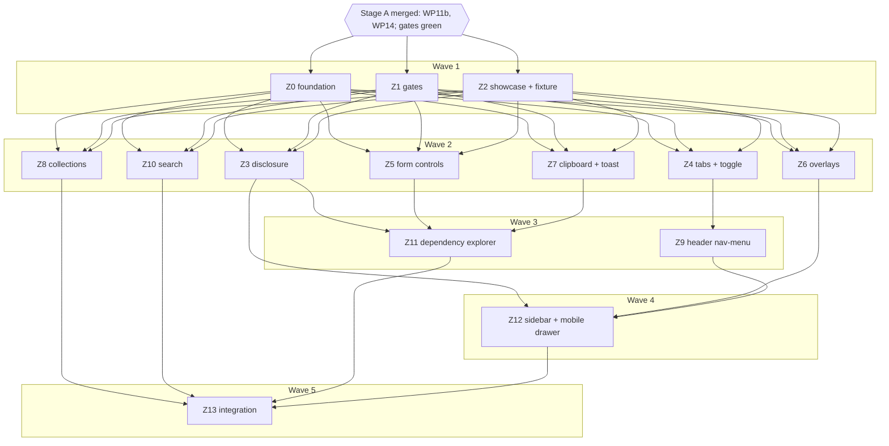

# Plan: ocx theme framework with Zag-backed components

## Status

- State:   executing
- Tier:    xhigh
- Tier-grammar: 5
- Effective-tier: derived
- Updated: 2026-09-28 (hex-review xhigh on 060b763: Needs Work; C-240 partial, review findings → Z15)
- Next:    /hex-execute .agents/plans/plan_zag-adoption.md

---

## Overview

**Author:** hex-plan (xhigh), owner Michael Herwig · **Date:** 2026-09-27
**Source discussion:** [website-buildout.md](../discussions/website-buildout.md) (ratified → loop)
**Goal / acceptance bar:** [.agents/goals/website-buildout.md](../goals/website-buildout.md) › Definition of done
**Predecessor:** [plan_website-buildout.md](plan_website-buildout.md) Stage A (WP11b, WP14 in flight; not edited here)
**Research:** [zag-adoption.md](../research/zag-adoption.md), [zag-framework-gates.md](../research/zag-framework-gates.md) (new, this run), [ocx-components-port.md](../research/ocx-components-port.md), `ui-primitives.md` (lands with WP14)
**Design:** live project https://claude.ai/design/p/550606f7-5b74-4164-b5e9-6a2e5b27cafe, export `.tmp/design/` (`OCX Components.dc.html` = component sheet, `OcxHeader.dc.html`, `OCX Design Guide.dc.html`)

Classification: scope large · reversibility one-way (medium) — the public component API, the
`ocx:*` event names and the `zag` prop become consumer contracts once `1.0.0` ships; nothing is
published in this plan · tier xhigh.

## Objective

Turn `@ocx-sh/theme` into one coherent, installable component framework: every interactive
widget gets its behaviour from Zag 1.44.x through one glue helper, while our public API, markup
and token CSS stay ours and the SSR first paint is final. Starlight stays underneath (data,
routing, content, search index); its search, sidebar and mobile menu become our overrides on Zag.
The framework is held to enforced memory and performance budgets, a clickable showcase in
`task dev`, and a packed-tarball consumer test.

**Precondition (goal item 1):** Stage A done — WP11b and WP14 merged on `hex/website-buildout`,
`task check`, `task e2e`, `task lighthouse`, `task pack` green. Stage Z does **not** wait for G1
(G1 gates Stage B only). No Stage-A worktree or plan row is touched by this plan.

## Scope

### In scope
- `packages/theme/src/**`: Zag glue, Zag-backed components (Tier A), Starlight overrides
  (Header, EcosystemMenu, Search, Sidebar, MobileMenuToggle, PageFrame, MobileMenuFooter, Footer
  toaster), migrations of Terminal, DependencyExplorer, Tabs, WP14 Select/Combobox/Choice.
- `examples/starlight/**`: showcase kit and one page per component.
- Gates: budgets module, Lighthouse on every example page, CDP memory/perf e2e, leak helper,
  consumer fixture that renders every exported component.

### Out of scope
- Consumer repos, Stage B, npm publish, hosting (discussion › Intent).
- Tier B machines (research §5). Own state machines (research §4).
- Global hotkeys beyond today's Ctrl/⌘K (discussion › Decisions).

## Decisions (question → research → decision)

The three open questions of the discussion are closed with their recommended answers (goal
Autonomy: never prompt; the goal file is the approval).

| ID | Question | Research | Decision |
|---|---|---|---|
| D-Z1 | Header: Zag navigation-menu or click-only popover? | research §1b; owner prefers Zag's model where it differs | **navigation-menu**: hover (200 ms) + click, sliding indicator, arrow keys between triggers; rail = vertical Zag `tabs` |
| D-Z2 | ~20 kB JS per docs page, 19.6 kB of it the header, loaded on first hover/focus? | research §3 sizes; spec review: once search (dialog), mobile drawer, toast and sidebar collapsible are Zag too, a page where the reader touches everything loads ~65–70 kB | **Accepted, restated**: nothing loads before interaction (C-113); the header costs ~20 kB on first hover/focus; a content page after every chrome widget is touched stays ≤ 90 kB gz (C-110). Lighthouse 100×4 on every page |
| D-Z3 | Code-token colour for variables/keys: coral or purple? | design export has no purple; coral is the single interactive colour (HANDOVER) | **Coral** (current). Z13 asserts `--ocx-color-code-variable` stays coral |
| D-Z4 | Research §1 keeps search, sidebar and mobile menu Starlight-owned; the goal adopts them | discussion › Requirements is the later, ratified source and names all three. Starlight 0.42.4 facts (Discover): `MobileMenuToggle` is a bare `popovertarget="starlight__sidebar"` button; the pane is `<sl-sidebar-pane popover>` in `PageFrame`, which sets `popover` to `null` at ≥ 50em and makes `.main-frame` inert while open; `Search` is `<site-search>` with a native `<dialog>`, a constructor-bound Ctrl/⌘K listener and Pagefind UI imported at idle | **Adopt as overrides**. Hooks kept: `#starlight__sidebar`, `.sl-menu-button`, `#starlight__search`, `body[data-search-modal-open]`, the ≥ 50em static pane, sidebar open-state and scroll persistence |
| D-Z5 | Sidebar: Zag `tree-view` or `collapsible`? Or keep Starlight's `<details>` (spec-review cut proposal)? | APG: `role=tree` is for app hierarchies; site nav is disclosure navigation. The goal names the sidebar explicitly, so keeping `<details>` would leave that item unmet | **collapsible** per nested group; top level stays the flat mono-caps list of the design. Cut proposal rejected for the reason above |
| D-Z6 | Mobile menu: `dialog` or `drawer`? | drawer 27.6 kB, adds swipe-to-close; loaded only on first tap, so no Lighthouse cost | **drawer**, via `MobileMenuToggle` + `PageFrame` overrides |
| D-Z7 | Checkbox/switch/radio: discussion says native checkbox; Tier A lists the machines | Zag's checkbox/switch/radio-group keep a real `<input>` as the form control | **Zag-backed with the native input as source of truth** (works without JS, submits in forms). `Choice` keeps its API; `RadioGroup` is new |
| D-Z8 | WP14 `Menu` (nav links) vs Zag `menu` | APG forbids `role=menu` for site navigation | `Menu.astro` stays the nav disclosure; new **`ActionMenu.astro`** on Zag `menu` (incl. context mode) |
| D-Z9 | Term Tooltip vs Zag tooltip | research §1: tap-open and links inside are requirements | term `Tooltip.astro` stays ours; icon-button hints use new **`Hint.astro`** on Zag `tooltip` |
| D-Z10 | Positioning model for overlays | research §3: popper inline styles conflict with `position-area` | Zag overlays use Zag positioning only (no `position-area` on their parts); own Popover-API overlays (term Tooltip, nav Menu) keep CSS anchor |
| D-Z11 | Lazy hydration trigger | memory goal; research §3 | Default **interaction** (first `pointerenter`/`focusin`/`touchstart` on the root) with replay of one activation; `visible` only where the machine must act without input (`toc`); **manual** where the start signal is not on the root (search Ctrl/⌘K, toaster on first `ocx:toast`, mobile toggle outside the pane) |
| D-Z12 | Toast API across SSR | Astro cannot pass functions; export map (design §4.1) is exact-matched by pack-smoke | DOM event `ocx:toast` (`{title, tone?}`); no new export key |
| D-Z13 | Showcase shape "like Zag's examples" | zag-framework-gates.md §3: upstream demos are live demo + code, no controls panel; the visualizer is third-party | Page = live **Demo** with an event log, **States**, **Props** table (checked against the `Props` type), plus **Events** and **Keyboard** for Zag-backed components. No controls panel |
| D-Z14 | How to measure memory | gates §4: `measureUserAgentSpecificMemory` needs COOP/COEP | CDP `HeapProfiler.collectGarbage` + `Performance.getMetrics` in Playwright (chromium); lhci assertions for weight and DOM |
| D-Z15 | "Every example page" | samples are gitignored and absent in CI | Every committed page under `examples/starlight/src/content/docs/` except `samples/**` |
| D-Z16 | Teardown on navigation | Starlight 0.42 ships no view transitions | Pages unload wholesale; `destroy()` exists for removal within a page. `ponytail:` note in `zag.mjs`: add an `astro:before-swap` teardown when a ClientRouter is enabled |
| D-Z17 | Where machine code may be imported | research §3 "all Zag glue in one helper" | `@zag-js/vanilla` only in `ui/zag.mjs`; `@zag-js/<machine>` only in `*.zag.mjs` modules (one per component: machine, connect, render, optional `readDom`) |
| D-Z18 | Which gate enforces the budgets? CI runs only `task check` and has no workflows yet | goal wording: "in `task check` or the e2e/lighthouse gate"; CI/release is Stage B (WP12) | Budgets live in `task e2e` and `task lighthouse`; `task check` stays as WP12 will wire it. The loop runs all four (check, e2e, lighthouse, pack) after every wave |
| D-Z19 | Showcase pages for Stage-A grouped pages (`form.mdx`, `overlays.mdx`, `status.mdx`) | spec review: one heading-id set per page | Z2 splits them into one page per component |
| D-Z20 | Consumer fixture pages | spec review (ponytail): separate fixture pages drift from the showcase | `pack-smoke` copies the example's component pages and showcase kit into the fresh fixture; no per-WP fixture files |
| D-Z22 | Local samples (gitignored) add ~3.5 kB gz of sidebar to every built page and break the htmlGz/DOM budgets locally | gates measure builds; CI has no samples | Sample sidebar groups render in `astro dev` only; sample pages still build and stay reachable by URL (`examples/starlight/astro.config.mjs`) |
| D-Z23 | Showcase navigation: one sidebar entry per component pushed heavy pages past the first TCP window | Z2 measurement (~60 B gz per entry per page) | Sidebar holds one `Components` link to the self-listing index (C-120); showcase styles load through `customCss`, never inline `<style>` |
| D-Z21 | Cuts from spec review | ponytail | No `Hint` on header buttons (their `aria-label` already names them; saves ~21 kB per page). No test-only hooks in shipped code (`__ocxZagTest`) |

## Component Contracts

IDs start at C-101 / S-101 to stay clear of design §7 (C-001…C-072).

### Foundation — Z0

- **C-101 Pin.** `packages/theme/package.json` `dependencies` hold `@zag-js/vanilla` and the 20
  Tier A machine packages (tabs, collapsible, accordion, clipboard, toast, combobox, select,
  checkbox, switch, toggle-group, menu, popover, dialog, drawer, navigation-menu, tooltip,
  tree-view, toc, radio-group, pagination) at exactly `1.44.0` (no `^`/`~`/range). A test fails on a
  range, a version outside `1.44.x`, a missing Tier A package, or an import that breaks D-Z17.
- **C-102 `ssrAttrs(props)`** (`packages/theme/src/components/ui/zag.mjs`): drops function and
  `undefined` values; `true` → `""`; `false` → omitted, except `aria-*` → `"false"`; a style
  object → CSS text; strips `data-focus` and `data-focus-visible`; output spreads onto an Astro
  element. Table test covers each case.
- **C-103 `ssrApi(machine, connect, props)`**: returns `connect()` of an unstarted
  `VanillaMachine` with `props` and `normalizeProps`; runs in Node with no `document`/`window`.
- **C-104 `mount(root, spec)`**, `spec = {load, trigger?, replay?, render}`:
  - `load: () => Promise<{machine, connect}>` (a dynamic `import()` of the component's
    `*.zag.mjs`); nothing is imported before the trigger.
  - `trigger`: `'interaction'` (default: first `pointerenter`, `focusin` or `touchstart` on
    the root), `'visible'` (IntersectionObserver) or `'manual'` (the handle's `start()` begins
    loading; for search, toaster and mobile toggle, D-Z11).
  - Machine props = `JSON.parse(root.dataset.zagProps)` plus the id SSR wrote to
    `root.dataset.zagId` (so part ids and `aria-controls` match SSR), plus `readDom(root)` when
    the `*.zag.mjs` exports it: state changed natively before start (checked input, restored
    tab) wins.
  - When the trigger fires, `mount` removes any `popovertarget` fallback inside the root (C-192,
    C-231) so the native popover and Zag never both open; on `error` it restores it.
  - `replay` (default `true`): exactly one activation that arrived before start is re-dispatched
    to its original target after the first render — the `click` if one came, else the
    activating `keydown` (Enter, Space, arrows, Home, End, Escape); a keydown followed by its
    click is replayed once. Replayed events are untrusted (`isTrusted: false`); the tests assert
    the widget acts on them. Form controls set `replay: false` (no double toggle).
  - Root attribute `data-zag-state`: `idle` → `loading` → `live`, or `error`.
  - Returns `{start(), destroy(), ready}`. Idempotent per root: a second `mount` returns the same handle.
  - `destroy()`: calls every `spreadProps` cleanup and unsubscribe, then `machine.stop()`, removes
    trigger listeners, forgets the root. Before the trigger it removes listeners and never
    imports. A second call is a no-op.
  - `load` rejects → `data-zag-state="error"`, one `console.error`, the SSR markup stays, nothing
    throws to the caller.
- **C-105 Events bridge.** `emit(root, scope, name, detail)` dispatches
  `CustomEvent('ocx:<scope>:<name>', {detail, bubbles: true})`; `detail` is JSON-serialisable.
  Every Zag callback a wrapper exposes surfaces this way.
- **C-106 `zag` passthrough prop.** Each wrapper's `Props` has `zag?: ZagProps<MachineProps>`,
  `ZagProps<T>` = `T` minus function-typed keys and `id`, `ids`, `getRootNode`, `dir`. Serialised to
  `data-zag-props` and handed verbatim to both `ssrApi` and `mount`. A type test
  (`expectTypeOf`) rejects a function-typed key.
- **C-107 Override stubs.** `Search.astro`, `Sidebar.astro`, `MobileMenuToggle.astro`,
  `PageFrame.astro` exist under `src/starlight/`, are registered in `OVERRIDES` (consumer
  overrides still win), and render Starlight's defaults unchanged. `Header.astro` imports
  `Search` through `virtual:starlight/components/Search`. The existing smoke, header and mobile
  e2e pass unchanged.
- **C-108a Tokens.** Z0 adds every new token the component WPs need, in one block with dark
  variants (dark-parity gate): scrim, z-index scale (`--ocx-z-*`: header, overlay, drawer,
  toast), toast surface, motion durations. Component WPs never edit `tokens.css`.
- **C-108b Inventory.** `packages/theme/test/component-inventory.mjs` exports the exempt list and
  the Starlight-override list (now including Search, Sidebar, MobileMenuToggle, PageFrame);
  `showcase-coverage.test.ts` imports it and keeps failing on an exported component without a
  page.
- **C-108 Test helpers.** `packages/theme/test/zag-helpers.ts`:
  `expectSsrMatchesConnect(html, part, attrs)` compares the rendered part's attributes to
  `ssrAttrs(attrs)` (order-insensitive).
- **C-107a Typing.** Importing `virtual:starlight/components/Search` typechecks (a module
  declaration or Starlight's own virtual types reference); `task typecheck` stays green.

### Gates — Z1

- **C-110 Budgets module** `tests/budgets.mjs`: page classes `content` and `showcase`, each with
  `preJsGz`, `postJsGz`, `totalBytes`, `domElements`, `heapMB`; `classOf(path)` maps every
  gated page to exactly one class (a unit test fails on an unclassified page). Values start at
  these caps (derived from research §3/§5 sizes: runtime 6.3, header 19.6, dialog, drawer,
  collapsible, toast, clipboard ≈ 70 kB for the full chrome) and Z13 ratchets them down to
  measured × 1.15, rounded up (1 kB, 100 elements, 1 MB):

  | | preJsGz | postJsGz | totalBytes | domElements | heapMB |
  |---|---|---|---|---|---|
  | content | 20 kB | 90 kB | 600 kB | 1400 | 16 |
  | showcase | 20 kB | 160 kB | 900 kB | 1400 | 24 |

  A value only goes up with a Spec Delta row in this plan. Sizes are gzip of the response body
  (zlib in Node), never `encodedDataLength` (headers, and `astro preview` may not compress).
- **C-111 Lighthouse on every example page.** `.lighthouserc.cjs` derives its URL list from the
  source tree (`examples/starlight/src/content/docs/**` minus `samples/**`, mapped to routes, plus
  `404.html`), so the unit test needs no build: it fails when a committed page is missing from
  the list. Assertions via `assertMatrix` (one URL pattern per class): the four categories
  `minScore: 1` (unchanged), `resource-summary:script:size` ≤ `preJsGz`, `total-byte-weight` ≤
  `totalBytes`, `dom-size` ≤ `domElements`. `numberOfRuns: 3`. lhci 0.15 takes assertions only
  (no `budgets.json`).
- **C-112 Budget e2e** `tests/e2e/budgets.spec.ts` (chromium project) over the same page list:
  load, wait for network idle, sum gzip sizes of every script body ≤ `preJsGz`; then
  hover and focus every `[data-zag-root]` and wait for `live`; script total ≤ `postJsGz`; after
  `HeapProfiler.collectGarbage`, `JSHeapUsedSize` ≤ `heapMB`; `document.querySelectorAll('*')`
  count ≤ `domElements`. A failure names page, metric, value and budget.
- **C-113 Lazy hydration.** On every page, 2 s after load with no input, every
  `[data-zag-root]` whose trigger is `interaction` still has `data-zag-state="idle"`; after a
  hover or focus it becomes `live`.
- **C-114 Leak helper** `tests/e2e/helpers/leak.ts` `expectNoLeak(page, cycle, {n = 20})`: one
  warm-up cycle, GC, snapshot `JSEventListeners`/`Nodes`/`JSHeapUsedSize`, `n` cycles, GC; asserts
  listeners ≤ base + 2, nodes ≤ base + 20, heap ≤ base × 1.10 + 256 kB. Teardown of a removed
  root is covered by the `destroy()` unit tests of C-104; shipped code has no test-only hooks.
- **C-115 Leak coverage.** A test fails when a `*.zag.mjs` component has no e2e spec calling
  `expectNoLeak` for it.

### Showcase and consumer fixture — Z2

- **C-120 Index.** `components/index.mdx` renders an example-local `<ComponentIndex />` that
  lists every page in the directory (title, description, link) from the content collection, as
  a card grid. Unit test: `index.mdx` renders `<ComponentIndex />` and the component reads the
  whole collection directory; the e2e smoke asserts the built index links every page. No
  component WP edits `index.mdx`. Grouped Stage-A pages are split one per component (D-Z19).
- **C-121 Page shape** (`showcase-shape.test.ts`). Each exported component's page has headings
  with ids `demo`, `states`, `props`, and for Zag-backed components also `events` and
  `keyboard`. `<PropsTable of="X" rows={…} />` rows equal the component's own declared `Props`
  members (TypeScript compiler API over the `.astro` frontmatter; `interface Props`,
  `type Props =` and union members), plus one `rest → <element>` row when `Props` extends HTML
  attributes. A missing or stale row fails `task test`. Overlay states (open Dialog, Drawer,
  Popover, menus) are live buttons that open each state, never modal markup rendered open in
  page flow.
- **C-122 Event log.** Example-local `<EventLog for="#id" />` next to a demo shows each `ocx:*`
  event (name + detail) live; no cost outside showcase pages.
- **C-124 Consumer fixture renders every component** (D-Z20). `scripts/pack-smoke.mjs` copies
  `examples/starlight/src/content/docs/components/**`, the showcase kit and the assets those
  pages use into the fresh-install fixture, rewrites nothing (pages already import
  `@ocx-sh/theme/components/…`), builds it, and asserts: every exported component outside the
  C-108b exempt list is imported by a copied page; each such page's built HTML contains the
  component (Zag-backed: a `[data-zag-root]` per demo); the overrides render
  (`#starlight__search`, `.sl-menu-button`). A failure names each missing component.

### Common wrapper contract — every Zag-backed component (Z3–Z12)

- **C-130** (a) SSR of each showcase state equals `ssrApi` for the same props (C-108), no
  `data-focus*`. (b) Root has `data-zag-root="<machine>"`, `data-zag-state="idle"`,
  `data-zag-props`. (c) First paint is final: with animations disabled, screenshot the component
  region with its `*.zag.mjs` chunk blocked; unblock, hover/focus the root, wait for `live`, move
  the pointer to a neutral point and blur, screenshot again: pixel-exact in the default state.
  Anything drawn only after `live` (e.g. the tabs indicator) is drawn by CSS at SSR. The page
  renders identically with images blocked. (d) Keyboard e2e per the named
  APG pattern. (e) axe clean in each showcase state. (f) Styles in `@layer ocx`, `--ocx-*` tokens
  only, keyed on Zag `data-part`/`data-state`; the css gate passes. (g) Callbacks surface as
  `ocx:<scope>:<event>` and are listed on the page. (h) `expectNoLeak` over the open/close or
  change cycle. (i) Showcase page (C-121). (j) Rendered by the fixture build (C-124). (k) Public props keep their
  names and meaning where the component already exists.

### Disclosure — Z3
- **C-140 `Collapsible.astro`**: `open?`, `disabled?`, `label` (trigger text or slot `trigger`),
  default slot = content; `ocx:collapsible:change {open}`; closed content `hidden`; APG disclosure.
- **C-141 `Accordion.astro`** + `AccordionItem.astro`: `multiple?`, `collapsible?`, `value?`;
  item `value`, `label`; `ocx:accordion:change {value}`; APG accordion (arrows, Home, End).
- **C-142 Terminal collapse** on `collapsible`: every `aria-expanded`/`hidden` assertion in
  `components-terminal.spec.ts` and `components-terminal.test.ts` passes unchanged.

### Tabs — Z4
- **C-150 `Tabs.astro` + `TabItem.astro`**: Starlight-compatible props (`syncKey`; `label`,
  `icon`); triggers are `<button role=tab>`; panels from the rendered slot (`data-ocx-tab`);
  `ocx:tabs:change {value}`; APG tabs, automatic activation.
- **C-151 syncKey**: an inline restore script rewrites SSR attributes from
  `localStorage["starlight-synced-tabs__<key>"]` before paint; a change updates every group
  with the same key and writes storage; a throwing `localStorage` changes nothing but
  persistence; the clicked tab keeps its viewport position.
- **C-152** `decorateTabs` is deleted; the icon is a prop; the converter emits the theme
  imports; `<Tabs syncKey="shell">` output is otherwise unchanged; the behaviour assertions of
  `code-tabs.test.ts` and `tables-tabs.spec.ts` still hold with new selectors.
- **C-153 `ToggleGroup.astro`**: `items`, `multiple?`, `value?`, `label`;
  `ocx:toggle-group:change {value}`; segmented look of the design (2–5 options).

### Form controls — Z5
- **C-160 `Choice.astro`** (API unchanged) on Zag checkbox/switch; new `RadioGroup.astro`
  (`name`, `items`, `value?`, `orientation?`, `label`). The native input submits in a `<form>`
  before and after start; a click before start keeps its state after start (`replay: false`,
  `readDom` supplies `defaultChecked`/`defaultValue`). Checked visuals key on
  `:has(input:checked)` as well as `data-state`, so they are right with JS off.
  Design: checkbox/switch fill coral with an ink mark, square switch thumb, round radio.
- **C-161 `Select.astro`** (API unchanged: `label`, `hideLabel`, `options`, `value`) on Zag
  `select` with a hidden native `<select>` for forms; `ocx:select:change {value}`; APG
  select-only combobox keys; typeahead.
- **C-162 `Combobox.astro`** live (API unchanged); filters `options` by `query`, highlight,
  empty state text, selection, Esc restores; `ocx:combobox:change {value}`,
  `ocx:combobox:input {query}`.

### Overlays — Z6
- **C-170 `Popover.astro`**: trigger slot, content slot, `placement?`, `modal?`;
  `ocx:popover:change {open}`; Esc and outside click close and return focus.
- **C-171 `ActionMenu.astro`**: `items {value,label,disabled?}[]`, `context?` (right-click on
  the slot target); `ocx:menu:select {value}`; APG menu (roving focus, typeahead).
- **C-172 `Dialog.astro`**: `title`, `description?`, `open?`, `modal?` (default true); focus
  trap, scroll lock, Esc, return focus; `ocx:dialog:change {open}`.
- **C-173 `Drawer.astro`**: as Dialog plus `side?` (`start`|`end`|`bottom`), swipe to close.
- **C-174 `Hint.astro`**: wraps an icon button; hover/focus hint with `openDelay`; the button's
  accessible name stays its `aria-label`.

### Clipboard and toast — Z7
- **C-180 `CopyButton.astro`**: `value`, `label?`; copies, then dispatches `ocx:toast`
  `{title: "Copied <label ?? value truncated to 40 chars>"}`; failure → `{title: "Copy failed",
  tone: "danger"}`; never an uncaught error.
- **C-181 Toaster** in the `Footer.astro` override: loads its machine on the first `ocx:toast`;
  bottom-right, 2.5 s (design), max 3 visible, `aria-live="polite"`, pauses on hover/focus.
- **C-182** Every copy action in the theme toasts: Expressive Code copy buttons (delegated
  listener, title = first code line truncated) and every `CopyButton`; an e2e enumerates copy
  controls on the showcase pages and asserts one toast each.

### Collections — Z8
- **C-200 `TreeView.astro`**: `items` (JSON tree), `value?`, `expanded?`; APG tree; the docs
  `Tree` stays native.
- **C-201 `Toc.astro`**: `items {id,label,depth}[]`; scroll-spy (`trigger: 'visible'`); Starlight's
  TOC stays.
- **C-202 `Pagination.astro`**: `count`, `pageSize`, `page?`, `href?` template (links mode);
  `ocx:pagination:change {page}`.

### Header — Z9
- **C-190** Header section nav on `navigation-menu` (D-Z1): docs and catalog are Link items,
  ecosystem is an Item whose Content is the mega panel; hover (openDelay 200 ms, closeDelay tuned
  against the strip) and click open; ArrowLeft/Right move between triggers; Esc and outside click
  close and return focus; indicator under the active section; stacking via a z-index token.
- **C-191** Rail = vertical Zag `tabs`, automatic activation; the strip keeps its `:has` preview.
- **C-192** With JS off every section renders with `aria-current` on the active one only; the
  ecosystem trigger keeps a `popovertarget` fallback that `mount` removes on start. Machine loads
  on first `pointerenter`/`focusin` on the nav. Rewritten `header.test.ts`/`header.spec.ts` keep
  every behaviour listed in their current titles, with new selectors.

### Search — Z10
- **C-210 `Search.astro`** override on Zag `dialog` (`trigger: 'manual'`: trigger interaction
  or Ctrl/⌘K starts it): the trigger looks and reads as today (platform-correct kbd hint, no
  flash); Ctrl/⌘K has exactly one listener (ours); Pagefind UI loads on first open, not at idle,
  with Starlight's Pagefind options passed through unchanged, including the `mergeIndex` list
  our plugin builds (an e2e asserts a merged-section result still appears when the example
  configures one); `#starlight__search` and `body[data-search-modal-open]` kept;
  Esc/outside click close and return focus; in dev, the dialog shows a "search works in builds"
  note. The search e2e asserts one open per Ctrl+K press.

### DependencyExplorer — Z11
- **C-220** Rows expand through `Collapsible`, the licence filter is `Select`, copy actions use
  `CopyButton`; every behaviour asserted by `components-dependency-explorer.*` still holds.

### Sidebar and mobile menu — Z12
- **C-230 `Sidebar.astro`**: top level flat (design); nested groups on `Collapsible`; open state
  and scroll restored before paint from `sessionStorage` (Starlight's persist semantics);
  `aria-current="page"` kept.
- **C-231 Mobile menu** via `MobileMenuToggle.astro` + `PageFrame.astro` on Zag `drawer` below
  50em (`trigger: 'manual'`, started by the toggle): `#starlight__sidebar` and `.sl-menu-button`
  kept; at ≥ 50em the pane is a static column with no `popover` attribute (as Starlight); focus trap, scroll lock, `inert` main
  frame, Esc, backdrop and swipe close; focus returns to the toggle; desktop renders the static
  column. JS off or load error: the SSR `popovertarget` fallback still opens the pane.
- **C-232** The ecosystem menu inside the drawer (C-023 at 390 px) and axe with both open keep
  passing (`mobile.spec.ts` behaviours).

### Integration — Z13
- **C-241** Every pinned Tier A machine is imported by at least one `*.zag.mjs` (adoption proof).
- **C-240** Every component checked against the design sheet with `task visual` pairs; each gap
  recorded under Design questions (for the PR). Budgets ratcheted down to measured × 1.15.
  `AGENTS.md` › Working here gains the Zag rules (D-Z17, C-104 trigger rule, budgets).

### List — Z14 (owner request, after Z13)
- **C-250 `List.astro`** on Zag `listbox`: `items` (value, label, disabled?, group?), `selectionMode`
  (`single`|`multiple`), `value?`, `orientation?` (vertical, horizontal; grid if Zag 1.44 supports it),
  `label`, empty-state text; a render slot for rich rows (card rows); arrow keys, Home/End,
  typeahead, disabled items skipped, groups labelled; `ocx:list:change {value}`; lazy `interaction`
  mount; SSR first paint final.
- **C-251 Async data** on Zag `async-list`: load, sort, filter, cursor paging (load more), loading,
  error + retry states; aborts in-flight loads on destroy/navigation; `ocx:list:load {…}` events.
  Shape (a `List` prop vs an `AsyncList` wrapper) decided in Z14 and recorded here.
  **Decided (Z14):** a `List` prop, no wrapper. Question: which shape keeps `List` SSR-first and its
  chunk small when async is unused? Research: Astro cannot pass a loader function across SSR, so the
  data source is a page-side handler either way; a wrapper would duplicate the listbox markup. Decision:
  `async` + `cursor` props; the wrapper script loads `async-list.zag.mjs` (2.8 kB gz, on top of
  `listbox.zag.mjs` 5.9 kB gz) only for a root with `data-ocx-async`, so a static list never fetches it.
- **C-252** C-130 (a)–(k) in full; showcase page covering every state with an EventLog; leak test
  over change and load/abort cycles; budgets ratcheted (down only; a new machine may need a
  showcase-class Spec Delta with measurement).
- **S-111 Catalog cards.** A reader pages through catalog cards with "load more"; the first page is
  SSR, further pages load; a failed load shows retry; keyboard selection works on card rows.

## User-Experience Scenarios

- **S-101 Browse the showcase.** Owner runs `task dev`, opens `/docs/components/`, clicks the
  Tabs card → live demo; clicking a tab logs `ocx:tabs:change` in the event log; States shows
  every state; Props lists each prop. Error: a new exported component without a page, or a page
  whose Props table misses a prop → `task check` fails naming it.
- **S-102 Mobile first visit.** A reader on a throttled phone loads a docs page: first paint is
  final, no Zag chunk is fetched. They tap the menu button → the drawer opens on that tap
  (replayed), focus is trapped; Esc, backdrop or swipe closes it and focus returns. Error: the
  chunk fails → the native popover fallback opens the pane.
- **S-103 Search.** Ctrl/⌘K opens the dialog once, Pagefind loads, results appear; Esc closes and
  returns focus. Error: no Pagefind bundle (dev) → explanatory note, no console error.
- **S-104 Copy.** Copying a code block shows "Copied `ocx install …`" bottom-right for 2.5 s,
  announced politely; three fast copies stack (max 3). Error: permission denied → "Copy failed"
  toast, no uncaught error.
- **S-105 Shell tabs.** Choosing "fish" switches every synced group and survives the next page
  load without a flash. Error: `localStorage` throws → tabs switch, choice is not persisted.
- **S-106 Consumer install.** The packed tarball installs into a fresh fixture, builds, and every
  exported component renders. Error: a component missing from the fixture or rendering empty →
  `task pack` fails naming it.
- **S-107 Budget breach.** A change that adds weight, DOM or heap past a budget, loads a machine
  before interaction, or leaks listeners → `task e2e` or `task lighthouse` fails naming page,
  metric, value and budget.
- **S-108 Keyboard header.** Tabbing into the header loads the machine without losing the key;
  ArrowRight moves between triggers; Enter opens ecosystem; arrows switch hubs; Esc closes and
  returns focus.
- **S-109 Sidebar.** Expanding a collapsed group and navigating restores the group and scroll on
  the next page before paint.
- **S-110 Early form input.** A checkbox clicked before hydration keeps its state after the
  machine starts; the form submits the value either way.

## Parallelization

| WP | Scope | Expected Files | Size | Wave | Depends on | Review | Verify | Status |
|----|-------|----------------|------|------|------------|--------|--------|--------|
| Z0 | Foundation: C-101…C-108b | `packages/theme/package.json`, `pnpm-lock.yaml`, `packages/theme/src/tokens.css`, `packages/theme/src/components/ui/zag.mjs`, `packages/theme/src/starlight/{index.mjs,Header.astro,Search.astro,Sidebar.astro,MobileMenuToggle.astro,PageFrame.astro}`, `packages/theme/src/virtual.d.ts` (if needed for C-107a), `packages/theme/test/{zag.test.ts,zag-pin.test.ts,zag-helpers.ts,plugin.test.ts,component-inventory.mjs,showcase-coverage.test.ts,tokens.test.ts,contrast-pairs.ts}` | M | 1 | Stage A | risk | full | merged |
| Z1 | Gates: C-110…C-115, S-107 | `tests/budgets.mjs`, `tests/budgets.test.ts`, `.lighthouserc.cjs`, `scripts/lhci-stage.mjs`, `scripts/lhci-urls.test.ts`, `tests/e2e/{budgets,hydration}.spec.ts`, `tests/e2e/helpers/leak.ts`, `tests/leak-coverage.test.ts` | M | 1 | Stage A | risk | full | merged |
| Z2 | Showcase kit + consumer fixture: C-120…C-124, S-101, S-106, D-Z19, D-Z20 | `examples/starlight/src/components/showcase/**`, `examples/starlight/src/content/docs/components/**` (index self-listing; split `form`/`overlays`/`status` into one page per component; `demo`/`states`/`props` sections on every existing page), `packages/theme/test/{showcase-shape.test.ts,props-table.test.ts}`, `scripts/pack-smoke.mjs`, `scripts/pack-smoke.test.ts`, `tests/fixtures/consumer/**` (drop pages the copy replaces), `tests/e2e/smoke.spec.ts` (index links) | M | 1 | Stage A | | | merged |
| Z3 | Disclosure: C-140…C-142 | `packages/theme/src/components/{Collapsible,Accordion,AccordionItem}.astro`, `packages/theme/src/components/{collapsible,accordion}.zag.mjs`, `packages/theme/src/components/{Terminal.astro,terminal.mjs}`, `packages/theme/test/components-{collapsible,accordion,terminal}.test.ts`, `tests/e2e/{zag-disclosure,components-terminal}.spec.ts`, `examples/…/components/{collapsible,accordion,terminal}.mdx` | M | 2 | Z0, Z1, Z2 | | | merged |
| Z4 | Tabs + toggle group: C-150…C-153, S-105 | `packages/theme/src/components/{Tabs,TabItem,ToggleGroup}.astro`, `packages/theme/src/components/{tabs,toggle-group}.zag.mjs`, `packages/theme/src/starlight/{tab-icons.mjs,MarkdownContent.astro,starlight.css}`, `scripts/samples/{convert,convert.test}.ts`, `packages/theme/test/{code-tabs,components-toggle-group}.test.ts`, `tests/e2e/{tables-tabs,zag-tabs}.spec.ts`, `examples/…/components/{tabs,toggle-group}.mdx` | M | 2 | Z0, Z1, Z2 | risk | | merged |
| Z5 | Form controls: C-160…C-162, S-110; DependencyExplorer licence filter onto the new `Select` | `packages/theme/src/components/ui/{Choice,RadioGroup,Select,Combobox}.astro`, `packages/theme/src/components/ui/{checkbox,switch,radio-group,select,combobox}.zag.mjs`, `packages/theme/src/components/ui/overlay.css`, `packages/theme/src/components/{DependencyExplorer.astro,dependency-explorer.mjs}` (licence filter only), `packages/theme/test/{ui-form,ui-overlay,components-dependency-explorer}.test.ts`, `tests/e2e/{zag-form,ui-overlay,ui-consistency,components-dependency-explorer}.spec.ts`, `examples/…/components/{choice,radio-group,select,combobox}.mdx` | L | 2 | Z0, Z1, Z2 | risk | | merged |
| Z6 | Overlays: C-170…C-174 | `packages/theme/src/components/ui/{Popover,ActionMenu,Dialog,Drawer,Hint}.astro`, `packages/theme/src/components/ui/{popover,menu,dialog,drawer,tooltip}.zag.mjs`, `packages/theme/test/ui-zag-overlay.test.ts`, `tests/e2e/zag-overlay.spec.ts`, `examples/…/components/{popover,action-menu,dialog,drawer,hint}.mdx` | L | 2 | Z0, Z1, Z2 | risk | | merged |
| Z7 | Clipboard + toast: C-180…C-182, S-104 | `packages/theme/src/components/{CopyButton.astro,clipboard.zag.mjs,toast.zag.mjs}`, `packages/theme/src/starlight/Footer.astro`, `packages/theme/test/components-copy.test.ts`, `tests/e2e/zag-copy.spec.ts`, `examples/…/components/copy-button.mdx` | S | 2 | Z0, Z1, Z2 | | | merged |
| Z8 | Collections: C-200…C-202 | `packages/theme/src/components/{TreeView,Toc,Pagination}.astro`, `packages/theme/src/components/{tree-view,toc,pagination}.zag.mjs`, `packages/theme/test/components-collections.test.ts`, `tests/e2e/zag-collections.spec.ts`, `examples/…/components/{tree-view,toc,pagination}.mdx` | M | 2 | Z0, Z1, Z2 | | | merged |
| Z10 | Search dialog: C-210, S-103 | `packages/theme/src/starlight/Search.astro`, `packages/theme/src/starlight/search.zag.mjs`, `packages/theme/test/search.test.ts`, `tests/e2e/search-dialog.spec.ts` | M | 2 | Z0, Z1, Z2 | risk | | merged |
| Z9 | Header navigation-menu: C-190…C-192, S-108 | `packages/theme/src/starlight/{Header,MobileMenuFooter}.astro`, `packages/theme/src/components/EcosystemMenu.astro`, `packages/theme/src/components/{navigation-menu,header-tabs}.zag.mjs`, `packages/theme/test/{header,chrome}.test.ts`, `tests/e2e/{header,a11y,mobile}.spec.ts` | L | 3 | Z4 | risk | full | merged |
| Z11 | DependencyExplorer rows + copy: C-220 | `packages/theme/src/components/{DependencyExplorer.astro,dependency-explorer.mjs}`, `packages/theme/test/components-dependency-explorer.test.ts`, `tests/e2e/components-dependency-explorer.spec.ts` | S | 3 | Z3, Z5, Z7 | | | merged |
| Z12 | Sidebar + mobile drawer: C-230…C-232, S-102, S-109 | `packages/theme/src/starlight/{Sidebar,MobileMenuToggle,PageFrame}.astro`, `packages/theme/src/starlight/{sidebar,mobile-menu}.zag.mjs`, `packages/theme/src/starlight/starlight.css`, `packages/theme/test/sidebar.test.ts`, `tests/e2e/{mobile,sidebar}.spec.ts` | L | 4 | Z3, Z6, Z9 | risk | full | merged |
| Z13 | Integration: C-240, C-241, D-Z3 | `tests/visual/pairs.ts`, `tests/budgets.mjs` (ratchet down only), `AGENTS.md`, `packages/theme/test/{tokens,zag-pin}.test.ts`, this plan's Design questions / Schedule log (orchestrator) | M | 5 | Z0–Z12 | risk | full | merged |
| Z14 | List + async list: C-250…C-252, S-111 (owner request, loop lead 2026-09-28) | `packages/theme/package.json` + `pnpm-lock.yaml` (pin `@zag-js/listbox`, `@zag-js/async-list` at 1.44.0), `packages/theme/src/components/ui/{List,ListItem?}.astro`, `packages/theme/src/components/ui/{listbox,async-list}.zag.mjs`, `packages/theme/test/{ui-list,zag-pin}.test.ts`, `tests/e2e/zag-list.spec.ts`, `tests/budgets.mjs` (ratchet only), `examples/…/components/list.mdx`, `packages/theme/test/component-inventory.mjs` if needed | M | 6 | Z13 | risk | full | merged |
| Z15 | Review fixes (hex-review 060b763): C-240 partial (visual pairs for Button, Input, Tag, nav Menu), replay guard, toast payload, async-list duplicate values, leak confirm window, require-dist inputs, coverage/contrast gates, Spec Deltas, Design questions completeness | `packages/theme/src/components/ui/{zag.mjs,async-list.zag.mjs}`, `packages/theme/src/starlight/toaster.mjs`, `tests/e2e/helpers/leak.ts`, `scripts/require-dist.*`, `tests/visual/pairs.ts`, `packages/theme/test/**`, docs, this plan | M | 7 | Z14 | | full | open |



**Critical path:** Stage A → Z0 → Z4 → Z9 → Z12 → Z13 (5 waves).

**Shippable after wave:** 2 — every Tier A component live with showcase, budgets, leak tests and
the consumer fixture, and search on Zag; the rest of the chrome still on Starlight defaults (Z0
stubs). Wave 3 adds the header, wave 4 sidebar and mobile drawer, wave 5 fidelity and ratchet.

**Merge order:** Z0, Z1, Z2 → Z3, Z4, Z5, Z6, Z7, Z8, Z10 → Z9, Z11 → Z12 → Z13; each only after
its deps; scoped check after each merge; `task e2e`, `task lighthouse`, `task pack` after every
wave (the gates of Z1/Z2 are live from wave 2 on).

**Parallelization justification:**
- Hot spots are pre-owned in wave 1: Z0 alone edits `packages/theme/package.json`,
  `pnpm-lock.yaml`, `tokens.css`, `starlight/index.mjs` and the component inventory (all 21
  packages pinned, all tokens added, all override stubs registered at once). Z2 alone edits the
  existing showcase pages (splitting grouped ones) and makes `components/index.mdx`
  self-listing; the fixture copies those pages (D-Z20), so component WPs add only their own page.
- Wave 1: Z0 edits `showcase-coverage.test.ts`; Z2 adds the separate `showcase-shape.test.ts`.
- Wave 2: Z5 owns every Stage-A overlay file (`overlay.css`, `ui-overlay.*`, `ui-consistency`)
  and the DependencyExplorer licence filter, because its `Select` change would break them; Z6
  creates new files only (`Menu.astro` untouched, D-Z8). `starlight.css`: Z4 (wave 2) and Z12
  (wave 4). `Footer.astro`: Z7 only.
- Wave 3: Z9 owns `Header`, `MobileMenuFooter`, `EcosystemMenu`, `a11y`/`mobile` specs; Z11
  owns `DependencyExplorer*` after Z5. Z12 waits for Z9 because both change `mobile.spec.ts` and
  the mobile ecosystem path.
- Z9 needs only Z4 (rail tabs; header hints were cut, D-Z21); Z10 needs only its own dialog
  machine, so it runs in wave 2.
**Verify justification:** Z0 `full` — the glue and the pin are what every other WP builds on. Z1
`full` — a mis-measured budget either blocks every later WP or lets breaches through. Z9 and Z12
`full` — they change chrome on every page (Lighthouse, a11y, mobile). Z13 `full` — final ratchet
and fidelity.

effective tier: high 8 · xhigh 6 (ceiling xhigh) — xhigh: Z0, Z1, Z9, Z12, Z13 (`risk` + `full`) and Z5 (`L` + `risk` + DependencyExplorer); high: the rest.

## Implementation Steps

> Contract-first TDD per WP: Stub → Specify (failing tests from the contracts above) →
> Implement → Review-Fix. Every component WP satisfies C-130 in full; the table below lists
> what is specific. Worktrees under `.agents/worktrees/zag-<wp>`.

### Z0 Foundation
- Stub: pin the 21 packages (C-101); `zag.mjs` exports `ssrAttrs`, `ssrApi`, `mount`, `emit`,
  type `ZagProps` (throwing bodies); override stubs re-exporting Starlight's defaults; Header
  import switch; token block (C-108a); inventory module (C-108b).
- Specify: C-101 pin/import test (scans `src/**` for imports, D-Z17); C-102 table; C-103 in Node
  without DOM globals (dialog, navigation-menu, accordion, tabs); C-104 under jsdom with a fake
  machine (no import before trigger, idempotent, manual start, SSR id reuse, `readDom`,
  `popovertarget` removed on trigger and restored on error, one replay for keydown+click,
  replay off, destroy before/after trigger, double destroy, load rejection); C-105; C-106 `expectTypeOf`; C-107 `OVERRIDES` keys and
  consumer-wins; existing e2e unchanged.
- Implement: thin; `ponytail:` note for D-Z16.

### Z1 Gates
- Stub: `tests/budgets.mjs` with the cap values; URL derivation shared by `.lighthouserc.cjs` and
  the e2e; `leak.ts`.
- Specify: C-110 classifier test; C-111 URL-list test (plant a page → missing → fail); C-112 and
  C-113 against the Stage-A example (no Zag roots yet: the hydration spec asserts the root count
  it found, so it cannot silently skip later); C-114 against a probe page that leaks on purpose
  (red) and one that does not (green); C-115.
- Implement: values start at the caps; record the measured Stage-A numbers in the Schedule log.

### Z2 Showcase kit + consumer fixture
- Stub: `ComponentIndex`, `PropsTable`, `EventLog`, `StateGrid` (example-local).
- Specify: C-120, C-121 (props extraction incl. union `Props` and `rest` row; planted
  undocumented prop fails), C-124 (planted exported component with no page fails; a page whose
  build lacks the component fails).
- Implement: split `form`/`overlays`/`status`; add `demo`/`states`/`props` sections to every
  existing component page (WP13, WP14 components); the pack-smoke copy step.

### Z3–Z8 Component WPs
- Stub: wrapper `.astro` (SSR via `ssrApi` + `ssrAttrs`), `*.zag.mjs` (machine, connect,
  `render(api, root)` spreading parts, optional `readDom`), showcase page.
- Specify: C-130 (a)–(k) + the WP's own contracts; migrations keep the old behaviour assertions.
- Implement to the design sheet (tokens only). Specific notes:
  - Z3: Terminal keeps its asciinema lazy player; only the collapse moves.
  - Z4: SSR strips `data-focus` (research §2); converter change covered by `convert.test.ts`.
  - Z5: `Select`/`Combobox` swap WP14's native/vocabulary internals for Zag, API unchanged;
    Zag positioning (D-Z10), `overlay.css` parts keyed on `data-part`; DependencyExplorer's
    runtime `<option>` building moves to the Select's item collection.
  - Z6: `Menu.astro` (nav disclosure) untouched (D-Z8).
  - Z7: the toaster script is inert until the first `ocx:toast`.
  - Z8: `Toc` is the only `trigger: 'visible'` component.

### Z9 Header navigation-menu
- Stub: nav-menu markup in `Header.astro`/`EcosystemMenu.astro` from `ssrApi`; rail tabs.
- Specify: C-190…C-192; rewritten `header.test.ts`/`header.spec.ts` keep each behaviour of the
  current titles (open by click/keyboard, Esc, outside click, focus leave, rail switch, strip
  preview, JS-off `aria-current`); a11y spec with the panel open; `mobile.spec.ts` ecosystem
  cases with the new trigger.
- Implement: `menu-focusout.mjs` deleted when no importer is left (WP14 `Menu.astro` still uses it
  → keep); z-index token.

### Z10 Search dialog
- Stub: `Search.astro` on `dialog`, `search.zag.mjs`.
- Specify: C-210 (one listener: two Ctrl+K presses toggle once each; Pagefind requested only
  after open; ids kept).
- Implement: reuse Starlight's Pagefind UI options and its CSS hooks.

### Z11 DependencyExplorer migration
- Specify: C-220 — existing specs unchanged except selectors; toast on copy.
- Implement: compose `Collapsible` and `CopyButton` (the licence `Select` landed in Z5).

### Z12 Sidebar + mobile drawer
- Stub: `Sidebar.astro` (flat + `Collapsible` groups + persist), `PageFrame.astro` with the drawer
  pane, `MobileMenuToggle.astro`.
- Specify: C-230…C-232; `mobile.spec.ts` behaviours kept; S-102 fallback with the chunk blocked.
- Implement: matchMedia 50em switch as Starlight; drawer content = the existing sidebar pane.

### Z13 Integration
- `task visual` pairs for every new component page against the design sheet; Design questions
  below finalised; budgets ratcheted; C-241 adoption test; AGENTS.md rules; coral assertion;
  full verification (check, e2e, lighthouse, pack).

## Design questions (for the PR)

Final list (Z13, C-240): seeded from the design export, one entry per gap the component WPs and
the Z13 `task visual` pass found, deduplicated. Each carries the interim decision that shipped.
Sheet tiles paired in `tests/visual/pairs.ts`: header, choice (toggle group, choice, radio group),
select, combobox, menu (action menu), feedback (hint, copy + toast), tabs, code, callout, pager.
Most need the owner: 1 (no tiles for eight components), 5 (header indicator), 7 (sidebar group cue).

1. **No sheet tile** for Accordion, Collapsible, Popover, Dialog, Drawer, TreeView, Toc, Pagination
   and the search dialog (the sheet names "search dialogs" in the adapter row only). Interim:
   Accordion/Collapsible use Tabs' underline language (coral 2 px under the open trigger,
   chevron-free as the sidebar); Popover the menu surface tokens; Dialog a surface-raised card, max
   `--ocx-dialog-width` (40rem); Drawer a full-height start sheet (`--ocx-drawer-width`); Pagination
   boxed mono numbers with the accent tint on the current page; TreeView the docs `Tree` look;
   search dialog Pagefind UI in the dialog card.
2. **Combobox**: the tile references `wa-combobox` (Pro) and shows group eyebrows, a key/count footer
   ("3 of 128") and a "search the docs" empty link. Interim: our Zag combobox replaces it; flat list,
   key hints only, plain empty text (no consumer needs groups or a count yet).
3. **Select "multiple"** (chips in the trigger) is on the tile; `Select` is single-choice. Interim:
   no multi-select until a consumer needs one.
4. **Hint vs term Tooltip**: one visual or two? The tile's hint bubble carries a kbd ("copy command
   ⌘C"). Interim: one inverted-ink look for both; Hint shows text only, a kbd when a shortcut exists.
5. **Header** (Z9): the tile shows click-only "ecosystem ▾"; D-Z1 adds hover-open. Zag's `indicator`
   marks the *open* trigger, not the active section, so the active section keeps the SSR CSS
   underline on `aria-current` (first paint final), no sliding indicator. Want a sliding underline?
   Also: rail labels render as the nav data spells them (lowercase), the tile capitalises them.
6. **Header, JS off** (Z9): the rail cannot switch hubs; only the first hub's panel shows. Interim:
   each hub keeps its "all →" link. The mega panel is labelled by its trigger ("ecosystem", was
   "ocx ecosystem"), as Zag does. Acceptable?
7. **Sidebar** (Z12): top-level groups never collapse (D-Z5), so a consumer's `collapsed: true` on a
   top-level group is ignored; nested group triggers keep the chevron-free mono-caps label, so a
   closed group shows no open/closed cue. Interim: no cue. Add one?
8. **Sidebar mount** (Z12): groups and the mobile drawer mount from Search.astro's every-page script;
   a consumer overriding Search keeps the pane on its native popover and groups in their first-paint
   state. A failed chunk shows the links (`[data-zag-state=error]`). Interim: documented at the
   plugin's OVERRIDES list. Accept, or pay one more early request for a chrome script?
9. **Mobile menu** (Z12): a start sheet under the header over a scrim, sliding in, instead of
   Starlight's full-width pane; JS off it is the same sheet without scrim. Confirm the look.
10. **Toast**: the sheet gives "bottom-right, 2.5 s"; stacking (max 3) is ours. Confirm.
11. **DependencyExplorer copy** (Z11): C-220 names "copy actions" the explorer never had; a
    CopyButton per row costs +647 B gz of showcase HTML (over the htmlGz cap). Interim: no copy
    action. Want one (needs Button/CopyButton CSS as lazily injected files)?
12. **Showcase navigation** (D-Z23): the example sidebar is one `Components` link, so prev/next
    between component pages is gone. Interim: index-only browsing. Acceptable?
13. **Italic text** costs Lighthouse performance where used (face not preloaded): preload,
    synthesize, or avoid? Interim: avoided (Z1 removed italics from the prose page).
    RESOLVED by the italic decision Spec Delta (2026-09-28): code comments upright, italic faces
    `font-display: optional`, never preloaded.
16. **List** (Z14): no sheet tile. Interim: the TreeView surface (subtle surface, hairline border), rows
    with the accent tint when selected, a CSS check box on multiple lists, card rows (medium label,
    muted description, mono meta), a dashed empty box, plain "Load more" / "Retry" buttons under the
    list. Also: an async list's data comes from a page handler (`ocx:list:fetch`); a `src` URL template
    (static paged JSON) would need no script. Want one for the catalog?
17. **Font weights** (plan_website-buildout.md:426): the design uses 500 (≈150×) and 700 (≈16×, prose
    h1), both now rendered at 400/600 (WP11b, Lighthouse budget). Re-adding a face costs Lighthouse
    performance 100 unless another is dropped. Ship as-is, or drop a different face to afford one back?
18. **Gradle/Java hub `meta`** (plan_website-buildout.md:410): the mock says "planned"; WP1 shipped
    `plugin` / `ocx-sdk`. Which is current?
19. **Sidebar section nav below 640px** (plan_website-buildout.md:413): a page without a sidebar has no
    section nav at that width. Also, the mock's entry labels are lowercase ("python sdk") against
    `nav.json`'s capitalised labels — pick one casing.
20. **Starlight "Overview" TOC entry** (plan_website-buildout.md:416): every page's TOC gets an
    auto-generated "Overview" link to the top of the page that the mock does not show. Keep, or
    suppress it?
21. **WP13 visual deltas vs ocx.sh** (plan_website-buildout.md:424–426): theme accent, square terminal
    dots (ocx.sh's are round), a one-shot reveal instead of a repeating one, and FeatureSection playing
    its "above the fold animates in" only for sections wholly below the viewport at load (Lighthouse
    LCP). Accept these as the new baseline?
22. **No design tile** for Terminal, Tree, PlatformIcons, FeatureSection, DependencyExplorer or
    Skeleton: no sheet reference exists for any of the six. Interim: each ships to its ocx.sh parity
    behaviour plus token colours (WP13/WP14). Confirm, or hold for a tile?
23. **Prop naming across overlay/collection components**: no single vocabulary was picked. Tooltip uses
    `side`/`delayDuration`, Hint uses `placement`/`openDelay` for the same concepts; Menu uses `align`
    where ActionMenu and Popover use `placement`; Select/Combobox use `options` where List and
    RadioGroup use `items`. Pick one name per concept before the first publish — a rename after is a
    breaking change across ~8 consumers (OW5).
24. **Expressive Code copy announced twice**: when an EC copy fires, EC's own `aria-live` region and
    the theme's copy toast both announce the copy, so a screen reader hears it twice. Suppress EC's
    own announcement, drop the toast for EC specifically, or accept the duplicate?

## Release checklist (not design questions)

1. **Transport model**: lhci serves HTTP/1.1 + gzip; production (Bunny) may serve h2 + brotli, where
   request count matters less. Interim: keep auditing the stricter model.
2. **Package license**: `packages/theme/package.json` declares `Apache-2.0`, but neither the repo nor
   the package ships a LICENSE file. Pick the license and add `LICENSE` (root + package). Interim: the
   tarball ships only `THIRD_PARTY_NOTICES` (MDI Tux path, Apache-2.0 text).

## Deferred findings (need the loop lead)

- Goal "CI green per job": no workflows exist until Stage B WP12 and the repo is not pushed, so
  no check runs can evidence it from this plan (D-Z18). The loop's DONE block must report it.

## Dependencies

| Package | Version | Purpose |
|---|---|---|
| `@zag-js/vanilla` + 20 Tier A machines | `1.44.0` exact | behaviour (Z0) |
| typescript (root, present) | — | Props extraction for C-121 |
| @lhci/cli 0.15.1, @playwright/test (present) | — | C-111…C-114 |

## Risks

| Risk | Mitigation |
|---|---|
| Budgets set from a noisy baseline flap | median of 3 in lhci; CDP numbers after forced GC; headroom 15% |
| Lighthouse on ~20 pages × 3 runs slows `task lighthouse` | accepted (goal demands every page); pages run in one lhci process |
| Zag 2.0 lands during the plan | pinned exact; all adapter coupling in `zag.mjs` (D-Z17) |
| Replay double-fires on some widgets | `replay` per spec; C-104 tests on/off; S-110 e2e |
| Floating-ui inline styles vs our CSS (D-Z10) | one positioning model per overlay; css gate + visual pairs |
| Overriding PageFrame couples us to Starlight internals | peer `<0.43` pin (plan_website-buildout risks); kept ids; mobile e2e |

## Open Questions

None. All ambiguities were closed as D-Z1…D-Z17.

## Spec Deltas

Target: this plan's Component Contracts (Stage-A WP14 deferrals folded in at execution start, 2026-09-28).

- MODIFIED `design_ocx-site.md` §4.1: exports now include the Zag-backed components (Tier A
  wrappers under `./components/*.astro` and `./components/ui/*.astro`); the deferral note
  "Dialog / Combobox deferred" is superseded — both ship on Zag (C-172, C-162).
- MODIFIED `design_ocx-site.md` §4.4 / C-019 / C-023: the Header uses the Zag `navigation-menu`
  with hover-open (D-Z1), and the `Search`, `Sidebar`, `MobileMenuToggle` and `PageFrame`
  overrides from D-Z1/D-Z4 replace Starlight's own `Search` (native `<dialog>` + idle Pagefind),
  the Popover-API sidebar/mobile pane, and the `focusout` script.
- MODIFIED C-071: `scripts/require-dist.mjs` also fails on a stale dist (a dist directory older
  than its inputs); `playwright.config.ts` reuses an existing dev server only when `E2E_REUSE=1`
  is set.
- ADDED note on C-210: `Search.astro` copies Starlight's CSS verbatim into its own cascade layer
  — a recorded `css-theming` exemption (the override cannot reference Starlight's unlayered
  styles across the layer boundary, so it duplicates them instead).
- ADDED **C-108c Warning tint** (Z0): `tokens.css` gains a label-grade `--ocx-color-warning-tint`
  (light + dark, contrast pair ≥ 4.5:1 with the warning label text in `contrast-pairs.ts`); the
  warning `Tag` uses it instead of the halved-tint stopgap.
- ADDED **C-162a** (Z5): WP14 shipped `Combobox` visual-only; C-162 is its behaviour and the
  published API stays unchanged.
- ADDED **C-221 Explorer reserve** (Z11): the DependencyExplorer's loading reserve equals the
  rows the SBOM will render (min(rows, 12)), so an SBOM under 12 rows causes no layout shift
  (e2e: bounding box of the next sibling identical before and after load).
- ADDED **C-222 Explorer loading demo** (Z11): the explorer showcase page has a live
  loading-state demo (a button that re-runs the load against a delayed source), per C-121 States.
- MODIFIED **C-104** (Z0): `render(api, root, spread)` and optional `readDom` come from the loaded
  `*.zag.mjs` module (D-Z17), not the spec; the handle also exposes an `api` getter (Z10, Z12 need it
  after a manual start); the root carries `data-zag-trigger="visible|manual"` (absent = interaction);
  an early click replays as a `MouseEvent` (Zag menus opening on `pointerdown` handle this in Z6);
  `aria-*: true` renders `"true"` (C-102).
- MODIFIED **C-108a** (Z0): `--ocx-color-overlay` is the scrim (no new scrim token); `--ocx-z-modal`
  111, modal-backdrop 110, tooltip 150; added inverted hint colours, toast width/padding, dialog and
  drawer widths, hint height, two easing curves. **C-108c**: light `--ocx-color-warning-tint`
  0.16 → 0.12 globally (warning label ≥ 4.5:1 on bg, surface, surface-subtle).
- MODIFIED **C-110/C-112** (Z1): new metric `htmlGz` ≤ 14,200 B (Lighthouse's simulation adds a
  round trip once HTML passes ~14.6 kB on the wire); `domElements` counts body elements (as
  Lighthouse `dom-size`); `preJsGz` carries a 26 KiB allowance for Starlight's idle Pagefind UI that
  switches off by itself once `starlight/search.zag.mjs` exists (Z10). C-114 probes live in
  `tests/e2e/budgets.spec.ts` via `page.setContent`.
- MODIFIED **C-121** (Z2): a component's page is the one holding its `<PropsTable>` (pages may import
  other components to compose demos); an overlay rendered open in page flow fails the shape test
  (Combobox exempt until Z5 lands C-162).
- ADDED **L2 scope** (orchestrator): the WP14-late additions — the Linux icon and the plugin's
  under-20 KB stylesheet inlining — are reviewed in the end-of-run L2 review.
- MODIFIED **C-110** (glue split): showcase pages whose first viewport holds a `visible` component
  get preJsGz = measured × 1.15 rounded up to 1 KiB (`PRE_JS_VISIBLE` in `tests/budgets.mjs`, read
  by the budgets e2e and lhci; measured = the larger gate's figure). Only `/docs/components/toc/`:
  23,373 B e2e, 29,290 B lhci transfer (headers, 19 requests) → 33 KiB. Every other page
  keeps its class cap; the eager glue is now the trigger layer only (`ui/zag.mjs`, vanilla half in
  `ui/zag-runtime.mjs`), preJsGz −7.7 KB gz on every other page.
- MODIFIED **C-130a** (Z9, header): the header's SSR equals `connect()` minus `lean()`
  (`navigation-menu.zag.mjs`): `dir`, `data-scope`, `data-state`, `data-orientation`, `data-ssr`,
  `data-uid`, `data-trigger-proxy-id`, `data-current`, `style`, and on the nav's own parts also
  `data-part`, `data-value`, `data-ownedby` (render finds them by structure and
  `data-ocx-section`). Reason: the header is on every page and the full attribute set cost
  ≈ +300 B htmlGz (combobox page 14,254 B > 14,200). The machine spreads them on start; first
  paint and JS-off semantics read none of them (pixel-exact e2e, C-130c). The trigger's
  `aria-expanded` is live-only too (C-192: the `popovertarget` invoker reports the state before
  start), and the Content's `hidden` never renders (the popover shows and hides it).
- MODIFIED **C-190/C-192** (Z9): the Zag root is `.ocx-header__sections` (`display: contents`)
  holding `nav.ocx-header__nav` and the Content as its sibling, so base.css's `.ocx-header__nav a`
  rules and its ≤ 640px `display: none` never reach the panel; `pointerenter`/`focusin` on the
  nav reach the root. The Content stays a popover (top layer, `--ocx-z-popover` kept for the
  JS-off path): the machine toggles it, sets it to `popover="manual"` when it starts closed (its
  own dismissal only), and a native toggle (the mobile menu's `popovertarget`, outside the root)
  syncs the machine's value. The rail is a child `tabs` machine started through `spawn`, reusing
  `tabs.zag.mjs` (no `header-tabs.zag.mjs`); a hover that loaded the machine is handed to the
  trigger once live, so the first hover opens after the delay. Callback:
  `ocx:navigation-menu:change {value}` (C-105).
- MODIFIED **C-192** (Z9, perf): the nav's `mount` call lives in `Search.astro`'s every-page script,
  not a Header script: a script of its own was one more early request and took Lighthouse
  performance to 0.99 (LCP one round trip later) on 8 pages. With Search overridden by a consumer
  the nav stays on its native popover fallback.
- MODIFIED **C-220** (Z11): each expandable row is a Zag `collapsible` root built at runtime (row =
  root, name button = trigger, detail row = content), mounted through `mount` with
  `collapsible.zag.mjs`; its closed parts equal `ssrApi` (unit test, C-130a). A filter hides rows
  instead of detaching them (a row machine finds its parts by id in the document); a detail row is
  filled on first open (DOM budget). Row styles ship in `dependency-explorer.css`, injected by the
  runtime module (`?inline`, the toast pattern), not in the page HTML. No copy action (Design
  question 11). C-113's DOM-vs-SSR root count becomes `≥` (runtime roots, `hydration.spec.ts`).
- MODIFIED **C-221** (Z11): the reserve is one placeholder table row per row, SSR-counted only from a
  `data:` source (any other source reserves 12); an SBOM with no rows reserves the empty state
  instead. Equal height holds for one-line rows (a wrapping crate name still grows its row); the
  Loader moved into the count line so the reserve is rows only. e2e: explorer height and the next
  element's offset unchanged, for the empty demo (0 rows) and a 12-row SBOM.
- MODIFIED **C-222** (Z11): the demo's "Reload, 2 s slower" button re-runs the demo explorer itself
  (no extra instance: a fourth explorer cost ~420 B gz HTML) via `ocx:deps:load`, an input event
  whose optional `detail.data` is the dependency JSON or a promise of it; a newer load wins.
- MODIFIED **C-222 / C-121** (Z11 review): the demo carries three state buttons (slow reload, no
  rows, bad data; `DepsControls.astro`, wiring in a lazy chunk), so the Error state has no instance of
  its own; one `data:` empty explorer stays for the SSR empty reserve (C-221 e2e). The page gains
  Events, Keyboard and an EventLog (below the demo: beside it the table's name column collapses).
  `isZagBacked` also counts a component whose imported module calls `mount(`. The EventLog script
  loads as a lazy chunk (inline it cost ~350 B gz HTML per showcase page). C-113 counts SSR roots
  exactly and runtime explorer roots apart (one per expandable row).
- MODIFIED **C-114** (zag-fix): the warm-up is `n` cycles, not one. A freshly loaded machine keeps
  growing the heap with V8 compiled code and type feedback for its first ~20 cycles, then flattens
  (drawer.zag per 20 cycles: +490, +84, +60, +49, +24, +7 kB; popover and dialog alike), so one
  warm-up cycle read that as a leak (drawer +520 kB vs ≈ +500 kB allowed, 8/8 runs red at base
  2.44 MB). Thresholds unchanged; the red probes (listener, nodes, heap) still fail.
- MODIFIED **C-181 / C-113 / C-122** (zag-fix, perf): Lighthouse simulates the gate's HTTP/1.1
  server with six connections; the four preloaded fonts hold four of them for ~1 s, so every
  request before first paint queues, and a page with ≥ 17 of them (code, copy-button, tabs,
  explorer) got LCP one round trip later (≈1810 vs 1660 ms, performance 0.99). Wave 2 added three
  every-page requests. Cuts: (1) the toaster glue moves from a Footer script to
  `starlight/toaster.mjs`, run by Search.astro's every-page script (the C-192 pattern; the toaster
  root stays in the Footer); (2) nothing imports `ui/zag.mjs` dynamically (Footer, CopyButton did:
  it gave the trigger-layer chunk a `rolldown-runtime` helper chunk, a third level on every page;
  a unit test guards it); (3) the plugin puts the trigger layer, Vite's preload helper and
  Starlight's `starlight-toc` into one client chunk (`codeSplitting` group; a consumer's own
  splitting wins); (4) the showcase EventLog fetches its logger at idle or on first input. Max
  first-paint requests 17 → 15 (plus the favicon); LCP ≈1660 ms on every sampled page.
- MODIFIED **C-110** (zag-fix, content `postJsGz` 90 → 119 KiB): after every widget is touched,
  `/docs/` loads 104,477 B gz (probe/long 105,641 B). The chrome's own Zag JS stays inside D-Z2's
  90 kB (≈ 53 kB: header nav + tabs rail ≈ 26 kB, search dialog ≈ 9 kB, toaster ≈ 8 kB, eager glue
  ≈ 8 kB); the rest is Pagefind, which opening the search loads (C-210): UI 26.5 kB, `pagefind.js`
  13.0 kB, `pagefind-worker.js` 12.0 kB. D-Z2's estimate never counted Pagefind's engine (Stage A
  ran no query, so it never loaded). No duplication: one version of every `@zag-js/*` package,
  shared modules in shared chunks. Cap = 105,641 × 1.15, rounded up to 1 KiB. Showcase unchanged.
- MODIFIED **C-110** (amendment, loop lead 2026-09-28, supersedes the 119 KiB content `postJsGz`): one
  cap let the Zag chrome grow ~30 kB unnoticed inside Pagefind's share. Split: `postJsGz` counts
  every script except `/pagefind/` URLs and is back at 90 KiB (content, D-Z2) / 160 KiB (showcase);
  new `pagefindGz` ≤ `PAGEFIND_GZ_MAX` = measured 51.5 kB × 1.15 → 58 KiB, both in
  `tests/e2e/budgets.spec.ts`.
- MODIFIED **C-230** (Z12): nested groups are collapsible roots rendered by `Sidebar.astro` itself
  (`ssrApi` of `collapsible.zag.mjs`, ids `sb-<n>`), not `Collapsible.astro`: its component script
  would be one more request on every page with groups and its sheet would inline into every page.
  They mount from `Search.astro`'s every-page script (as the nav, C-192). Persistence keeps
  Starlight's key, hash and `{hash, open[], scroll}` shape; `open[]` is indexed by nested group in
  document order and restored at ≥ 50em by one inline script right after the list (flips the parts
  and `data-zag-props.defaultOpen`), which also saves each `ocx:collapsible:change`; Starlight's
  Page script still saves the scroll on page hide. JS off, a `<noscript>` rule (`@layer ocx`) shows
  every nested group. Entry badges are `.sl-badge <variant>` spans styled in `starlight.css`:
  Starlight's `Badge` import inlined its sheet into every page (htmlGz −0.7 kB on every page).
- MODIFIED **C-231** (Z12): the drawer is non-modal (`modal: false`). Zag's modal traps focus in the
  pane, blocks pointer events outside it and aria-hides the rest, which locks out the ecosystem
  menu (C-232) living in the header's top layer. Focus containment is Starlight's: `.main-frame` and
  the skip link are `inert` while the pane is open (header and pane stay reachable); the scroll lock
  is CSS on `#starlight__sidebar:popover-open`. The pane stays a popover (`PageFrame` is
  Starlight's, unchanged): the machine shows it as `manual` while open and returns it to `auto`,
  never re-shows it at ≥ 50em, and a native close (Starlight dropping `popover` on resize) closes
  the machine. Focus returns to the toggle from `onOpenChange`; Esc and outside interaction spare a
  native popover open over the pane. SSR is `lean()`: trigger `type` + `aria-controls`, backdrop
  `id` + `hidden` (the `popovertarget` invoker reports the expanded state until start). Callback:
  `ocx:mobile-menu:change {open}`. The machine is `drawer.zag.mjs`'s (one shared chunk).
- ADDED **C-233** (Z12): probe pages (`/docs/probe/*`) carry a nested sidebar from the example's
  route middleware (`examples/starlight/src/probe-sidebar.ts`), so the budget, Lighthouse and
  sidebar e2e gates build and measure the collapsible groups the one-link example sidebar (D-Z23)
  never renders.
- MODIFIED **C-110** (Z13 ratchet): every budget set to measured × 1.15, rounded up (1 KiB, 100
  elements, 1 MiB), from the max over the class's pages; where both gates measure, the larger figure
  (budgets e2e: gzip of bodies, 2 runs; lhci: transfer size, 3 runs each, 37 URLs). Content `postJsGz`
  and `pagefindGz` split the scripts by owner: Pagefind = every `/pagefind/` script plus its UI chunk
  (`@pagefind/default-ui`, bundled as `/_astro/ui-core.<hash>.js`; the budgets e2e fails unless it
  finds exactly one such chunk holding `PagefindUI`), chrome = everything else. The budgets e2e runs
  a real search (query "install", results shown; other sections' bundles served from this one's, as
  in the search-dialog spec); its index, fragments and wasm are fetches and count toward no JS
  metric. `PAGEFIND_GZ_MAX` = 51,456 × 1.15 → 58 KiB (the amended cap, not above it). `HTML_GZ_MAX`
  unchanged (physical limit). Table in the Schedule log (Z13).
- MODIFIED **C-019 / C-230** (L2 fix): a consumer `components.Search` still wins, and the plugin's
  `config:setup` logs one Starlight-logger warning naming what it drops (header nav, mobile drawer,
  sidebar collapsibles, toaster incl. copy toasts) and how to keep them (copy Search.astro's script).
  Search.astro's script marks `sl-sidebar-state-persist[data-mounted]`; the sidebar's inline script
  sets every nested group to `data-zag-state="error"` on DOMContentLoaded when the mark is absent, so
  its existing rule shows the content (no page unreachable without a mount; normal pages unchanged).
- MODIFIED **every-page chunk** (L2 fix): "a consumer's own splitting wins" covers `codeSplitting` on
  the client environment's or the top-level `build.rolldownOptions.output`, and Rollup-style
  `build.rollupOptions.output.manualChunks`; any of them (or an output array) keeps the theme's group out.
- ADDED **C-031** (L2 fix): the tarball ships `THIRD_PARTY_NOTICES` (`files` = src, bin,
  THIRD_PARTY_NOTICES); pack-smoke fails without it.
- MODIFIED **Tier A** (owner, 2026-09-28, via loop lead: "I am kinda missing the ListView (maybe List?)"):
  `@zag-js/listbox` and `@zag-js/async-list` move from Tier B (research §5a parked them; combobox
  covered listbox) to Tier A; C-101's package list and C-241's adoption proof include them. New WP
  Z14 (C-250…C-252, S-111); the owner had asked earlier for async-list for the catalog cards.

- ADDED **C-251a Async data contract** (Z14): the page is the data source. Each load dispatches
  `ocx:list:fetch {cursor, filter, sort, signal, respond}` on the root; the handler calls
  `respond(promise of {items, cursor?})`. No answer, or an answer without an `items` array, is the error
  state (never a throw). Commands sent to the root: `ocx:list:filter {text}`, `ocx:list:sort {column,
  direction}`, `ocx:list:reload` (all reload from the first page); a command sent before the machine is
  live starts it and is delivered once live. Output: `ocx:list:change {value}`, `ocx:list:load {count,
  hasMore}`, `ocx:list:error {message}`. The first page is SSR (`items`), its next cursor on the root
  (`data-ocx-async`). A newer load aborts the one in flight (its `signal`), and so does destroy.
- MODIFIED **C-251** (Z14, Zag gap): `async-list.zag.mjs` spreads Zag 1.44's async-list config with two
  changes (`ponytail:` note): the context's `cursor` starts from an `initialCursor` prop (Zag always
  starts at `null`, so an SSR first page could never "load more"), and a root `exit: ['cancelFetch']`
  (Zag's `stop()` runs no state exit, so destroy left the fetch running). Drop when Zag covers both.
- MODIFIED **C-250** (Z14): rich rows are a function child (`{(item) => …}`), rendered at SSR only; rows an
  async list loads use the built-in card row (label, description, meta), and loaded items ignore `group`
  (groups are for SSR lists). Typeahead reads a slot row's label from `data-label`. The async parts
  (status, Retry, Load more) are ours, not Zag parts; `aria-busy` marks the listbox while loading.
  Measured on `/docs/components/list/` (budgets e2e): htmlGz 13,617 B, preJsGz 9,997 B, postJsGz
  68,748 B, DOM 720, heap 4.13 MB: inside every showcase cap, no budget change.

- MODIFIED **C-250 / C-251a** (Z14 L1 review): an `async` list ignores `group` (flat rows: a reload would
  leave empty `role=group` wrappers); rows a load keeps get their text refreshed. `respond` is
  respondWith-style: called synchronously in the listener, with the page or a promise of it (reject →
  error state); a later call is the error state and the first answer wins. A sort during a load aborts
  the load first (Zag 1.44's `loading` state drops SORT). Destroy clears `aria-busy` and the status (the
  patched exit also calls our `onStop`). Types `ListFetchDetail`, `ListPage`, `ListFilterDetail`,
  `ListSortDetail` are exported from `List.astro`. Rows are options: no interactive content inside.

## Schedule log

- 2026-09-28 Step 0 (Stage A tip e24beb6): `task check` green; `task pack` green; `task e2e` 345
  passed, 4 failed — all in `components-samples.spec.ts` from a stale gitignored samples cache
  (refreshed with `task samples`); `task lighthouse` performance 0.99 on 5 of 10 pages on two runs
  (host load 15–18). Root causes fixed in Z1: HTML past the first TCP window (htmlGz budget) and two
  early EcosystemMenu requests (script inlined).
- 2026-09-28 Wave 1 merged: Z0 (merge after b49c6c5), Z1 (0959635), Z2 (merge 9d03249, fix 8571d75
  terminal page props-before-states so the player is not in the first viewport). Zag pinned 1.44.0.
  Measured (Stage A + showcase, per class max): content preJsGz 34,780 B, htmlGz 12,409 B,
  totalBytes 155,237 B, domElements 578, heap 1.51 MB (probe/long); showcase preJsGz 36,115 B (tabs),
  htmlGz 14,150 B, totalBytes 156,775 B, domElements 1,363, heap 1.61 MB (dependency-explorer).
  Tightest: explorer htmlGz 50 B and DOM 37 under cap — Z11 must shrink that page.
  Wave-1 gates on the merged tip (samples refreshed and present, D-Z22): check, e2e, lighthouse
  (24 pages, 100 x4 + budgets), pack all green.
- 2026-09-28 Wave 2 merged: Z3 (merge 1e4b6ff), Z4 (2ad7cc7), Z5 (a2435eb), Z6 (6ebd5f1), Z7
  (d68af49), Z8 (a68d9b1), Z10 (1ad3db2). After the wave: 3261ad9 splits the Zag glue (trigger layer
  `ui/zag.mjs` eager, vanilla half `ui/zag-runtime.mjs` lazy; preJsGz −7.7 KB gz per page); 343ab59 +
  88482e4 give `/docs/components/toc/` its own preJsGz cap (Spec Delta C-110, glue split). The host
  ran out of memory with 7 parallel worktrees running lhci/playwright; resume caps parallel WPs at 2
  and serialises heavy gates (e2e, lighthouse) through one flock across worktrees.
- 2026-09-28 Waves 3–4 merged: Z9 (merge 671c355), Z11 (bbd3339), tip gate fixes (a996f1c: LCP
  early-request count 17 → 15, leak warm-up 20 cycles, search-test race; content postJsGz reviewed by
  the loop lead and split into chrome ≤ 90 KiB + Pagefind ≤ 58 KiB, 4844b24), Z12 (4af5bed). Also
  9e9da84: `postpack` removes the emitted `.d.mts`, whose stale copies shadowed sources in lint.
  Z12 on its merged branch: budgets all green, Lighthouse 37 URLs pass, max htmlGz 13,211 B
  (components/tree), `/docs/` 13 requests, LCP ≈ 1654 ms. Open: `zag-overlay.spec.ts:394`
  popover leak test failed once on the tip, not reproduced in ~100 runs.
- 2026-09-28 Z13 ratchet (branch `hex/website-buildout--zag-z13`, build with the Z13 fixes): measured
  max per class → new cap (old cap). e2e = budgets e2e (max of 2 runs), lhci = max of 3 runs × 37 URLs.

  | class | metric | e2e | lhci | page | old | new |
  |---|---|---|---|---|---|---|
  | content | preJsGz | 9,466 | 9,218 | probe/long | 20 KiB | 11 KiB |
  | content | postJsGz (chrome) | 56,806 | — | probe/long | 90 KiB | 64 KiB |
  | content | totalBytes | — | 130,620 | probe/long | 600 KiB | 147 KiB |
  | content | domElements | 609 | 574 | probe/long | 1400 | 800 |
  | content | heapMB | 3.45 | — | probe/long | 16 | 4 |
  | showcase | preJsGz | 13,416 | 16,862 | dependency-explorer | 20 KiB | 19 KiB |
  | showcase | postJsGz (chrome) | 82,427 | — | dependency-explorer | 160 KiB | 93 KiB |
  | showcase | totalBytes | — | 142,602 | toc | 900 KiB | 161 KiB |
  | showcase | domElements | 1,054 | 984 | dependency-explorer | 1400 | 1300 |
  | showcase | heapMB | 4.17 | — | dependency-explorer | 24 | 5 |
  | toc page | preJsGz | 22,103 | 27,187 | components/toc | 33 KiB | 31 KiB |
  | all | pagefindGz (UI + engine) | 51,456 | — | / (query "install") | 58 KiB | 58 KiB |
  | all | htmlGz | 13,216 | — | components/tree | 14,200 B | 14,200 B (limit, not ratcheted) |
- 2026-09-28 Z13 merged (6efaff0). L2 review (scope 1ad3db2..6efaff0, incl. glue split 3261ad9 and
  the WP14-late items): CHANGES, 1 major + 4 minor, fixed in d1d331f, e701447, 6e1e3d9, a327284,
  bcdf5e8. Final gates on bcdf5e8, serialized: check green, e2e 629 passed, lighthouse 37 URLs × 3 all
  100 ×4 with budgets, pack OK. Then Z14 (List, owner request) added; gates rerun after it.
- 2026-09-28 Z14 merged (0aaafa2; L1 CHANGES fixed in 1b7e6b5). Final gates, serialized: check
  green (1209), e2e 643 passed, lighthouse 38 URLs × 3 all 100 ×4 with budgets, pack OK after
  the demo loader's `signal` type fix (consumer fixture `exactOptionalPropertyTypes`). State → review.
- 2026-09-30 W1 (storybook pilot, Tabs). Budgets e2e, gzip of bodies; iframe subresources count
  (Playwright `page` responses include child frames), so the doc page's preJs holds the first canvas.
  | page | htmlGz | preJsGz | postJsGz | heapMB | DOM | LH ×4 |
  |---|---|---|---|---|---|---|
  | components/tabs (4 stories) | 12,289 | 12,068 | 66,005 | 4.18 | 776 | 100 |
  | stories/tabs/default | 4,573 | 7,436 | 24,592 | 2.41 | 282 | 100 |
  | stories/tabs/synced-with-the-demo | 4,581 | 6,675 | 23,831 | 2.47 | 385 | 100 |
  | stories/tabs/plain-labels-not-synced | 2,308 | 4,529 | 21,685 | 2.26 | 85 | 100 |
  | stories/tabs/more-tabs-than-fit | 2,415 | 4,529 | 21,685 | 2.28 | 122 | 100 |

  Story CSS: the shared `_astro_assets` sheet (tokens, base, showcase kit; the same file every
  Starlight page loads) 7,269 B gz, the Tabs sheet 617 B, Expressive Code 3,667 B; the story-page
  rules inline (~450 B). Stories' own CSS is one 756 B sheet on storied doc pages only. totalBytes: lhci
  green under the story and showcase caps. D-SB10 applied: native `loading="lazy"` fetched all four
  canvases (6.64 MiB heap, cap 5); with only the first canvas an iframe, the rest and every Code
  frame created on demand, 4.18 MiB. Deviations: Expressive Code's `<Code>` has no deep import in
  Starlight 0.42 (only the barrel, +17 KB gz CSS per story page), so `#code` uses Astro's Shiki
  `<Code>` with a token theme; C-126 `./toaster` added, imported by story pages under `?story` so it
  never splits out of Search.astro's every-page chunk. Lighthouse: 7 pages at performance 0.99
  (asides, badges, cards, steps, command-bar, command-bar-more, previews), built from sources
  identical to HEAD (showcase.css unchanged, no new chunk on them): not W1's; gate task to triage.
  `task pack`: fails on HEAD's `LivePreviews.astro` (imports `scripts/previews/sites.mjs` by
  relative path, absent in the fixture); with that file dropped from the fixture, pack-smoke OK.
- 2026-09-30 GATE (storybook). 184 gated pages: content 5, showcase 62, story 117 (49 story
  directories). Class maxima (budgets e2e gzip of bodies; lhci transfer sizes; DOM the larger of
  both); Toc pages carry their own preJs cap, terminal/open is listed apart:
  | class | htmlGz | preJsGz (e2e / lhci) | totalBytes (lhci) | DOM | heap MiB |
  |---|---|---|---|---|---|
  | content | 12,966 probe/long | 9,818 / 9,985 probe/long | 135,646 probe/long | 784 probe/long | 3.82 probe/long |
  | showcase | 13,974 toast | 13,450 dependency-explorer / 16,096 toast | 149,151 dependency-explorer | 1,211 code | 4.90 gallery |
  | story | 6,596 command-bar/demo | 9,397 / 10,902 dependency-explorer | 117,541 toc/default | 889 keyboard | 3.39 command-bar/demo |
  | Toc doc page | 11,896 | 24,172 / 29,502 | 155,393 | 692 | 4.26 |
  | stories/toc/default, states | 2,915 | 19,272 / 25,033 | 117,541 | 196 | 2.11 |
  | stories/terminal/open | 2,895 | 70,553 / 71,066 | 169,167 | 138 | 1.73 |

  Ratchet (Z13 rule): `BUDGETS.story` = 13 / 75 / 133 KiB, 1100 elements, 4 MiB (postJs 66,397 B
  command-bar/demo); `PRE_JS_VISIBLE` for both Toc stories 29 KiB (25,033 B lhci). No cap raised.
  Lighthouse runtime (design question 8): Z13 ~2 min for 38 URLs; now 316 s cold for 184 URLs
  (202 runs, 3 lanes); warm reruns skip unchanged pages. D-SB10: already applied by W1 (first canvas
  native, the rest on intersection); showcase caps hold (gallery heap 4.90 of 5 MiB, Toc preJs
  29,502 of 31 KiB lhci). Extra fallout fixes: story route on a `stories` content collection with
  `render(entry)` (a glob route linked every story's CSS and scripts into every story page); hidden
  h1/h2 on story pages (axe page-has-heading-one, heading-order); zero-specificity story resets;
  CycleButton listener on story pages via the new `./cycle-button` export; body `min-block-size:
  100vh` (axe misread modals as off screen); Stories and gallery CSS folded into showcase.css and
  thumbnails deferred to `load` (a fourth render-blocking sheet cost a Lantern round trip);
  DependencyExplorer placeholder cells split by column (mobile CLS); PlatformIcons entrance
  animates transform only (NO_FCP); the icon story got a text line (NO_LCP); heights raised on 9
  stories for the 720 px fit check. Still red: terminal/open (an open Terminal loads the asciinema
  player in the first viewport: preJs and totalBytes over the showcase ceiling; owner decision), and
  Lighthouse performance 0.99 on asides, badges, cards, steps, previews (pre-existing, Starlight's
  split built-in CSS) and breadcrumbs, toast, iconography/os (green before stories; a fourth
  render-blocking sheet such as Expressive Code plus the first canvas push LCP one round trip;
  removing the canvas alone does not make it stable).
  2026-09-30: open Terminal now creates its player on first interaction (hover/focus/touch/start
  click; autoPlay keeps the viewport trigger), no cap raised; the stories/terminal/open row above is
  superseded, re-measured: htmlGz 2,908, preJsGz 6,269 (e2e) / script 7,090 (lhci), totalBytes
  101,499 (lhci), 62 elements, 1.23 MiB, Lighthouse 100x4, CLS 0; inside `BUDGETS.story`.

## Owner findings 2026-09-28

28 UI findings from the owner, addressed by 12 parallel tracks (a84e0cd … 3defefe) and a bulk
phase (3730c77 … 2139502). Hover and state rule (orchestrator): accent only for links, the
current/selected indicator, primary actions and the focus ring; neutral hover tint
(`--ocx-color-hover`, `--ocx-color-hover-border`) elsewhere; one square focus ring; expanded
state is a non-accent marker at ≥ 3:1 (`--ocx-color-border-control`).

### Spec Deltas

- ADDED **C-031 `./icons`** export (icon registry, `Icon.astro`). `./icons` and `./nav` point
  `types` at committed `src/icons/icons.d.ts` / `src/nav.d.ts` (outside prepack's `*.d.mts`
  cleanup) so dev typechecks without a pack; the C-031 test accepts a committed `.d.ts` sibling.
- MODIFIED **D-Z17**: `ui/` may hold two non-Zag helpers, `data-table.mjs` (DataTable sort, filter,
  paging; Zag has no table machine) and `fuzzy.mjs` (Combobox fuzzy match, the default filter).
- MODIFIED **AGENTS.md Zag rule**: `visible` mount trigger only for `Toc`. Avatar no longer mounts
  a Zag machine (see the Avatar delta below), so it never needed the `visible` allowance.
- ADDED **`./toast`** export (additive): public `toast(title, options?)`, `toast.dismiss`,
  `toast.promise`; the legacy two-arg form is unchanged. Non-breaking.
- MODIFIED **D-Z17 (Avatar)**: no Zag `avatar` machine. A native `` stacked over the initials
  in one reserved box, plus a tiny inline script that hides a failed image and reports
  `ocx:avatar:status`. The visible-trigger chunk cost ~6 KB gz on first load for one status event.
  `@zag-js/avatar` leaves the dependency set.
- MODIFIED `ocx:dialog-result`: emitted exactly once per close; value is `confirm` | `cancel` | `ok` for the preset button, or `dismiss` for Esc, X or outside click. ADDED icons `info`/`success`/`warning`/`error` (AlertDialog tones). Alert tone icons live in the icon registry.
- MODIFIED **iconography stability rule** (once, owner 2026-09-28): the hand-made registry gives way to
  Lucide (UI, ISC) and Simple Icons (OS, brand, shells, CC0), both `@iconify-json/*` devDependencies,
  plus custom glyphs for Elvish, cmd, Tux (Material Design Icons) and `sort`. A generator
  (`packages/theme/scripts/generate-icons.mjs`) writes the checked-in `icons.generated.mjs`, so the
  entry shape, `Icon.astro` and every call site are unchanged and nothing imports the JSON at
  runtime. Line icons take one weight from `--ocx-icon-stroke` at every size. The new set is stable:
  no swaps for looks. Shell tab icons become monochrome inline `<Icon>` (no `url()` backgrounds), and
  the toast and tree icons draw from the registry, which fixes the toast icons sitting too high.
- ADDED page **`components/code-colours/`**: the code colour roles with contrast values, one place
  to review them (see the code colour roles delta above).
- ADDED **first-paint tests' repaint nudge** (`tests/e2e/helpers/repaint.ts`): a 1px viewport
  nudge before a pixel-exact compare. Chromium repaints only the invalidated rect of a removed
  hover or focus ring and anti-aliases round corners a shade differently; the gate compares
  state, not raster history. Not a product change.
- MODIFIED **italic decision** (code, code-colours and prose pages sat at Lighthouse 0.99):
  code comments are upright (the design has no italics; italic tree descriptions were dropped
  earlier for the same reason). Italic font faces use `font-display: optional`, so they never
  block first paint and never swap in later. Prose emphasis uses the italic when cached, a
  synthesized oblique otherwise. Italic faces are never preloaded (`code-page-load.spec` enforces
  it). This supersedes "italic comments" in the code colour roles delta above.
- MODIFIED **Tree/TreeView `selectable`** is opt-in: BREAKING for consumers. State it in the PR body
  and the changelog.
- DEFERRED nit: `fuzzy.mjs` shifts match highlights when lowercasing changes a string's length
  (some Unicode letters). Cosmetic; fix when a real label hits it.
- NOTE **TOC end-of-page fix** relies on Starlight 0.42 internals (`current`, `_current` on the
  TOC element). Recheck on every Starlight upgrade.
- ADDED pages `components/data-table/` (split from tables) and `components/dialog-presets/`
  (Confirm/Alert, split from dialog), `components/iconography/{index,icon,os,catalog}`; every
  page under `components/` is in the sidebar (test-enforced).
- HTML_GZ_MAX unchanged at 14,200 B: the grouped sidebar (+884 B/page) and new showcase content
  pushed 13 pages to 14.6–16.6 KB; 3948ea1 cut ~1.3 KB of chrome per page (minimal
  ThemeProvider override, LanguageSelect only on multi-language sites, `is:global` on
  `ocx-`-prefixed chrome styles, minified inline scripts), and two pages were split.
- MODIFIED **D-P10 / Loader** (owner 2026-09-29, "the loader is a bit too boring now, get creative"): the calm
  fading square gives way to four layers pulled in turn clockwise around a 2×2 grid, 1.8 s linear. The head
  is neutral ink (`--ocx-color-fg-muted`), not accent, so accent stays off a non-interactive status; forced
  colours draw the cells in `GrayText` and the head in `CanvasText`.
- MODIFIED **Slider/Meter contrast**: the slider thumb edge and range use `--ocx-color-focus` (the thin-marker
  token, 3:1 on bg and surface) instead of coral; `contrast-pairs.ts` gains `focus` on `surface-subtle` and
  on `border` (the track). `range.css` gets a forced-colors block (track outline, fill and range in system ink).
- MODIFIED **Slider**: the first-paint value text is Zag's snapped, clamped value, and a disabled slider
  disables its hidden inputs (SSR and `slider.zag.mjs`), so a form does not submit it.
- ADDED **code colour roles** (50bb3b1): commands/functions get their own blue
  (`#1a5fc2` light / `#6cb6ff` dark tokens), new `--ocx-color-code-punctuation`, italic comments
  (later made upright, see the italic decision);
  a small pwsh injection colours `-Param` as a flag and bare commands as commands. Min contrast
  on code bg 5.20 (light) / 5.94 (dark). Elvish uses the vendored BSD-2 grammar from
  elves/elvish via EC `shiki.langs` (notice in THIRD_PARTY_NOTICES); consumer `shiki.langs` append.
- MODIFIED **C-057** (owner 2026-09-29, dev-speed request): "median of 3 runs" becomes one run
  per URL; a URL failing any assertion gets two more runs and is judged on lhci's representative
  (median FCP/TTI) run. `scripts/lighthouse.mjs` replaces `lhci autorun`: 3 lanes (`LH_SHARDS`),
  each one long-lived Chrome driven through the Lighthouse Node API (fresh tab per audit), one
  shared static server, lhci's own assertion engine over the unchanged `assertMatrix`, no
  full-page screenshot, JSON reports only. A URL whose content-hash key matches a previous green
  result is skipped (`LH_NO_CACHE=1` forces all). The old config judged categories on lhci's
  default optimistic aggregation (best of 3); the median run is the stricter reading C-057 names.
  Measured on this host: before 207 runs, ~36 min; after, cold 131 s (71 runs, 3 lanes, ~1.7 GB
  per lane), warm 1 s, one edited page 11 s. Per run 5 s against ~10.4 s with a fresh Chrome.
  4 lanes (96 s) left under 3 GB free when other work ran and flaked first runs to perf 0.47-0.93
  and SEO 0.92 (robots.txt fetch timeouts); retries recovered them, so the default stays 3.

### Design decisions (deviations from the design export)

- Card hover is neutral (`--ocx-color-hover-border`), not coral (hover rule).
- Card icon tiles are neutral, not accent-tinted.
- Tag: 12 px (`text-xs`) semibold for contrast and legibility.
- Loader: a 2×2 grid of layers pulled clockwise, `calc(var(--ocx-duration-slow) * 6)` linear; the head is neutral ink (`--ocx-color-fg-muted`), never accent (owner 2026-09-29, superseded the calm square; see Spec Deltas).
- Tree folder names: neutral fg semibold, not accent (accent rule).
- Commands take a blue distinct from keywords (design gives both the keyword hue); JSON keys and
  variables share coral as in the design.
- Icons: inline SVG from the registry; client-side chunks (`tree.mjs`, `toast.zag.mjs`) keep
  byte-identical literals naming the registry key, to avoid shipping the ~11 KB registry.

## Owner request 2026-09-29: primitives

Owner: "I am missing a few components" (HeroUI Link, Meter, ProgressCircle, SearchField, Slider,
TagGroup, ToggleButton, ToggleButtonGroup, Label, Input, InputGroup) plus a tags field with
suggestions; "have those primitives and re-use them in the other components". HeroUI pages were
read for anatomy, states and variants only; look and code are ours (tokens, design sheet).
Contract IDs C-260…C-299, scenarios S-112…, WPs P0…P13. C-130 (a)–(k) applies to every
Zag-backed entry below; C-121 page shape applies to every new page.

### Decisions

| ID | Question | Decision |
|---|---|---|
| D-P1 | Where do primitives live? | `packages/theme/src/components/ui/*.astro`, published through the existing `./components/*.astro` export (`@ocx-sh/theme/components/ui/X.astro`). No new export key |
| D-P2 | Field chrome is duplicated (Input.astro `is:global`, overlay.css for Select/Combobox) and Combobox's label styles depend on an Input being on the page | New `ui/field.css` (label, message, invalid, `.ocx-ui-input`, `.ocx-ui-input-group`) imported by every field component; `Label.astro` renders `.ocx-ui-field__label` so existing selectors keep matching |
| D-P3 | Meter: native `<meter>` or `role=meter`? | `role="meter"` div, SSR only, no JS: native `<meter>` styling needs per-engine pseudo-elements and differs by browser |
| D-P4 | ProgressCircle: Zag `progress`? | No machine: a static SVG ring with `role="progressbar"`; nothing to hydrate. Markup comes from one string builder (`ui/progress-circle.mjs`) that the Astro component and the toast chunk both call; styles in `ui/progress-circle.css`, imported by the component and inlined by `toast.zag.mjs` (as toast.css). No linear Progress: Meter covers the bar look (ponytail: add when a task-progress bar has a consumer) |
| D-P5 | ToggleButton: Zag `toggle` or native? | Native `<button aria-pressed>` + one delegated click listener in the component's script (Avatar precedent): a machine for one boolean costs the 6 kB runtime. `@zag-js/toggle` not added |
| D-P6 | ToggleButtonGroup vs existing ToggleGroup | Keep **`ToggleGroup`** (Zag's and Radix's name, no alias file: an alias would need its own page). It gains icon items and adopts the ToggleButton look |
| D-P7 | TagGroup machine | `selectionMode: 'none'` → plain `<ul role="list">` of Tags, removal by a native script. `'single' \| 'multiple'` → Zag **toggle-group** (radio group / `aria-pressed` buttons) with the design's "filter toggle" chip look. Selectable **and** removable in one group needs the APG grid pattern: not offered (type-enforced), design question |
| D-P8 | TagsInput: Zag tags-input, combobox `multiple`, or both? | **tags-input** owns the value, chips, delimiter, paste, Backspace/arrow chip navigation and the hidden form input; a **combobox** child machine (`spawn`, C-104) on the same input owns the suggestion popup, highlight and filtering. Combobox handles ArrowUp/Down, Enter while an option is highlighted and Escape while open; every other key reaches tags-input. One module `ui/tags-input.zag.mjs` imports both (ponytail: a suggestion-less TagsInput also fetches combobox; split the chunk when a page ships one without suggestions) |
| D-P9 | Tag reuse by TagsInput runtime chips | TagsInput SSR renders one inert `<template data-ocx-chip>` holding a removable `<Tag>`; the Zag render clones it for new values, so chip markup and its icon have one source and the chunk ships no icon registry |
| D-P10 | Loader vs ProgressCircle | `Loader` keeps its own neutral pull animation (owner 2026-09-29, Design decisions; no accent). ProgressCircle replaces the toast's spinning `loader-circle` glyph |
| D-P11 | Starlight search | Header trigger stays a button. Pagefind owns the dialog's input, so it wears the SearchField look through CSS only (Search.astro). DataTable filter and DependencyExplorer search become `SearchField` |
| D-P12 | Slider first paint | `thumbAlignment: 'center'` so Zag's SSR thumb and range styles are percentages (no measured `thumbSize`); the control pads inline by half a thumb so thumbs stay inside |
| D-P13 | New tokens (P0 adds them; component WPs never edit `tokens.css`, C-108a) | `--ocx-track-size` (meter, slider track: 4px) and `--ocx-slider-thumb` (16px). No new colour: track `--ocx-color-border`, fills reuse tone colours. Icon `plus` (Lucide `plus`) joins `NAME_MAP` for the TagsInput create row |

### Component contracts

- **C-260 `Label.astro`** (HeroUI Label): `for?`, `as?: 'label' | 'span'` (span + id for
  non-labelable targets: groups, meters), `hidden?` (visually hidden, still the name; renders
  `data-hidden`), `required?` (appends an `aria-hidden` `*` in `--ocx-color-fg-subtle`),
  `disabled?`, rest attributes spread (so `ssrAttrs(api.getLabelProps())` lands on it). Class
  `.ocx-ui-field__label`. No JS.
- **C-261 `ui/field.css`**: `.ocx-ui-field` (column, label above, message below), `__label`,
  `__msg`, `[data-invalid]`, `.ocx-ui-input` (the c-input box, moved verbatim from Input.astro),
  `.ocx-ui-input-group`; all `@layer ocx`, tokens only. Input renders pixel-identical (visual pair).
- **C-262 `InputGroup.astro`** (HeroUI InputGroup): the c-input box around slots `start`, default
  (the control), `end`; `disabled?`, `invalid?` (also derived by CSS from `:has(:disabled)` /
  `:has([aria-invalid='true'])`), rest spread (Zag control props). Focus = focus border on
  `:focus-within`, no ring (c-input). Addons: an icon (`--ocx-color-fg-subtle`), a text addon
  `<span class="ocx-ui-input-group__addon">` (mono, subtle), a `Button size="s" variant="ghost"`
  fits inside. `[data-wrap]` wraps children (TagsInput). Inner control class
  `.ocx-ui-input-group__input` (transparent, borderless, `caret-color` accent). No JS.
- **C-263 `Input.astro`**: API unchanged (`label`, `hideLabel`, `type`, `hint`, `error`, rest);
  adds `type` `'password' | 'number'`, `required` flows to Label, and slots `start`/`end` → the
  input renders inside InputGroup; without slots the markup is today's. Uses Label + field.css.
- **C-264 `Link.astro`** (HeroUI Link): `href`, `underline?: 'always' | 'hover' | 'none'`
  (default `always`, the prose link look: `--ocx-color-accent-fg`, `--ocx-color-accent-tint-border`
  underline darkening to currentColor on hover), `tone?: 'accent' | 'neutral'` (neutral =
  fg-muted → fg on hover, for footers/meta), `external?` (default: absolute http(s) URL whose
  origin differs from `Astro.site`; any absolute URL when `site` is unset) appends
  `<Icon name="external" size="sm" label="(external)">`, `newTab?` sets `target="_blank"`
  `rel="noopener noreferrer"` and a visually hidden "(opens in a new tab)"; never implied by
  `external`. `aria-disabled="true"` drops `href` (Button's rule). Slot = text. No JS.
- **C-265 `ProgressCircle.astro`** (HeroUI ProgressCircle): `label` (accessible name, required),
  `value?` (0–100; absent = indeterminate), `size?: 's' | 'm' | 'l'` (`--ocx-icon-md`,
  `--ocx-control-sm`, `--ocx-control-xl`), `tone?: 'neutral' | 'success' | 'warning' | 'danger'`
  (neutral = `--ocx-color-fg-muted` arc; accent stays reserved), `showValue?` (percentage beside
  the ring). Root `role="progressbar"`, `aria-valuemin=0`, `aria-valuemax=100`, `aria-valuenow`
  only when determinate; parts `data-part="track"`, `data-part="fill"` (SVG circles,
  `pathLength="100"`, `stroke-dasharray` from `--_value`), `data-state="determinate" |
  "indeterminate"`. Consumers update it by setting `aria-valuenow` and `style="--_value:N"`; no JS
  API. Indeterminate spins a quarter arc (`--ocx-duration-slow` based); reduced motion: still arc.
  Stroke `--ocx-border-width-strong`, non-scaling. `progressCircleSvg({value, size})` in
  `ui/progress-circle.mjs` is the single markup source (C-265a).
- **C-266 `Meter.astro`** (HeroUI Meter): `label`, `hideLabel?`, `value`, `min?` 0, `max?` 100,
  `format?: Intl.NumberFormatOptions` (data; default percent of range), `valueText?` (overrides
  the text, e.g. "3.2 of 5 GB"), `tone?` as C-265, `size?: 's' | 'm'`. Root `role="meter"`,
  `aria-labelledby` → Label `as="span"`, `aria-valuenow/min/max`, `aria-valuetext` = the shown
  text; parts `label`, `value-text`, `track`, `fill` (`inline-size` from `--_value` percent,
  clamped at SSR). Track `--ocx-track-size` on `--ocx-color-border`. No JS.
- **C-267 `ToggleButton.astro`** (HeroUI ToggleButton): `pressed?`, `value?`, `size?: 's' | 'm'`,
  `iconOnly` (type requires `aria-label`, as Button), `disabled?`, rest; slot. `<button
  type="button" class="ocx-ui-toggle-button" aria-pressed>`. Look = today's segmented cell
  (`ui/toggle-button.css`, global): hairline box, mono text-sm, pressed = accent-fg on accent tint
  with the emphasis edge; keyed on `[aria-pressed='true'], [data-state='on']` so Zag items share
  it. Script: one delegated click listener for `.ocx-ui-toggle-button:not([data-scope])` flips
  `aria-pressed` and emits `ocx:toggle-button:change {pressed, value}`. APG button (toggle):
  Space/Enter.
- **C-268 `Tag.astro`** (chip primitive, reused by TagGroup and TagsInput): existing `variant`
  `label | stamp`, `tone` unchanged, plus `variant: 'filter'` (design c-tags "filter toggle":
  off = surface + hairline + fg-muted; on = accent-fg, accent tint, `--ocx-border-width-emphasis`
  coral edge and a trailing `check` icon shown by CSS when `[aria-pressed='true']`,
  `[aria-checked='true']` or `[data-state='on']`), `as?: 'span' | 'button'`, `value?`
  (`data-value`), `removable?` with required `removeLabel` (type union) rendering a trailing
  `<button class="ocx-ui-tag__remove" aria-label>` holding `<Icon name="close" size="xs">`,
  `removeProps?` (spread on that button), rest attributes. Styles move from scoped `<style>` to
  global `ui/tag.css` (runtime chips need them). Tag alone has no JS; PlatformIcons and every
  existing Tag render pixel-identical.
- **C-269 `SearchField.astro`** (HeroUI SearchField): `label`, `hideLabel?` (default `true`),
  `placeholder?` (default `label`; required non-empty for the empty-state CSS), `value?`, `name?`,
  `disabled?`, `class` → root, rest → the `<input type="search">`. Anatomy: Label + InputGroup
  (start `search` icon, input, end clear `<button aria-label="Clear <label>">` with `close` icon,
  Button ghost s iconOnly). Clear hidden while `input:placeholder-shown` and under
  `@media (scripting: none)`; native `::-webkit-search-cancel-button` hidden. Script (delegated):
  clear click → value `''`, dispatch bubbling `input`, focus the input, emit
  `ocx:search-field:clear`; Escape on a non-empty input clears and stops propagation (a
  surrounding dialog stays open); Escape on an empty input does nothing. Enter submits natively.
- **C-270 `Slider.astro`** (HeroUI Slider) on Zag **slider**: `label`, `hideLabel?`,
  `value: number | [number, number]` (a pair = range), `min?` 0, `max?` 100, `step?` 1, `name?`
  (one hidden input per thumb), `disabled?`, `marks?: (number | {value, label})[]`,
  `format?: Intl.NumberFormatOptions` (value text and `aria-valuetext`; `readDom` builds
  `getAriaValueText` from it), `thumbLabels?` (range default `["Minimum <label>", "Maximum
  <label>"]`), `showValue?` (default true, value text in the label row, range as "a – b"),
  `zag?: ZagProps<slider.Props>`. Parts per Zag anatomy (label, value-text, control, track, range,
  thumb, marker-group, marker). Look: track `--ocx-track-size` on `--ocx-color-border`, range
  accent (interactive), square thumb `--ocx-slider-thumb` (the switch's square thumb) surface +
  accent edge; focus ring on the thumb. D-P12 first paint. Events `ocx:slider:input {value}`
  (during drag), `ocx:slider:change {value}` (value change end). APG slider / multi-thumb: arrows,
  PageUp/Down (large step), Home/End. Mount `interaction`, `replay: false`.
- **C-271 `ToggleGroup.astro`** (= HeroUI ToggleButtonGroup, D-P6): API unchanged; items gain
  `icon?: IconName` and `iconOnly?` (label becomes the `aria-label`); items carry
  `.ocx-ui-toggle-button` and ToggleGroup keeps only the segmented joining rules (shared borders,
  vertical). Pixel-identical to today for text items.
- **C-272 `TagGroup.astro`** (HeroUI TagGroup): `label` (group name; visible Label `as="span"`
  unless `hideLabel`), `items: {value, label, disabled?, tone?}[]`, `selectionMode?: 'none' |
  'single' | 'multiple'` (default `none`), `value?: string | string[]`, `removable?` (only with
  `none`, type-enforced), `removeLabel?: (label) => string` default "Remove <label>", `zag?`
  (toggle-group data props, e.g. `deselectable`). Wraps across lines (`flex-wrap`, gap
  `--ocx-space-2`).
  - `none`: `<ul role="list" aria-labelledby>` of `<li>` + `Tag variant="label"` (removable →
    remove buttons). Script: remove click dispatches cancelable `ocx:tag-group:remove {value}`;
    not prevented → the `<li>` goes, focus moves to the next remove button, else the previous,
    else the group's label target (the root gets `tabindex="-1"`). Backspace/Delete on a focused
    remove button = click. No Zag.
  - `single`/`multiple`: Zag toggle-group root (`data-zag-root="tag-group"`, lazily mounting
    `toggle-group.zag.mjs`), items `Tag as="button" variant="filter"`; single = radio group
    (`deselectable: false` default, as ToggleGroup), multiple = `aria-pressed` buttons.
    `toggle-group.zag.mjs` emits under the root's `data-zag-root` scope, so TagGroup emits
    `ocx:tag-group:change {value}` and ToggleGroup keeps `ocx:toggle-group:change`. Arrow keys
    move linearly through wrapped chips, Home/End, Space/Enter toggle.
- **C-273 `TagsInput.astro`** (owner's "search field with discardable chips") on Zag
  **tags-input** + a **combobox** child (D-P8): `label`, `hideLabel?`, `hint?`, `error?`,
  `value?: string[]`, `suggestions?: {value, label, meta?}[]` (ComboboxOption), `allowCreate?`
  (default `true` without suggestions, `false` with), `matchMode?` (Combobox's, default `fuzzy`),
  `max?`, `delimiter?` (`,`), `placeholder?`, `name?` (Zag hidden input, values joined by the
  delimiter), `disabled?`, `readOnly?`, `empty?` ("No match"), `zag?: ZagProps<tagsInput.Props>`.
  - Anatomy: Label + InputGroup `data-wrap` (Zag control) holding one Tag chip per value (Zag
    item, item-preview, item-text = the suggestion's label or the raw value,
    item-delete-trigger = Tag's remove button, `removeLabel` "Remove <label>") and the input;
    popup = `overlay.css` `.ocx-ui-overlay` with `.ocx-ui-option` rows (label with the Combobox
    match marks, meta), a first "Create "<text>"" row with `plus` icon when `allowCreate` and the
    text matches no suggestion, and the empty text; Zag-positioned, `strategy: 'fixed'` (D-Z10).
  - Behaviour: typing filters suggestions (values already added are hidden) and opens the popup;
    ArrowDown opens it; ↑/↓ highlight; Enter adds the highlighted suggestion, else the typed text
    when it equals a suggestion's value or label (case-insensitive, stored as that value), else
    the typed text when `allowCreate`; the delimiter key and paste (split on the delimiter) follow
    the same rule; anything else is rejected: the text stays, `ocx:tags-input:invalid {value,
    reason: 'unknown' | 'duplicate' | 'max'}`. Backspace on an empty input highlights the last
    chip, a second Backspace deletes it; ←/→ from the input start move between chips;
    Delete/Backspace deletes the highlighted chip; Escape closes the popup, a second Escape clears
    the text; blur clears the text (`blurBehavior: 'clear'`); `editable: false`. At `max` the
    input is disabled for typing and the root has `data-max`.
  - A11y: the input is the APG combobox (role, `aria-expanded`, `aria-controls`,
    `aria-activedescendant` from the combobox child sharing the tags-input input id); chips are
    announced through Zag's live region; each remove button is named.
  - Events: `ocx:tags-input:change {value}`, `ocx:tags-input:create {value}` (a value outside
    `suggestions` was added), `ocx:tags-input:invalid {value, reason}`.
  - SSR: chips, input and closed popup equal `ssrApi` (C-130a); `<template data-ocx-chip>` per
    D-P9. Mount `interaction`, `replay: false`; `readDom` picks up text typed before start.
  - Leak test over add/remove/open/close cycles (C-114).
- **C-274 Reuse refactors** (behaviour and public APIs unchanged; tests keep every behaviour):
  - Combobox: Label + InputGroup (Zag control props spread) + field.css; the clear "✕" text
    becomes `<Icon name="close">` in the same ghost s icon button as SearchField. Select: Label +
    field.css. overlay.css drops its copy of the field label rules.
  - Toast: `loading` draws `progressCircleSvg()` (indeterminate, size s, neutral) instead of the
    spinning `loader-circle`; `ToastDetail.progress?: number` (0–100, additive) makes a loading
    toast's ring determinate; an update by id moves it. The ring is `aria-hidden` inside a toast
    (the live region announces the title).
  - DataTable filter and DependencyExplorer search: `SearchField`, keeping
    `input[data-ocx-filter]`, `aria-controls`, the `.ocx-deps__search` hook and `input` events.
  - Search dialog (Pagefind input): CSS only in Search.astro to the SearchField look (c-input box,
    search icon start, clear end); header trigger unchanged.
  - ToggleGroup: C-271.
- **C-275 Showcase**: one page per new component (link, label, input-group, meter,
  progress-circle, slider, toggle-button, tag-group, tags-input, search-field) with Demo (EventLog
  for components that emit), States (each state named in its contract, dark and light via the
  page), Props (PropsTable), Events and Keyboard where they apply; updated pages for input, tag,
  toggle-group, toast, combobox. TagsInput demo: an entry's tags picked from a fixed list
  (allowCreate off), a second one with allowCreate on, a free one without suggestions, max
  reached, disabled, error.
- **S-112 Tag an entry.** A reader focuses the tags field, types "kub", sees "kubernetes"
  highlighted, presses Enter: a chip appears, the popup stays open with the rest; Backspace twice
  removes it; typing "foo" + Enter with allowCreate off keeps the text and logs
  `ocx:tags-input:invalid`. Error: the chunk fails → SSR chips stay, the input stays typeable,
  one console error.
- **S-113 Filter chips.** A reader toggles "linux" and "windows" in a multiple TagGroup; the
  event log shows both values; arrow keys walk the chips; single mode allows one.

### Breaking changes (state in the PR body; nothing is published yet, 0.0.0)

- None to prop names or events. Visual: Combobox clear glyph (text ✕ → icon), toast loading
  glyph (spinner → ring), DataTable/DependencyExplorer search gains the search icon and clear
  button, Pagefind dialog input restyled.
- Tag CSS turns global (`tag.css`): a consumer relying on Astro's scoped class hash breaks.
- `toggle-group.zag.mjs` emits under `data-zag-root`'s scope (ToggleGroup's event unchanged).
- Toc `ocx:toc:change` (C-201): `value` holds the probe's one active heading (`[id]` or `[]`),
  no longer the set of headings in view, and fires once per change of it (was twice per
  IntersectionObserver update, the first with a value the UI never showed). Both TOC spies
  (Zag Toc, Starlight override) band from `scroll-padding-top` and keep a clicked entry active
  while the view sits where its jump left it (toc-probe.mjs).
- Accordion `collapsible` defaults to `true` (was `false`; owner 2026-09-30: a chevron promises
  the item closes). `collapsible={false}` keeps one item open: its trigger carries
  `aria-disabled="true"` (APG) and hides its chevron (root flag `data-keep-one`).

### Parallelization (P-waves; after Z15)

P0 (integrator, before wave 1): pin `@zag-js/slider` and `@zag-js/tags-input` at 1.44.0,
`ocx exec -- pnpm install`; tokens of D-P13 (light block only, size tokens); `plus` into
`NAME_MAP` + `ocx exec -- pnpm --filter @ocx-sh/theme icons`. After each wave the integrator adds
sidebar entries (`examples/starlight/astro.config.mjs`), `slider`/`tags-input` to `zag-pin.test.ts`
TIER_A once imported (C-241), visual pairs (`tests/visual/pairs.ts`), and anything a worker
reported as a need; then runs check, e2e, lighthouse, pack one at a time.

| WP | Wave | Scope | Hard |
|---|---|---|---|
| P1 | 1 | Label, field.css, InputGroup, Input slots (C-260…C-263) | |
| P2 | 1 | Link (C-264) | |
| P3 | 1 | ProgressCircle + builder (C-265) | |
| P4 | 1 | ToggleButton (C-267) | |
| P5 | 1 | Tag chip primitive (C-268) | |
| P6 | 2 | SearchField (C-269) | |
| P7 | 2 | Slider + Meter (C-270, C-266) | |
| P8 | 2 | TagGroup (C-272), toggle-group scope | yes |
| P9 | 2 | TagsInput (C-273, S-112) | yes |
| P10 | 3 | Combobox + Select reuse (C-274) | |
| P11 | 3 | Toast ring + `progress` (C-274) | |
| P12 | 3 | ToggleGroup on ToggleButton look + icons (C-271) | |
| P13 | 3 | SearchField reuse: DataTable, DependencyExplorer, Pagefind look (C-274) | |

Risk: ten new sidebar entries add roughly 600 B gz to every page's HTML against
`HTML_GZ_MAX` 14,200; the integrator measures after wave 1 and either finds room or records a
Spec Delta (budget or sidebar grouping) before wave 2.

### Design questions (for the PR; no design tile unless named)

1. Meter and ProgressCircle default to neutral ink (fg-muted), not coral: accent stays for
   interactive state. Slider range and thumb edge are coral (interactive). Derived from Choice
   (c-choice) switch and the toast's neutral loading ink.
2. Slider thumb is square like the switch thumb; track and meter bar share `--ocx-track-size`.
3. TagGroup filter chips follow c-tags "filter toggle" (✓ when on). The dashed "+ platform" add
   chip is not built; want it as a TagGroup trailing action that opens a TagsInput?
4. TagGroup cannot be selectable and removable at once (needs APG grid). Needed?
5. Single-select TagGroup is not deselectable (radio semantics, like ToggleGroup); flip with
   `zag={{ deselectable: true }}`?
6. TagsInput default `allowCreate` = off when suggestions exist; unknown text stays in the field
   with an event, no error message. Show an inline error instead?
7. Loader keeps its neutral pull animation; ProgressCircle only in toasts and inline. Unify later?
8. ToggleButtonGroup stays named `ToggleGroup`.
9. Label `required` marker is a subtle `*`; Link underlines by default (prose look) and never
   opens a new tab unless `newTab`.
10. No linear Progress bar; Meter covers the bar look.
11. InputGroup, SearchField, TagsInput boxes derive from c-input; the suggestion popup from
    c-combobox.

## Owner request 2026-09-30: storybook showcase

> "Design our preview more like a storybook promoting all our components; do not use these
> '-more' pages — merge them."

**Verdict.** Adopt the recommended direction (stories as chromeless pages embedded in the
component page through lazy iframes), with four changes: stories stack on the page like
Storybook's Docs view instead of sitting behind tabs; the canvas toolbar needs no JavaScript;
the code view is a `#code` fragment of the story page itself, so there is no second route; and
restyled Starlight built-ins stay inline. The demo markup leaves the component page's HTML, so a
page never has to split to fit `HTML_GZ_MAX` again, and all seven split pages merge back. No
existing cap goes up.

Why the page is small: the chrome alone is ~10.2 KB gz of the 14.2 KB cap (measured
2026-09-30: `steps` 10,272 B, `badges` 10,398 B), and the pages that were split sit at
13.6–14.1 KB. A story canvas costs about 150 B gz once gzip dedupes the repeated toolbar. Code
is never inlined on the component page: a highlighted snippet costs 1–3 KB gz.

### Decisions

- **D-SB1 Story = page.** Every story is its own static page, `/docs/stories/<slug>/<story>/`,
  built from one MDX file with no Starlight chrome. The component page embeds each story in an
  `<iframe loading="lazy">` with a reserved height. E2e and visual tests target story pages
  directly.
- **D-SB2 Stacked canvases (Storybook "Docs" view), not story tabs.** Every story shows at once,
  one after another: nothing to switch, no JS, a deep-linkable `h3` per story, and every state
  on show. Rejected: one canvas with a story list. Its theme and open-in-new-tab buttons need JS
  to know the current story, and it hides the stories it should promote.
- **D-SB3 No-JS toolbar.** Each canvas `<iframe>` carries `name="c-<slug>-<story>"`:
  - *Light* and *Dark* are links to `…/?theme=light|dark` with `target` set to that name.
  - *Width* 390 / 768 / Full is a fieldset of radios; `.story:has(input[value="390"]:checked)
    iframe { width: 390px }` resizes the canvas and the stage scrolls sideways.
  - *Open* is `target="_blank" rel="noopener"`.
  - *Code* is a `<details>` holding a second lazy iframe on `…/#code`. A lazy iframe inside a
    closed `<details>` never loads until opened.

  Known limit: link navigation inside an iframe adds joint-history entries, so Back steps
  through canvas changes (design question 2).
- **D-SB4 The story page follows the site theme live.** An inline head script reads `?theme`,
  else `localStorage['starlight-theme']`, else the OS setting, and sets `data-theme`. Without
  `?theme` it re-applies on the `storage` event, so the site's theme toggle repaints every
  canvas with no messaging code. Without JS the story page renders light, like Starlight
  without JS.
- **D-SB5 MDX with YAML frontmatter is the story format.** One file serves as the story page
  (its default export), the code snippet (its raw source minus frontmatter) and the gallery
  thumbnail (the `default` story in `?thumb` mode). MDX because consumers write MDX pages and the
  current demos move over verbatim. Rejected: `.astro` stories, which have no named exports and
  a source that is not what a consumer writes.
- **D-SB6 Component pages never import story modules.** Astro bundles the CSS of every module a
  page imports, rendered or not. Doc pages and the gallery therefore read stories only through
  `import.meta.glob(…, { query: '?raw', import: 'default', eager: true })` plus a flat
  frontmatter parser. Only the story route imports story modules. A doc page imports no theme
  component it does not render; the `PropsTable of` check reads the imports of the page's
  stories (C-121 below).
- **D-SB7 Restyled Starlight built-ins stay docs-only, with no canvas.** These are asides,
  badges, cards, code, code-colours, prose, steps, tables, typography, iconography/index,
  iconography/catalog and iconography/os. Their real rendering context is a Starlight article
  (Starlight markup, `.sl-markdown-content`, Expressive Code in the page). None of them was ever
  split.
- **D-SB8 SEO.** Story pages are indexable, with no `noindex`: Lighthouse SEO `is-crawlable`
  fails on `noindex`, and every page must score 100. They carry
  `<link rel="canonical" href="<site>/docs/components/<slug>/">`, a `<title>`
  (`<Story> · <Component> story`), a meta description, `lang` and a viewport meta. They stay
  out of Pagefind because they have no `data-pagefind-body`. The sitemap is design question 4.
- **D-SB9 Gallery landing.** `components/` becomes a gallery grouped by the sidebar groups
  (read from `Astro.locals.starlightRoute.sidebar`; the sidebar config stays the one source of
  categories), with the existing filter.
  - A card is a link holding a thumbnail box (`aspect-ratio: 16 / 10`, canvas surface token)
    and its title and description.
  - The thumbnail is the `default` story at 200 % size scaled to 0.5, as an iframe with
    `inert`, `tabindex="-1"`, `aria-hidden="true"` and a `title`. It gets its `src` from
    `data-src` when an IntersectionObserver reports it on screen (no root margin), so Lighthouse
    loads only the two to four thumbnails in its viewport.
  - The observer lives in `component-filter.mjs`, which the index already loads, so no new
    request.
  - Without JS the box shows the component title as a static fallback.
  - Docs-only pages get that static box always.
  - The filter hides a group whose cards are all hidden.
- **D-SB10 Loading fallback, decided by the pilot.** Default: native `loading="lazy"` on every
  canvas. If the pilot measures a showcase cap, or Lighthouse performance on the pilot page,
  broken by below-the-fold canvases loading inside Chrome's lazy distance, the non-primary
  canvases switch to the gallery's `data-src` + IntersectionObserver pattern, with a
  `<noscript>` link to the story. The canvas on screen first always keeps a native `src`.
- **D-SB11 Fixed canvas height.** A story declares `height` in px: the reserved box at the
  content-column width (720 px). An e2e check fails any story whose page scrolls at 720 × height,
  so clipped content is caught. Narrower widths scroll inside the canvas. Auto-resize
  (postMessage from a ResizeObserver) is left out; add it if fixed heights become a chore.
- **D-SB12 No page splits for budget, ever.** Content that does not fit becomes another story.
  The 7 split pages merge (list below) and are deleted with no redirects (design question 5).

### Page anatomy

Component page (`/docs/components/<slug>/`, Starlight chrome, class `showcase`):

1. The title, then one or two lines of intro.
2. `## Stories`, then `<Stories of="<slug>" />`, which renders:
   - a row of anchor chips, one per story;
   - one `<figure class="story" id="story-<name>">` per story, `default` first, each holding:
     - an `h3` with the story title and its one-line description;
     - the toolbar (D-SB3);
     - the canvas `<iframe name title loading="lazy" height>`;
     - `<details><summary>Code</summary>` with the code iframe.
3. `## Props`: the existing `<PropsTable>`s, unchanged.
4. `## Events` and `## Keyboard` for Zag-backed components, unchanged.
5. `## Accessibility` and `## Usage`, both optional prose.

Story page (`/docs/stories/<slug>/<story>/`, class `story`), rendered by `StoryLayout.astro`:

- `<html lang="en" data-story-height="<height>">`.
- Head: inline theme and platform script (the Kbd platform detection, copied from the theme's
  `Head.astro`), the Fonts API `<Font>` for sans and mono (same preloads as `Head.astro`),
  `tokens.css`, `base.css`, `showcase.css`.
- `<main>`:
  - `<Demo id="story" block? prose?>` reused as is, holding the story `<Content />` and, when
    `log: true`, `<EventLog for="#story" slot="log" />`;
  - `<section id="code">` with the snippet through `@astrojs/starlight/components/Code.astro`
    (deep import; never the `@astrojs/starlight/components` barrel, which pulls every Starlight
    component's CSS).
- CSS: `#code:not(:target) { display: none }` and `:root:has(#code:target) #story { display: none }`,
  so `#code` shows only the code. `[data-thumb]` hides the log and the code.
- `prose: true` wraps the story in `.ocx-prose` (base.css). A story that needs Starlight markup
  styles (for example the DependencyExplorer error aside) imports
  `@ocx-sh/theme/starlight.css` itself.
- `toaster: true` renders the C-181 toaster root (as in `Footer.astro`) and calls
  `installToaster(document)`. If the glue is not importable through a package export, W1 adds
  the export (Spec Delta C-126).

### Routes

- `examples/starlight/src/pages/stories/[...id].astro`: `getStaticPaths` over
  `import.meta.glob('../../stories/**/*.mdx')`, one path per file. The id is the path under
  `stories/` without `.mdx` (for example `tabs/overflow` or `iconography/icon/default`); the
  slug is its directory. The route renders `StoryLayout`. Starlight's `[...slug]` never
  collides: no docs content lives under `stories/`.
- Node side: `tests/budgets.mjs` adds `STORIES_DIR` and `storyRoute(rel)`.
  `examplePages(docsDir, storiesDir)` returns docs pages ∪ story routes, so Lighthouse, budgets
  e2e and hydration pick story pages up with no list edits.

### Story authoring format

`examples/starlight/src/stories/<slug>/<story>.mdx`, where `<slug>` equals the doc page's path
under `components/`:

```mdx
---
title: More tabs than fit
description: The list scrolls horizontally with a thin themed scrollbar.
height: 180
order: 3
---

import Tabs from '@ocx-sh/theme/components/Tabs.astro';
import TabItem from '@ocx-sh/theme/components/TabItem.astro';

<Tabs>
  <TabItem label="Alpha">Region alpha.</TabItem>
  …
</Tabs>
```

- Frontmatter is a flat set of keys:
  - `title` (required);
  - `height` (required; integer px);
  - `description` (one sentence; also the story page's meta description);
  - `order` (integer; the default story is always first, then `order`, then title);
  - `log`, `block`, `prose`, `toaster` (booleans).
- `default.mdx` is required in every story directory: it is the primary canvas and the gallery
  thumbnail. Every directory has at least one more story. The old States sections become stories,
  so each component keeps a demo and its states.
- **Naming contract** (binding; lets a spec owner compute another group's story paths from the
  pre-migration source):
  - `default` is the page's first `<Demo>`.
  - Every other story is named with the github-slug of the heading it came from: the `###`,
    or the `##` when the section has no `###`, on the page or on its -more page.
  - A States block with no heading of its own is named `states`.
  - A name collision gets `-2`.
  - A story may combine several sections only when no spec outside its task references them;
    it takes the first section's name.
  - The old `<Demo id="<slug>-demo">` wrapper is gone: `#<slug>-demo X` becomes `#story X` on
    the story page. Ids inside the story stay.
- Showcase controls (`ToastControls`, `DepsControls`, `ListControls`, …), `StateGrid` and
  `State` are imported by relative path from the kit, and C-121's overlay rule applies to
  stories.
- Kit module `src/components/showcase/stories.mjs` holds pure helpers over raw sources:
  `parseFrontmatter(raw)`, `snippet(raw)` (source minus frontmatter, trimmed),
  `storyRoute(id)`, and `storiesOf(slug, raws)` (sorted). Doc pages, the gallery and the route
  share it. Only the route imports story modules.

### Budgets per page class (no existing cap raised)

| Class | Pattern | Caps |
|---|---|---|
| content | unchanged | unchanged |
| showcase | `^/docs/components/` (doc pages, docs-only pages, gallery) | unchanged; now measured including the canvases' iframe subresources, which Lighthouse counts |
| **story** (new) | `^/docs/stories/` | ADDED at the showcase values (19 / 93 / 161 KiB, 1300 elements, 5 MiB) as a ceiling; the gate task ratchets it down to measured × 1.15 (Z13 rule) |
| `HTML_GZ_MAX` | every page | unchanged 14,200 B; applies to story pages too |
| `PRE_JS_VISIBLE` | Toc | `/docs/components/toc/` kept (its primary canvas loads the Toc story); `/docs/stories/toc/default/` ADDED at the same 31 KiB |

Known limit: Astro bundles a dynamic route's CSS per route, so every story page may share one
CSS file holding every story's component CSS. It is cached across all canvases and thumbnails,
but it grows with the component count. The pilot measures it. If it breaks the story cap, the
fix is one route file per story directory.

### Test migration plan

- **Coverage** (`showcase-coverage.test.ts`): the import scan covers `src/stories/**/*.mdx` as
  well as `components/**`.
- **Shape** (`showcase.mjs` `checkShape`, `showcase-shape.test.ts`): a page's imports are its
  own plus its stories'. A page that has `<Stories` needs heading `stories`,
  `<Stories of="<slug>" />` matching its slug, and `props` (+ `events` and `keyboard` for Zag).
  From W1 to F2, pages without `<Stories` keep the old demo/states rule; F2 deletes that branch.
- **Stories lint** (new `packages/theme/test/stories.test.ts`) checks:
  - frontmatter keys and types; `default.mdx` plus at least one more story per directory;
  - every story directory has a doc page with `<Stories of>`, and every `<Stories of>` names a
    directory;
  - `snippet` and `parseFrontmatter` behaviour;
  - each story compiles with `@mdx-js/mdx` when it resolves through the example's dependency
    tree (`createRequire`); no new dependency.
- **Budgets unit tests** (`tests/budgets.test.ts`, `scripts/lhci-urls.test.ts`): story routes
  are classified `story`, and `examplePages` includes them.
- **pack-smoke** (C-124): the fixture also copies `src/stories/**` and `src/pages/stories/**`.
  Component presence is asserted on the built story pages.
- **E2e:**
  - New `tests/e2e/stories.spec.ts`: canvas loads its story; Light and Dark links repaint the
    iframe; the 390 radio resizes it; Code loads `#code` only; Open has `_blank` + `noopener`;
    canonical and meta description are present; the canvas follows the site toggle through the
    `storage` event; everything works with JS off; every story fits at 720 × `height`.
  - Component specs move to story pages under the naming contract, each spec owned by the task
    of its components.
  - F2 owns the cross-cutting specs `smoke`, `ui-consistency`, `iconography` and
    `images-blocked`.
- **Visual pairs:** retargeted from `/docs/components/<slug>/` to
  `/docs/stories/<slug>/<story>/` with `selector: '#story …'`. Pairs of docs-only pages and the
  header stay. W1 moves the tabs pair; F2 moves the rest from the workers' reported mappings.
- **Lighthouse:** no list edit, since `examplePages()` grows by roughly 150–200 story pages. The
  content-hash cache keeps reruns to changed pages (design question 8).

### Pages to merge (all 7, deleted in F2 once their content lives in stories)

| Page | Into | Task |
|---|---|---|
| `components/tabs-more.mdx` | `stories/tabs/` | W1 (pilot) |
| `components/combobox-more.mdx` | `stories/combobox/` | G1 |
| `components/data-table-more.mdx` | `stories/data-table/` | G5 |
| `components/dependency-explorer-more.mdx` | `stories/dependency-explorer/` | G5 |
| `components/list-async.mdx` | `stories/list/` | G5 |
| `components/tags-input-more.mdx` | `stories/tags-input/` | G7 |
| `components/command-bar-more.mdx` | `stories/command-bar/` | G8 |

`dialog-presets` is no split: it documents ConfirmDialog and AlertDialog (one component, one
page) and stays.

### Concurrent work this plan waits on

Execution starts from a base where these have landed:

- the live-previews change: `astro.config.mjs`, `tables-tabs.spec.ts`, samples removal;
- the CI and release change: `packages/theme/package.json`;
- the grim skills change.

G8 (command-bar) starts only after the in-flight CommandBar change has landed.

### Spec Deltas (storybook)

- ADDED **C-125 Stories**: every story is `examples/starlight/src/stories/<slug>/<story>.mdx`
  (frontmatter `title`, `height`, optional `description`, `order`, `log`, `block`, `prose`,
  `toaster`), built at `/docs/stories/<slug>/<story>/` without Starlight chrome, and embedded on
  `/docs/components/<slug>/` by `<Stories of="<slug>" />` as lazy iframes with the no-JS toolbar
  of D-SB3. `default.mdx` is required plus at least one more story. Story pages are indexable
  and canonical to the component page.
- MODIFIED **C-120 Index**: the index is a gallery grouped by the example sidebar's groups, with
  inert, IntersectionObserver-loaded thumbnails of each component's `default` story (static box
  for docs-only pages and with JS off). The filter also hides empty groups. Still one
  `<ComponentIndex />` reading the whole collection.
- MODIFIED **C-121 Page shape**: headings `demo` and `states` are replaced by `stories` plus
  `<Stories of="<slug>" />`. `PropsTable of` must be imported by one of the page's stories, and
  the doc page imports no theme component it does not render. The overlay rule also covers
  stories.
- MODIFIED **C-122 Event log**: the log lives on the story page (`log: true`,
  `for="#story"`), beside the canvas.
- MODIFIED **C-124 Consumer fixture**: it copies `src/stories/**` and `src/pages/stories/**`,
  and asserts components on the built story pages.
- MODIFIED **C-058 Visual pairs**: component pairs target story pages, cropped with
  `selector: '#story …'`.
- MODIFIED **D-Z15 Gated pages**: `examplePages()` = docs pages (minus `samples/**`) ∪ story
  routes.
- ADDED **C-110 page class `story`**: `CLASS_PATTERNS.story = '^/docs/stories/'`,
  `BUDGETS.story = { preJsGz: 19 * KB, postJsGz: 93 * KB, totalBytes: 161 * KB, domElements: 1300, heapMB: 5 }`
  (equal to showcase, not above; ratcheted down after measurement).
- ADDED **C-110 `PRE_JS_VISIBLE['/docs/stories/toc/default/'] = 31 * KB`** (the existing Toc
  value; the Toc doc page keeps its entry).
- REMOVED the 7 split pages (tabs-more, combobox-more, data-table-more, dependency-explorer-more,
  list-async, tags-input-more, command-bar-more) and their sidebar entries. Splitting a page to
  fit `HTML_GZ_MAX` is no longer a remedy (D-SB12).
- ADDED **C-126 Toaster glue export** (only if W1 needs it): `@ocx-sh/theme/toaster` exports
  `installToaster(doc)` (C-181 glue), for story pages without Starlight's footer.
- ADDED **C-127 CycleButton glue export** (GATE): `@ocx-sh/theme/cycle-button` exports
  `install()`, the listener Search.astro mounts; story pages import it under `?story`.
- MODIFIED **C-125 Stories** (GATE): the route reads a `stories` content collection (glob loader
  over `src/stories/**/*.mdx`) and renders with `render(entry)`, so each story page links only
  its own CSS and scripts; the consumer fixture defines the same collection.
- ADDED **C-110 `PRE_JS_VISIBLE['/docs/stories/toc/states/']`** (GATE): every Toc story shows its
  Toc in the first viewport; both Toc story entries ratcheted to 29 KiB.

### Waves (storybook)

| Task | Wave | Scope | Hard |
|---|---|---|---|
| W1 | 1 | Story route, StoryLayout, Stories/canvas, stories.mjs, budgets class, shape/coverage/lint tests, pack-smoke, stories e2e, pilot Tabs (+ tabs-more) | yes |
| G1 | 2 | select, combobox (+more), choice, radio-group, menu, cycle-button | |
| G2 | 2 | button, input, input-group, label, search-field, toggle-button, slider | |
| G3 | 2 | action-menu, dialog, dialog-presets, drawer, hint, popover, tooltip | |
| G4 | 2 | accordion, collapsible, toggle-group, breadcrumbs, pagination, toc, tree-view | |
| G5 | 2 | data-table (+more), list (+async), dependency-explorer (+more), tree, avatar, keyboard | |
| G6 | 2 | toast, copy-button, loader, skeleton, meter, progress-circle, link | |
| G7 | 2 | tag, tag-group, tags-input (+more), platform-icons, feature-section, terminal, iconography/icon | |
| G8 | 2 | command-bar (+more), after the CommandBar change lands | |
| F1 | 3 | Gallery landing (ComponentIndex, filter, index.mdx) | yes |
| F2 | 3 | Integration: sidebar, pairs, cross-cutting specs, delete split pages, drop transitional shape rule, AGENTS.md (done 2026-09-30) | yes |
| GATE | 4 | check, e2e, lighthouse, visual, pack one at a time; fix fallout; ratchet story caps | yes |

### Design questions (storybook, for the PR)

1. Stories stack on the page like Storybook's Docs view, not behind story tabs. Fine?
2. Theme links and Code navigate the iframe, so Back steps through canvas changes. Accept, or
   spend ~300 B of JS on `location.replace`?
3. Live gallery thumbnails paint after the page, into a reserved box with no layout shift but a
   brief blank. Is that acceptable under the no-flicker rule, or keep text cards?
4. Exclude `/docs/stories/**` from the sitemap?
5. No redirects for the 7 deleted split pages (example site, no inbound links). OK?
6. Restyled Starlight built-ins stay inline with no canvas (D-SB7). OK?
7. Export the toaster glue publicly (C-126), or keep toast stories without the toaster?
8. Lighthouse audits ~150–200 more pages; a cold full run grows from ~2 to ~6–7 min
   (the cache makes reruns cheap). Accept, or gate story pages on a sample?
9. Fixed canvas heights, scrolling inside the canvas at narrow widths, and no auto-resize. OK?

## Refinement 2026-09-30: logo, skeletons, motion

> Owner (optional, once everything else is met): "adding new common components, especially logo
> and more skeletons, and ensuring all transition changes have animations."

**Verdict.** Three additions and no new mechanism:
- a `Logo` component that inlines the existing `logo.svg` untouched;
- `Skeleton` variants built from the one primitive, with a shimmer that stops under reduced motion;
- a motion pass that gives every state change that snaps today a token-driven transition, using
  the patterns already in `overlay.css` and `disclosure.css`.

Contract IDs are C-300…C-302 and tasks are R1…R6. No budget cap goes up.

### Decisions

- **D-R1 The logo is never redrawn.** `ui/Logo.astro` inlines `src/logo.svg?raw` the way
  `Header.astro` does today. Colour comes from CSS only: `path { fill: … }` beats the
  presentation attribute, so the file stays byte-identical and the favicon keeps serving it. The
  hard rule from AGENTS.md applies: no agent edits the paths or the `fill` attribute.
- **D-R2 The wordmark is text, not artwork.** The mark plus `nav.json`'s `brand.wordmark` is set in
  `--ocx-font-mono`, semibold and lowercase, at 0.7× the mark height (the Header's current rule).
  No wordmark SVG exists, and none gets drawn.
- **D-R3 The Header adopts Logo only at equal weight.** Logo renders exactly the Header's brand
  markup: `<a class="… ocx-header__brand" href aria-label>`, then the svg with
  `width`/`height`/`aria-hidden`, then `<span>`. The brand CSS moves out of `Header.astro` into
  Logo. If a built content page's HTML gzip grows by more than 16 B, Header keeps its inline copy
  and the PR says why. The Header renders
  `<Logo class="ocx-header__brand" href={nav.brand.href} wordmark={nav.brand.wordmark} label="ocx home" size="m" />`,
  so `base.css`'s existing `.ocx-header__brand` rules (flex, gap, colour, `--ocx-icon-lg` mark)
  still apply unchanged; `base.css` is not edited for the Logo (R6 owns it in this wave).
  - *Spec Delta / outcome 2026-09-30:* the fallback applies; the Header keeps its inline brand
    copy. Rendering `<Logo>` put Logo's `is:global` CSS into the tiny shared chunk Astro inlines
    into every page (the `@layer ocx` inline style grew 758 → 2025 B raw, 306 → 700 B gz), so
    the HTML gzip grew far past 16 B: `/docs/components/` 13834 → 14353, `cards/` 14011 → 14371,
    `iconography/catalog/` 13946 → 14326, all over C-112's 14200 cap, with Lighthouse
    performance 0.99 on the first two. With the inline copy back: 14107, 14157, 14093. Logo
    stays an exported component for its own page and stories.
- **D-R4 One Skeleton, variants by prop.** A `variant` prop covers the primitives (`text`,
  `circle`, `rect`) and composites built from them (`card`, `list`, `table`, `code`, `terminal`),
  all in one file. There is no `SkeletonGroup` and no preset component: one import and one props
  table.
- **D-R5 Each composite reserves the real component's box.** Every composite takes its block size
  from the same tokens and classes as its counterpart (`.ocx-card`, List row, DataTable row,
  Terminal frame, code frame). A swap story renders the two side by side, and e2e asserts equal
  block sizes (±1 px).
- **D-R6 Shimmer replaces "No animation".** Each bar's `::after` sweeps a gradient with
  `translate` (compositor only, never `background-position`), inside
  `@media (prefers-reduced-motion: no-preference)` like the Loader. `animated={false}` opts out.
  In forced colours the bars are `GrayText` and the sweep is hidden.
- **D-R7 Motion contract (C-302).** Every animated state change follows these rules:
  - (a) Durations and easings read `--ocx-duration-*` and `--ocx-ease-*` only. There is no
    `transition: all` and no raw ms/s.
  - (b) Animate transform, opacity and colour. Size is animated only where the existing
    `interpolate-size` disclosure pattern already does it (height).
  - (c) First paint is final. Any rule that can match at load, meaning `@starting-style` or a
    state set by `mount`, sits under `[data-zag-state='live']`, or under `[data-live]` for
    non-Zag scripts, which set the attribute on first interaction and never at init. Plain
    hover-only colour transitions need no gate.
  - (d) Reduced motion is already handled by the token zeroing in `tokens.css`. An infinite
    animation also sits inside `prefers-reduced-motion: no-preference`.
  - (e) Forced-colours blocks are not touched.
  - (f) Exit animations use `display`/`overlay` with `allow-discrete` when the node stays in the
    DOM. A node the script removes leaves through `leave(el)` (C-302 helper, WAAPI fade and
    scale on `--ocx-duration-base`, instant when the token is 0).
  - (g) Focus rings never animate.
- **D-R8 Deliberately not animated:**
  - slider thumb and range while dragging (the fill would lag the pointer);
  - DataTable sort reorder (FLIP needs JS per row);
  - Tabs panel exit (the panels would have to stack, which changes layout);
  - the Loader's enter (an SSR-visible Loader would fade in on load; only its exit fades);
  - the Avatar image arriving over its initials (a load, not a state change; a fade delays the
    final look);
  - the header nav's `aria-current` underline (it changes only across page loads).
- **D-R9 Theme switch.** `theme-toggle.mjs` applies the theme inside
  `document.startViewTransition` when it exists, as a root crossfade on
  `--ocx-duration-moderate`. While the switch runs, `:root[data-ocx-theme-switch]` sets
  `transition: none` on descendants, so per-control colour fades do not play over the crossfade.
  Browsers without the API flip at once, as today; they set the same attribute around the flip
  (removed on the next animation frame), or every control would fade its colours on its own.

### Component contracts

- ADDED **C-300 Logo** (`ui/Logo.astro`). Props:
  - `wordmark?: string | false`, default `false`: the mark only; a string shows that text beside
    it.
  - `size?: 's' | 'm' | 'l' | 'xl'`, default `m`. The mark sizes are `--ocx-icon-md` (14 px),
    `--ocx-icon-lg` (20 px, equal to the Header's `calc(--ocx-space-5 + --ocx-space-2)`),
    `--ocx-control-2xl` (38 px) and `calc(--ocx-control-3xl * 2)` (84 px). The svg carries the
    matching `width`/`height` attributes (14, 20, 38, 84), so its box is reserved before CSS loads;
    a unit test pins attributes to tokens.
  - `tone?: 'brand' | 'current'`, default `brand`: `fill: var(--ocx-color-accent)` or
    `currentColor`; `CanvasText` in forced colours.
  - `href?: string`: renders an `<a>`, otherwise a `<span>`.
  - `label?: string`, default `'ocx'`: the accessible name. It goes in `aria-label` on the link,
    or with `role="img"` on the span. An empty string makes the logo decorative (`aria-hidden`).
    The svg is always `aria-hidden` and `focusable="false"`.
  - `class`.

  There is no JS and no Zag. It is exported through `./components/*.astro`.
- MODIFIED **C-301 Skeleton**:
  - `variant?: 'text' | 'circle' | 'rect' | 'card' | 'list' | 'table' | 'code' | 'terminal'`,
    default `text`, which keeps today's output.
  - `lines?: number` for text, code and terminal.
  - `rows?: number` for list and table (default 3); `columns?: number` for table (default 3).
  - `size?: 'sm' | 'md' | 'lg'` for circle, Avatar's scale.
  - `ratio?: string` for rect, default `'16 / 9'`. It must match
    `^\d+(\.\d+)?\s*/\s*\d+(\.\d+)?$`, otherwise it throws, because it is written into `style`.
  - `animated?: boolean`, default `true`.
  - `class`.

  The root is still `aria-hidden` with no role. Pair it with a Loader, as before.
- ADDED **C-302 Motion contract** (D-R7). `ui/motion.mjs` exports `leave(el)`: it sets
  `inert` and `data-leaving`, reads the computed `--ocx-duration-base` and `--ocx-ease-out`
  (`s` or `ms` parsed to ms), and removes the node at once when the duration is 0; otherwise it
  runs `el.animate({ opacity: [1, 0], scale: [1, 0.96] }, { duration, easing })` and removes the
  node on finish. It returns a promise that resolves after removal. A renderer that diffs its
  children by key (TagsInput, TagGroup) skips `[data-leaving]` nodes, so a leaving chip never
  counts as a live item. Not exported from the package: internal to `components/`.

### Motion audit (2026-09-30, `packages/theme/src`)

Verified against the tree at `c6645d8` by grepping every `transition`, `animation` and
`@starting-style` rule and every state selector (`:hover`, `[data-state]`, `aria-*`,
`[data-highlighted]`, `[hidden]`, `:popover-open`) per file.

Already animated, no change: overlays (Popover, ActionMenu, Select, Menu, Combobox and TagsInput
popups), Tooltip, Hint, Dialog, AlertDialog, ConfirmDialog, Drawer, the search dialog, the
mobile drawer and scrim, Accordion and Collapsible panels, the Tree details and row hover, the
TreeView, Terminal, Accordion and Collapsible chevrons, toasts, Choice/Switch, the Expressive
Code and CommandBar copy feedback, the Terminal title-bar hover, the DependencyExplorer toggle,
PlatformIcons, FeatureSection reveals, and hover on the header nav, header search trigger,
header install link, cards, link cards and pager, prose links and Link.

Two animations read a raw easing keyword (`ease`, `ease-out`) against D-R7 (a):
`PlatformIcons.astro` (the icon enter) and `FeatureSection.astro` (reveal and settle). R4
swaps them for `--ocx-ease-out` so its guard test passes on the whole tree.

These snap today and get a fix:

| Family | State change | Fix | Task |
|---|---|---|---|
| Header | ecosystem trigger chevron on menu open; `.sl-menu-button` hover and open | chevron `rotate` base ease-out, live (the navigation-menu root); colour and `background-color` base | R1 |
| Tabs | trigger colour + underline on select | `color`, `border-bottom-color` base | R3 |
| Tabs | panel shown | live `@starting-style` opacity 0 → 1, enter | R3 |
| Pagination | current page, hover | `color`, `background-color`, `border-color` base | R3 |
| Toc (theme) | active marker on scroll | `color`, `border-inline-start-color` base | R3 |
| TreeView | branch content open/close | disclosure pattern (height, opacity, display allow-discrete), live | R3 |
| Accordion, Collapsible | trigger hover colour | `color` base (the chevron already rotates) | R3 |
| List | hover, selected, multi check box | `background-color` fast, check `background-color`/`border-color` base | R3 |
| DataTable | rows shown by filter/page; sort glyph swap | live `@starting-style` opacity on `tr:not([hidden])`; glyphs stacked in one cell and crossfaded | R3 |
| Select | chevron on open | `rotate` base ease-out | R4 |
| Menu | chevron on open; item highlight | `rotate` base; item `background-color` fast | R4 |
| ActionMenu, option rows | highlight | `background-color` fast | R4 |
| Button, ToggleButton | hover, pressed | `color`, `background-color`, `border-color` base | R4 |
| InputGroup, Select control, Input | open and hover border | `border-color` base; focus rings stay instant (D-R7 g) | R4 |
| SearchField | clear button shows and hides with the value | `opacity` + `visibility` base | R4 |
| Breadcrumbs | hover, overflow open | colour base | R4 |
| Tag, TagGroup, TagsInput | hover/on and highlighted chip; chip added; chip removed | colour base; live `@starting-style` opacity + scale; `leave()` | R5 |
| CopyButton | copy/copied label swap, success colour | labels stacked in one grid cell and crossfaded (CommandBar pattern), colour moderate; the button now reserves the wider "copied" width, so it no longer jumps on copy | R5 |
| CommandBar | copy, action and field hover | colour and `border-color` base | R5 |
| CycleButton | glyph swap | glyphs stacked; opacity + `rotate`/`scale` crossfade under `[data-live]` | R5 |
| Terminal | start overlay hides; play/pause and fullscreen glyphs; start button hover | overlay fades out (display allow-discrete); glyphs crossfaded, live; `background-color` base | R5 |
| Meter | value change | fill at full width, `scale: calc(var(--_value) / 100) 1` from inline-start, `scale` slow | R5 |
| ProgressCircle | value change | `stroke-dasharray`, `opacity` slow ease-out | R5 |
| Loader | hidden when done | exit fade only (opacity + display allow-discrete) | R5 |
| DependencyExplorer | rows shown by filter or after load | `@starting-style` opacity on `tr:not([hidden])`, only under `.ocx-deps__table:not([aria-busy])` (busy at first paint) | R5 |
| Ecosystem mega menu | open/close; hub panel switch; blurb and preview swap | fade + translate as `overlay.css`; panels crossfade (opacity + visibility), live; blurb/preview `@starting-style` fade | R6 |
| Sidebar groups | open/close | disclosure pattern on `[data-zag-root='collapsible'][data-zag-state='live'] > [data-part='content']` | R6 |
| Search | trigger hover, result hover, clear hover | colour and `border-color` base | R6 |
| Header tools, eyebrow, chips (`base.css`) | `.ocx-header__tool`, `.ocx-eyebrow a`, `.ocx-chip--toggle`, panel rail and category hovers | colour, `background-color`, `border-color` base | R6 |
| Starlight TOC | `aria-current` marker | `color`, `border-inline-start-color` base | R6 |
| Sidebar, footer, mobile sections, TOC links | hover | colour base | R6 |
| Prose `<details>` | open/close | `::details-content` block size + `content-visibility` allow-discrete (the TreeNode pattern) | R6 |
| Theme toggle | page scheme flip | D-R9 | R6 |

### Parallelization (R-wave, after GATE)

The file sets are strictly disjoint, so all six run in parallel. Each task writes its own test
files. The e2e specs duplicate an 8-line `getAnimations()` probe rather than share a helper,
because a shared helper would make the tasks depend on each other.

| Task | Scope | Hard |
|---|---|---|
| R1 | Logo component, stories, doc page, sidebar entry, skills; Header adoption (D-R3) and the Header's own motion rows | yes |
| R2 | Skeleton variants and shimmer, stories, swap e2e | |
| R3 | Motion: Tabs, Pagination, Toc, TreeView, List, DataTable, Accordion and Collapsible trigger hover | yes |
| R4 | Motion: overlay chevrons and highlights, Button, ToggleButton (and ToggleGroup through it), fields, SearchField, Breadcrumbs, the raw-easing fixes, the motion-token guard test, the theming skill's motion rules | yes |
| R5 | Motion: `ui/motion.mjs` (`leave()`), tags, CopyButton, CommandBar, CycleButton, Terminal, Meter, ProgressCircle, Loader, DependencyExplorer rows | yes |
| R6 | Motion: mega menu, sidebar, Starlight TOC, footer, mobile sections, Search, `base.css` chrome, prose details, theme view transition | yes |

**File ownership.** A file not listed is read-only for every R task. A shared spec that goes red
(`cascade`, `a11y`, `budgets`, `hydration`, `stories`, `components-index`, `images-blocked`,
`ui-consistency`, `smoke`, `iconography`, `zag-slider`, `ui-shared-sheet`, the showcase tests) is reported to the orchestrator, never edited. Paths
are relative to `packages/theme/` (`src/`, `test/`) or the repo root (`tests/`, `examples/`,
`skills/`).

- **R1:** NEW `src/components/ui/Logo.astro`; `src/starlight/Header.astro`; NEW
  `test/ui-logo.test.ts`; `test/header.test.ts`; NEW `tests/e2e/components-logo.spec.ts`; NEW
  `examples/starlight/src/content/docs/components/iconography/logo.mdx`; NEW
  `examples/starlight/src/stories/iconography/logo/{default,states}.mdx`;
  `examples/starlight/astro.config.mjs` (the wave's only sidebar edit);
  `skills/ocx-theme-components/SKILL.md`; `skills/ocx-theme-components/references/content-navigation.md`;
  `skills/ocx-theme-setup/SKILL.md`.
- **R2:** `src/components/ui/Skeleton.astro`; `test/ui-status.test.ts`;
  `tests/e2e/ui-status.spec.ts`; NEW `tests/e2e/components-skeleton.spec.ts`;
  `examples/starlight/src/content/docs/components/skeleton.mdx`;
  `examples/starlight/src/stories/skeleton/{default,states}.mdx` and NEW
  `examples/starlight/src/stories/skeleton/{variants,swap}.mdx`;
  `skills/ocx-theme-components/references/data-feedback.md`.
- **R3:** `src/components/{Tabs,Pagination,Toc,TreeView,Collapsible,AccordionItem}.astro`;
  `src/components/ui/{List,DataTable}.astro`; `src/components/ui/data-table.mjs`;
  `test/{code-tabs,components-collections,ui-list,components-data-table,components-accordion,components-collapsible,chrome-misc,toc-probe,tree-view-outside-click}.test.ts`;
  `tests/e2e/{tables-tabs,zag-tabs,zag-collections,zag-toc,zag-list,zag-disclosure,components-data-table-sort,tree-view-outside-click}.spec.ts`;
  NEW `tests/e2e/motion-collections.spec.ts`.
- **R4:** `src/components/ui/{overlay,button,toggle-button,field,breadcrumbs}.css`;
  `src/components/ui/{Menu,ActionMenu,Select,Combobox,SearchField,Breadcrumbs}.astro`;
  `src/components/{PlatformIcons,FeatureSection}.astro`; NEW `test/motion-tokens.test.ts`;
  `test/{ui-overlay,ui-zag-overlay,ui-field,ui-field-addons,ui-field-addons.dom,ui-form,ui-toggle-button,ui-toggle-button.dom,ui-breadcrumbs,ui-search-field,ui-search-field.dom,components-platform-icons,components-feature-section,components-toggle-group}.test.ts`;
  `tests/e2e/{ui-overlay,zag-overlay,ui-field,ui-field-addons,ui-form,zag-form,ui-toggle-button,breadcrumbs,ui-search-field,components-platform-icons,components-feature-section}.spec.ts`;
  NEW `tests/e2e/motion-controls.spec.ts`; `skills/ocx-theme-theming/SKILL.md`.
- **R5:** NEW `src/components/ui/motion.mjs`; `src/components/ui/{tag,command-bar,cycle-button,progress-circle,loader}.css`;
  `src/components/ui/range.css` (the `.ocx-ui-meter*` rules only);
  `src/components/ui/{Tag,TagGroup,TagsInput}.astro`;
  `src/components/ui/{tag-group,cycle-button}.mjs`; `src/components/ui/tags-input.zag.mjs`;
  `src/components/{CopyButton,Terminal}.astro`; `src/components/terminal.mjs`;
  `src/components/dependency-explorer.css`; NEW `test/ui-motion.dom.test.ts`;
  `test/{ui-tag,ui-tag-group,ui-tag-group.dom,ui-tags-input,ui-tags-input.dom,components-copy,components-copy-live,ui-command-bar,ui-command-bar.dom,ui-cycle-button,ui-cycle-button.dom,components-terminal,ui-meter,ui-progress-circle,components-dependency-explorer}.test.ts`;
  `tests/e2e/{ui-tag,zag-tag-group,zag-tags-input,zag-copy,ui-command-bar,ui-cycle-button,components-terminal,ui-meter,ui-progress-circle,components-dependency-explorer,components-dependency-explorer-defer}.spec.ts`;
  NEW `tests/e2e/motion-feedback.spec.ts`.
- **R6:** `src/base.css`; `src/starlight/{starlight.css,theme-toggle.mjs}`;
  `src/starlight/{Search,Sidebar,TableOfContents,Footer,MobileMenuFooter,ThemeSelect}.astro`;
  `src/components/EcosystemMenu.astro`;
  `test/{sidebar,search,chrome,chrome-weight,theme-select}.test.ts`;
  `tests/e2e/{header,sidebar,mobile,search-dialog}.spec.ts`; NEW `tests/e2e/motion-chrome.spec.ts`;
  `skills/ocx-theme-setup/references/plugin-behaviour.md`.

**Motion probe** (each motion spec copies it): after the state change, read
`document.getAnimations()` filtered to the target subtree and expect at least one
`CSSTransition`/`CSSAnimation`/`Animation` whose `transitionProperty` or effect names the
property from the audit row; with `page.emulateMedia({ reducedMotion: 'reduce' })` expect the
state to be final in the same frame; and on a fresh load expect `getAnimations()` empty for the
component before any interaction (first paint is final).

After the wave, run `task check`, then `task e2e`, `task lighthouse` and `task visual` one at a
time. Visual baselines change only on the Logo and Skeleton stories and on the CopyButton,
which now reserves its "copied" width. A changed chrome baseline is a bug, because every motion
rule is gated and first paint must be final.

### Spec Deltas (refinement)

- ADDED C-300 Logo; MODIFIED C-301 Skeleton (variants, shimmer); ADDED C-302 motion contract and
  `ui/motion.mjs`.
- MODIFIED the Skeleton file comment: "No animation" becomes "shimmer, still under reduced
  motion".
- MODIFIED `cycle-button.css`: the swap is still final at first paint, and it animates only
  under `[data-live]`.
- ADDED the sidebar entry `Iconography › Logo` (about 60 B gzip on every example page, inside
  the current headroom; `task e2e`'s budget spec confirms it, and no budget value changes).
- MODIFIED the Header brand: rendered by `ui/Logo.astro`, same markup and accessible name
  ("ocx home").
- MODIFIED CopyButton: both labels share one grid cell, so its width is the "copied" width at
  first paint (visual baseline changes once).
- MODIFIED `PlatformIcons.astro` and `FeatureSection.astro`: easing `ease`/`ease-out` becomes
  `var(--ocx-ease-out)` (D-R7 a).

### Design questions (refinement, for the PR)

1. Should the shimmer be on by default (`animated` defaults to `true`)? That puts it on the
   DependencyExplorer's loading state too.
2. D-R3: adopt Logo in the Header only at equal weight (16 B), or accept a small byte cost for
   the de-duplication?
3. D-R9: theme switch as a view-transition crossfade, or keep the instant flip?
4. D-R8: are the six exclusions (slider drag, sort reorder, tab panel exit, Loader enter, Avatar
   image arrival, nav `aria-current` underline) fine?
5. CopyButton: reserve the wider "copied" width (no jump on copy, slightly wider button), or
   keep today's width and crossfade without stacking?
